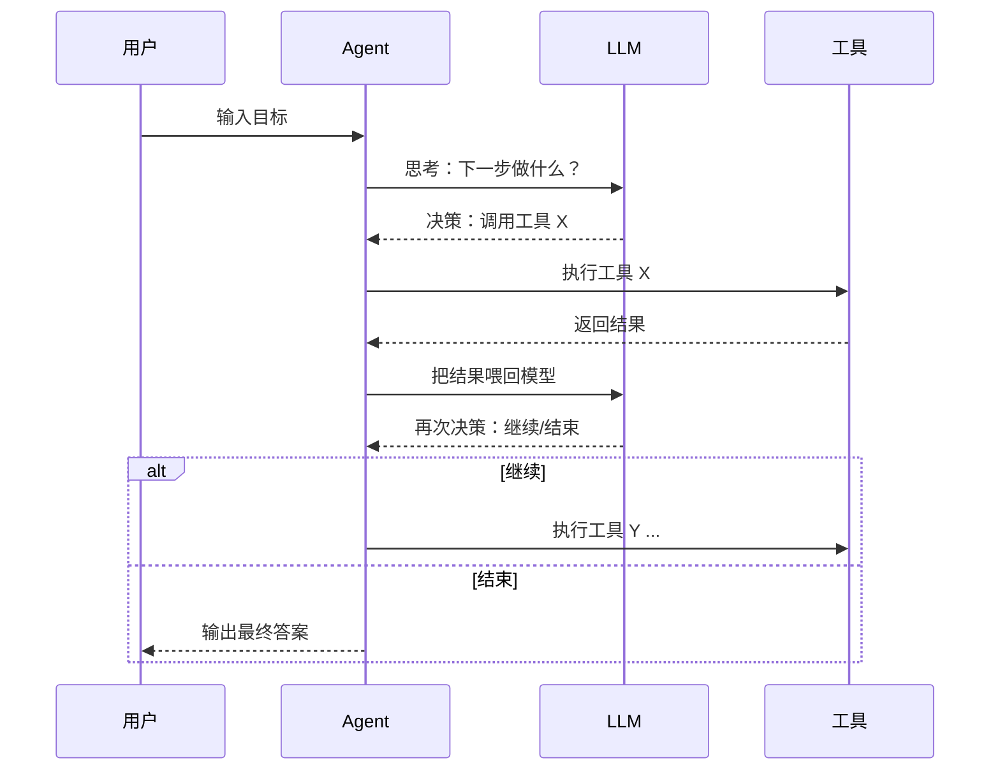

<title>AI Agent 知识点手册 · 08-13 · Agent 循环机制</title>

# 知识点：Agent 循环

<callout emoji="💡">
Agent 循环不是"聊完一轮"，而是"接收输入 → 判断要不要调用工具 → 执行工具 → 把结果喂回模型 → 再判断 → 直到完成"。这个循环是 Agent 从"会聊天"变成"会做事"的核心机制。
</callout>

为什么需要循环？因为 LLM 一次生成有两个致命局限：第一，它不知道实时信息（今天是几号、广州多少度、数据库里有什么）；第二，它不能直接执行操作（不能发请求、不能写文件、不能查库）。所以 Agent 必须靠循环来突破这个天花板：先想一步，做一步，看结果，再想下一步。

LangGraph 的 StateGraph 本质就是把这个循环建模成一张图：节点负责干活，边负责决定怎么走，共享的 State 负责传递数据（完整介绍见 08-12 的 LangGraph StateGraph 文章）。你 ai-tools-demo 项目的 graph.ts 里的 plan→sketch→generate→validate→repair 就是一条典型的 Agent 循环链路。

| 维度         | 普通单轮对话   | Agent 循环                   |
| ------------ | -------------- | ---------------------------- |
| 输入         | 用户问题       | 用户问题 + 上下文 + 工具结果 |
| 模型调用次数 | 1 次           | N 次（每步一次）             |
| 信息获取     | 靠模型训练数据 | 靠实时工具调用获取           |
| 执行动作     | 不能           | 能（调用 API、查库、写文件） |
| 失败处理     | 不能           | 可重试、可修复、可降级       |
| 上下文长度   | 固定           | 随循环递增，需主动控制       |



这个循环的关键在于：每次工具调用结果必须被**完整地喂回给模型**，让模型基于真实信息做下一步判断。如果工具结果不喂回去，循环就断了，Agent 就变成了"先猜再答"，跟普通聊天没区别。

# 示例：用真实 DeepSeek Function Calling 实现 Agent 循环

场景：实现一个 Agent，用户问天气时，它会自动调用工具获取实时数据，再组织回答。注意，这里用的是真实 LLM 的 function calling 机制，不是 MockModel。

**TypeScript 示例：真实 DeepSeek/OpenAI function calling**

```typescript
import { ChatOpenAI } from "@langchain/openai";
import { tool } from "@langchain/core/tools";
import { HumanMessage, SystemMessage, ToolMessage } from "@langchain/core/messages";
import { z } from "zod";

const model = new ChatOpenAI({
  model: "deepseek-chat",
  configuration: { baseURL: "https://api.deepseek.com/v1" },
  apiKey: process.env.DEEPSEEK_API_KEY,
});

// 1. 定义工具（LangChain 原生格式，tool() + zod schema）
const getWeather = tool(
  async ({ city }: { city: string }) => {
    const map: Record<string, string> = {
      广州: "广州多云，29°C，湿度 72%，适合出门但建议带伞",
      北京: "北京晴，31°C，紫外线强，注意防晒",
      上海: "上海小雨，27°C，出门建议带伞",
    };
    return map[city] ?? `${city} 今日天气正常，22°C`;
  },
  {
    name: "get_weather",
    description: "获取指定城市的实时天气",
    schema: z.object({ city: z.string().describe("城市名，如广州") }),
  }
);

const modelWithTools = model.bindTools([getWeather]);

// 2. Agent 循环
async function agentLoop(userInput: string): Promise<string> {
  const messages = [
    new SystemMessage("你是一个助手，必要时调用工具获取信息，然后基于工具结果回答。"),
    new HumanMessage(userInput),
  ];

  for (let step = 0; step < 5; step++) {
    const response = await modelWithTools.invoke(messages);
    messages.push(response);

    if (!response.tool_calls?.length) {
      return typeof response.content === "string" ? response.content : "（无回答）";
    }

    for (const call of response.tool_calls) {
      if (call.name === "get_weather") {
        const result = await getWeather.invoke(call.args);
        messages.push(new ToolMessage({ tool_call_id: call.id!, content: result }));
        console.log(`  → 调用了 get_weather，结果：${result}`);
      }
    }
  }
  return "Agent 循环超过最大次数，已中止。";
}

// 运行
const answer = await agentLoop("广州今天适不适合出门？");
console.log("\n=== 最终回答 ===");
console.log(answer);
```

**运行方式**

1. 安装：`npm i @langchain/openai @langchain/core zod`
2. 设置环境变量：`export DEEPSEEK_API_KEY="sk-你的key"`
3. 运行：`npx tsx agent-loop.ts`

**Python 示例：同样逻辑，用 LangChain 库**

```python
from langchain_openai import ChatOpenAI
from langchain_core.tools import tool
from langchain_core.messages import HumanMessage, SystemMessage, ToolMessage

model = ChatOpenAI(
    model="deepseek-chat",
    openai_api_key="***",  # 建议从环境变量读取
    openai_api_base="https://api.deepseek.com/v1",
)


# 1. 定义工具（LangChain 原生格式，@tool 装饰器）
@tool
def get_weather(city: str) -> str:
    """获取指定城市的实时天气"""
    weather_map = {
        "广州": "广州多云，29°C，湿度 72%，适合出门但建议带伞",
        "北京": "北京晴，31°C，紫外线强，注意防晒",
        "上海": "上海小雨，27°C，出门建议带伞",
    }
    return weather_map.get(city, f"{city} 今日天气正常，22°C")


model_with_tools = model.bind_tools([get_weather])


# 2. Agent 循环
def agent_loop(user_input: str) -> str:
    messages = [
        SystemMessage(content="你是一个助手，必要时调用工具获取信息，然后基于工具结果回答。"),
        HumanMessage(content=user_input),
    ]

    for step in range(5):
        response = model_with_tools.invoke(messages)
        messages.append(response)

        if not response.tool_calls:
            return response.content or "（无回答）"

        for call in response.tool_calls:
            if call["name"] == "get_weather":
                result = get_weather.invoke(call["args"])
                messages.append(ToolMessage(
                    tool_call_id=call["id"],
                    content=result,
                ))
                print(f"  → 调用了 get_weather，结果：{result}")

    return "Agent 循环超过最大次数，已中止。"


# 运行
if __name__ == "__main__":
    answer = agent_loop("广州今天适不适合出门？")
    print("\n=== 最终回答 ===")
    print(answer)

```

**运行流程详解**

1. 用户输入"广州今天适不适合出门？"
2. 模型收到消息，判断需要查天气 → 返回 `tool_calls`，包含 `get_weather(city:"广州")`
3. 代码执行工具，拿到结果"广州多云，29°C"
4. 代码把工具结果以 `role: "tool"` 追加到 messages 里
5. 模型再次收到消息，此时已有工具结果 → 判断够了，直接回答
6. 用户看到最终回答

关键差异就是第 2-4 步。没有这个循环，模型只能瞎编天气。

# 面试考点

1. **Agent 循环的核心是什么？**  
   高分回答：核心是"判断→执行→喂回→再判断"的闭环。关键动作是把工具结果以 `role:tool` 喂回模型，让模型基于真实信息做下一步推理。
2. **Agent 循环和普通 API 调用有什么区别？**  
   高分回答：普通调用一次请求就结束；Agent 循环需要维护上下文（messages 数组），每次工具结果都追加进去，模型再基于新上下文做决策，可能多次调用才能完成一个任务。
3. **怎么防止 Agent 循环卡死？**  
   高分回答：加最大轮次限制（如 5-10 步）、加超时控制、加状态检测（连续重复调用同一工具时终止）、配合 LangGraph 的 checkpoint 保存状态，失败后可恢复。

追问：上下文长度会随循环递增，怎么控制 Token 成本？工具返回结果太长怎么办？怎么判断工具调用是否成功？

# 常见坑

- **循环卡死（无限调用工具）**：模型反复调用同一个工具而不终结。解决：加最大轮次 + 检测重复调用模式。
- **上下文爆炸**：每次工具结果累加，messages 越来越长。解决：对长工具结果做摘要，或只保留最近 N 轮历史。
- **工具结果不喂回**：代码执行完工具后，结果没追加到 messages 里，模型下一轮无法使用。这是最常见的 Agent 实现错误。
- **工具参数解析失败**：模型返回的 JSON 参数格式不对。解决：用 try-catch 包裹 JSON.parse，失败时通知模型重新生成。

# 小实验

1. 把 `max_steps` 改成 1，看看 Agent 会不会直接回答（不调工具就乱编）
2. 在工具里刻意返回"工具异常"，观察模型是否尝试重试或降级
3. 给工具加一个 `get_time`，让 Agent 能同时回答时间和天气
4. 打开你 ai-tools-demo 项目的 graph.ts，对比这里的循环和 LangGraph 的 StateGraph 图结构

# 学习延伸

这篇讲的是 Agent 循环的"单机版"——手动维护 messages 数组做循环。在实际项目中，LangGraph 的 StateGraph 把这个循环封装成了图结构，支持 checkpoint 断点续跑、并行节点、条件边等高级能力。看完这篇后，建议回头读 08-12 的 LangGraph StateGraph 文章，理解"图"比"手动循环"好在哪。

更进一步：ReAct 模式（在循环中加"思考过程"）、Planner-Executor（先规划再执行）、AutoGPT 式长期循环（带持久化）。

- [OpenAI Function Calling 文档](https://platform.openai.com/docs/guides/function-calling)
- [LangGraph 官方文档：Low-level API](https://langchain-ai.github.io/langgraphjs/concepts/low_level/)
- [ReAct: Synergizing Reasoning and Acting in Language Models](https://react-lm.github.io/)
