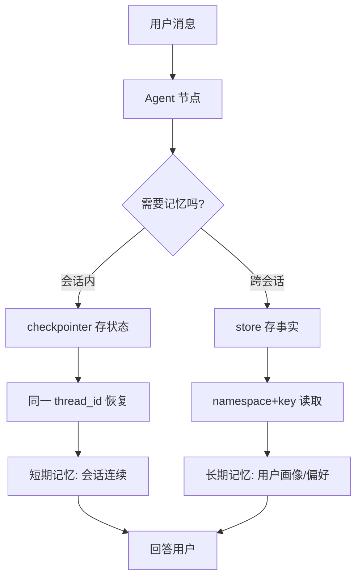

# 全栈 AI Agent 工程师 · 08-16 · 怎么让 Agent 记住上次对话？从"每次失忆"到"跨会话记忆"

你刚让 Agent 记住了你的名字，换了个会话它又问"你叫什么"——这就是 Agent 最常见的尴尬：每次调用都是全新状态，上一次对话像没发生过一样。用户会觉得这产品很笨。

LangGraph 解决这个问题靠的是 **Checkpointer（检查点）**：把每次执行后的状态保存下来，下次调用时恢复。本文用一个跨会话记忆示例，对比"无记忆"和"有记忆"两种 Agent 的差别，再把记忆的隔离原理和层次讲清楚。

## 先跑一遍：无记忆的 Agent 有多失忆

先定义 Agent：一个 model 节点，接收消息返回回复。下面是完整可运行的初始化——包含 LLM 客户端、系统提示词和状态定义：

```typescript
import "dotenv/config";
import { Annotation, StateGraph, START, END } from "@langchain/langgraph";
import { ChatOpenAI } from "@langchain/openai";
import { SystemMessage, HumanMessage, BaseMessage } from "@langchain/core/messages";

// LLM 客户端：读环境变量（LLM_API_KEY / LLM_BASE_URL / LLM_MODEL）
const llm = new ChatOpenAI({
  model: process.env.LLM_MODEL ?? "deepseek-v4-flash",
  apiKey: process.env.LLM_API_KEY,
  configuration: { baseURL: process.env.LLM_BASE_URL },
  temperature: 0.2,
});

const SYSTEM_PROMPT = new SystemMessage(
  "你是一个乐于助人的助手。用户可能在对话中透露个人信息（比如名字），" +
    "如果历史消息里有，被问到时直接回答；如果没有，就如实说不知道。"
);

// 状态里只存消息列表：reducer 把每次节点返回的消息追加进历史
const AgentState = Annotation.Root({
  messages: Annotation<BaseMessage[]>({
    default: () => [],
    reducer: (a, b) => [...a, ...b],
  }),
});

async function modelNode(state: typeof AgentState.State) {
  const res = await llm.invoke([SYSTEM_PROMPT, ...state.messages]);
  return { messages: [res] };
}

// 不挂 checkpointer —— 这就是"无记忆"的全部差别
const graph = new StateGraph(AgentState)
  .addNode("model", modelNode)
  .addEdge(START, "model")
  .addEdge("model", END)
  .compile();
```

跑两轮对话，第二轮问"我叫什么名字"——注意第二次调用没有传任何历史，状态是全新的：

```bash
会话 1：我叫张三，请记住我的名字。
  Agent：好的，张三，我记住了。有什么可以帮你的吗？
会话 2：我叫什么名字？
  Agent：抱歉，我还没有在对话中得知您的名字。
  → 结论：没有记忆，Agent 对上个会话一无所知
```

Agent 第一轮明明记住了，第二轮就忘了。原因是：**State 是"每次调用后即焚"的**——invoke 之间不共享任何状态，第二轮进来时 messages 是空的。上面的输出是演示用示例输出，真实跑起来 Agent 的回答措辞会略有不同，但"忘了名字"这个行为是确定的。

## 加上 Checkpointer：同一个 thread 就能记住了

LangGraph 的解决方式：编译时挂一个 **checkpointer**，每次执行后把状态保存起来（MemorySaver 是**内存版**，把状态存在进程内存里，适合演示和开发；生产环境用持久化实现，后面讲）。下次用**同一个 thread_id** 调用时，框架从检查点恢复历史状态：

```typescript
import { MemorySaver } from "@langchain/langgraph";

// 唯一的变化：compile 时传 checkpointer
// MemorySaver 是内存实现：状态存在进程内存，服务重启就丢（开发用）
const checkpointer = new MemorySaver();
const graph = new StateGraph(AgentState)
  .addNode("model", modelNode)
  .addEdge(START, "model")
  .addEdge("model", END)
  .compile({ checkpointer });

// 调用时带 thread_id —— 记忆的隔离粒度
const config = { configurable: { thread_id: "user-zhangsan" } };
```

同样的两句话，用同一个 thread_id 跑：

```bash
会话 1（thread=user-zhangsan）：我叫张三，请记住我的名字。
  Agent：好的，张三，我记住了！有什么需要帮忙的吗？
会话 2（thread=user-zhangsan）：我叫什么名字？
  Agent：你叫张三。
  → 检查点里已存 4 条消息，跨会话生效 ✅
```

同一个图、同一个 model 节点，唯一的差别是 compile 时多传了一个 checkpointer。第二次 invoke 时框架从检查点读出之前的消息，Agent 就知道你叫张三了。（示例输出，真实运行时措辞可能不同）

注意：MemorySaver 把状态存在**内存**里，不是落盘——服务重启，记忆就没了。生产环境要换持久化实现（如 PostgresSaver，把状态存进 PostgreSQL），才能做到重启不丢、多实例共享。PostgresSaver 的用法和 MemorySaver 一样：\`new PostgresSaver()\` 传给 compile 的 checkpointer 参数，只是底层存储从内存换成了数据库，图代码不用改（官方用法见下方参考来源的 Persistence 文档）。

## 记忆是隔离的：thread_id 就是"会话身份证"

记忆按 thread_id 隔离——同一个 thread 共享记忆，不同 thread 互不可见。这就是多用户/多会话隔离的原理：

```bash
thread-A：我叫李四，请记住我的名字。（已写入 A 的记忆）
thread-B：我叫什么名字？
  Agent：抱歉，我目前还不知道您的名字。
  → 结论：记忆按 thread_id 隔离，多用户/多会话互不干扰 ✅
```

每个用户一个 thread_id（比如 user-001、user-002），A 用户的信息永远不会串到 B 用户。生产环境 thread_id 通常由后端生成：用户登录后创建一个会话，把数据库里生成的会话 ID 作为 thread_id 传给图。

## 短期记忆 vs 长期记忆：checkpointer 只是第一层

checkpointer 解决的是**短期记忆（thread-scoped）**：会话连续性、中断恢复、工具调用过程。它是图状态的一部分，按 thread 隔离，生命周期跟随会话。但也有两个局限：① 只在当前 thread 内有效，用户明天再来（新 thread）就丢了；② 状态里塞越多消息，token 成本越高。

真正需要跨会话记住用户偏好、事实，要用 **长期记忆（cross-thread）**。下面的示例基于 LangGraph JS v1.4.x（2026-08 实测可用）：

```typescript
import { InMemoryStore } from "@langchain/langgraph";

// store 负责跨 thread 的长期记忆：namespace 像文件夹，key 像文件名
// 以下 API 在 LangGraph JS v1.4.7 实测通过：put / get / search
const store = new InMemoryStore();

const graph = new StateGraph(AgentState)
  .addNode("model", modelNode)
  .addEdge(START, "model")
  .addEdge("model", END)
  .compile({ checkpointer, store }); // 两层都挂上

// 写入用户事实：namespace 带 userId，key 是记忆 ID
await store.put(["user-zhangsan"], "profile", {
  name: "张三",
  preference: "喜欢简洁回答",
});

// 跨 thread 读取
const memory = await store.get(["user-zhangsan"], "profile");
console.log(memory.value.name); // "张三"

// 完整闭环：invoke 时带 thread_id，Agent 可以同时用短期+长期记忆
const reply = await graph.invoke(
  { messages: [new HumanMessage("我叫什么名字？")] },
  { configurable: { thread_id: "user-zhangsan" } }
);
console.log(reply.messages.at(-1).content); // 结合 store 里的名字回答
```

checkpointer（短期）+ store（长期）组合是生产标准配置：**会话上下文放 checkpoint，用户级稳定事实放 store**。这样既不丢会话连续性，也不让历史消息无限膨胀——这也是控制 token 成本、缓解上下文污染的关键。

## 核心原理：记忆的三个层次



LangGraph 参考人类记忆分类，把记忆分成三种，每种对应不同的落地位置：

- **语义记忆（事实）**：用户叫什么、偏好什么、订单号是多少。放 store，按 namespace + key 存取，跨会话有效。
- **情景记忆（经历）**：上次聊了什么、工具调用到哪一步。放 checkpointer 的图状态里，跟随 thread，支持中断恢复。
- **程序记忆（规则）**：系统提示词、操作指令、工具使用规范。放 system prompt，每次调用都带着，不参与状态存储。

三层各司其职，不混在一起：规则不进状态（否则每次都要重复计算），事实不进历史（否则 token 无限膨胀），经历不落 store（否则跨会话串味）。

最后说下滑动窗口：多轮对话里如果每次都把全部历史塞进上下文，token 成本线性增长，还会触发 context rot（上下文腐烂——token 越多，模型从上下文里准确召回信息的能力越差）。所以生产环境通常只保留最近 N 轮消息，更早的要么丢、要么压缩成摘要（让模型把历史总结成几行要点），需要时再从 store 检索完整内容。这是上下文工程的另一块内容，本文先点到为止。

## 总结

Agent 失忆的根因是 State 每次 invoke 后即焚。解决办法：compile 时挂 checkpointer，调用时带同一个 thread_id，框架从检查点恢复历史状态——**记忆的开关就是 compile 多传一个参数**。

记忆按 thread_id 隔离，一个用户一个 thread，互不串扰。checkpointer 解决短期记忆（会话内），store 解决长期记忆（跨会话），生产环境两层都挂：会话上下文放 checkpoint，用户级事实放 store。

设计记忆系统时先分清层次：短期记运行过程（checkpoint），长期记稳定事实（store），规则放系统提示词。别把无限增长的聊天历史直接当记忆——那只是把 token 成本和上下文污染问题往后拖。

## 面试考点

- **LangGraph 怎么实现跨会话记忆？** 编译时传 checkpointer（如 MemorySaver），invoke 时带 configurable.thread_id。框架按 thread 保存和恢复状态。
- **记忆怎么隔离？** 按 thread_id 隔离。同一个 thread 共享记忆，不同 thread 互不可见——这就是多用户隔离的原理，每个用户一个 thread_id。
- **短期记忆和长期记忆什么区别？** 短期记忆是 thread-scoped（checkpointer 存图状态，跟随会话），长期记忆是 cross-thread（store 按 namespace+key 存用户事实，跨会话有效）。
- **生产环境为什么 MemorySaver 不够？** MemorySaver 是内存实现，状态存在进程内存里，服务重启就丢、多实例不共享。生产用持久化 checkpointer（如 PostgresSaver）和持久化 store。
- **记忆和无限增长的历史是一回事吗？** 不是。无限增长的历史会推高 token 成本、加剧上下文污染（context rot：token 越多模型从上下文中准确召回信息的能力越差）。正确做法是稳定事实沉到 store，历史做滑动窗口或摘要。

## 参考来源

- [LangGraph JS：Persistence（checkpointer、store、namespace）](https://docs.langchain.com/oss/javascript/langgraph/persistence)
- [LangGraph JS：Memory（跨会话记忆、语义/情景/程序记忆分类）](https://docs.langchain.com/oss/javascript/langgraph/memory)
- [《深入理解 AI Agent》第 3 章：用户记忆和知识库](https://bojieli.github.io/ai-agent-book/book/chapter3/)
