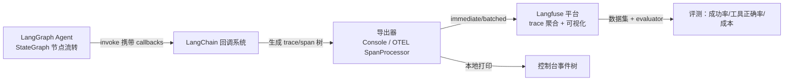

# Agent 内部到底在干什么？怎么观测和评估它？

## 一个能跑但看不见的 Agent

上篇文章我们用 LangGraph 搭了一个能查天气、能算数的 Agent。它能跑，但如果你问"它内部到底干了什么"，答案只有一行：最终回复。

真实场景里，Agent 一次请求 = 多轮 LLM 调用 + 多次工具调用 + 状态在节点间流转。任何一个环节出错——模型幻觉、选错工具、参数传错、死循环、超时——你都只能对着最终回复猜。Langfuse 官方文档有句话说得直接：

<callout emoji="💡">
Because AI is inherently non-deterministic, debugging your application without any observability tool is more like guesswork.（AI 天然非确定性，没有可观测性工具的调试更像猜谜。）
</callout>

先看痛点：一个没接可观测性的 Agent，只能靠 console.log 手动追踪（真实运行输出）：

```text
[console.log 手动追踪] agent 节点返回：要调用工具 get_weather, calculate
[console.log 手动追踪] agent 节点返回：直接回答（无工具调用）
[console.log 手动追踪] 总耗时 2308ms

最终回复：上海 31°C 闷热多云；31 + 28 = 59。

（复盘过程只能翻 messages：）
[0] HumanMessage: 查一下 Shanghai 的天气，然后用计算器把 31 和 28 相加
[1] AIMessage: 工具调用 → get_weather({"city":"Shanghai"}), calculate({"a":31,"b":28})
[2] ToolMessage: 31°C，闷热多云
[3] ToolMessage: 59
[4] AIMessage: 总结
```

能跑，但一旦出错，你只有最终答案和几行自己写的日志。模型到底选了哪个工具？参数传对没有？哪一步最慢？花了多少 token？全不知道。这就是"盲人摸象"。

## trace 是什么：把每次请求的完整生命周期记录下来

可观测性（Observability）是个大概念，包含 tracing、metrics、logging。对 LLM 应用来说，最重要的是 **tracing**——记录一次请求流经系统的全过程，保留操作之间的因果关系。

Langfuse 官方定义：

<callout emoji="💡">
Application tracing records the complete lifecycle of a request as it flows through your system. Each trace captures every operation — LLM calls, retrieval steps, tool executions, and custom logic — along with timing, inputs, outputs, and metadata.
</callout>

数据模型是树状的：**trace** = 一次请求的完整生命周期（对应一次 `agent.invoke`）；**span/observation** = 生命周期里的单个操作（一次 LLM 调用、一次工具执行、一个图节点），带时间、输入、输出、元数据，嵌套成树。

## 别忘了另两级：Session 和 User

单条 trace 能回答"这一次请求内部发生了什么"，但解决不了另一个问题：**单轮 trace 是孤立无关联的**。用户连问三轮，每轮是一条独立 trace，你怎么知道这三轮是同一个对话？同一个用户？

Langfuse 的追踪体系是**三个层级**（参考：Langfuse 官方文档 + 实战分析）：

| **层级** | **追踪什么**                                                           | **解决什么问题**                             |
| -------- | ---------------------------------------------------------------------- | -------------------------------------------- |
| Trace    | 单条 LLM 请求的完整执行链路（输入→中间步骤→输出，含执行树/耗时/token） | 单轮问题的根因分析                           |
| Session  | 同一上下文的关联请求聚合为会话（多轮连续问答）                         | 单轮 trace 孤立无关联，无法复盘多轮交互      |
| User     | 按用户唯一 ID 聚合其所有 Session 和 Trace（用户→对话→单轮 三层关联）   | 用户视角全局分析（留存、行为特征、问题分布） |

这就是为什么第二步接入 Langfuse 时，CallbackHandler 要带上 `sessionId` 和 `userId`——它们不是可选项，是让 trace 能"串起来"的钩子：同一次对话的所有请求共享一个 sessionId，所有属于同一个用户的 session 再挂上同一个 userId。你在 Langfuse UI 里就能从用户点进去看对话，从对话点进去看每一轮内部。

```typescript
const langfuseHandler = new CallbackHandler({
  sessionId: "chat-20260817-001", // 一次多轮对话共用一个 sessionId
  userId: "user_zhang", // 同一用户的所有 session 挂同一个 userId
  tags: ["agent-observability"],
});
```

## 第一步：零成本体验 trace 结构（ConsoleCallbackHandler）

没有 Langfuse key 也能先看到 trace 长什么样——LangChain 内置的 `ConsoleCallbackHandler` 会把每次 invoke 的完整链路事件树打印到控制台。这比 console.log 强在哪？看真实输出：

```text
[chain/start] [1:chain:LangGraph] Entering Chain run
[chain/start] [1:chain:LangGraph > 2:chain:__start__] Entering Chain run
[chain/end]   [1:chain:LangGraph > 2:chain:__start__] [2ms]   Exiting Chain run
[chain/start] [1:chain:LangGraph > 3:chain:agent] Entering Chain run
[llm/start]   [1:chain:LangGraph > 3:chain:agent > 4:llm:ChatOpenAI] Entering LLM run
[llm/end]     [1:chain:LangGraph > 3:chain:agent > 4:llm:ChatOpenAI] [969ms] Exiting LLM run   ← 模型决定调工具
[chain/end]   [1:chain:LangGraph > 3:chain:agent] [976ms] Exiting Chain run
[chain/start] [1:chain:LangGraph > 6:chain:tools] Entering Chain run
[tool/start]  [1:chain:LangGraph > 6:chain:tools > 7:tool:get_weather] Entering Tool run   input: {"city":"Shanghai"}
[tool/start]  [1:chain:LangGraph > 6:chain:tools > 8:tool:calculate]  Entering Tool run   input: {"a":31,"b":28}
[tool/end]    [1:chain:LangGraph > 6:chain:tools > 7:tool:get_weather] [2ms] Exiting Tool run   output: 31°C，闷热多云
[tool/end]    [1:chain:LangGraph > 6:chain:tools > 8:tool:calculate]  [2ms] Exiting Tool run   output: 59
[chain/end]   [1:chain:LangGraph > 6:chain:tools] [5ms] Exiting Chain run
[chain/start] [1:chain:LangGraph > 9:chain:agent] Entering Chain run
[llm/start]   [1:chain:LangGraph > 9:chain:agent > 10:llm:ChatOpenAI] Entering LLM run
[llm/end]     [1:chain:LangGraph > 9:chain:agent > 10:llm:ChatOpenAI] [958ms] Exiting LLM run   ← 基于工具结果生成总结
[chain/end]   [1:chain:LangGraph] [1.97s] Exiting Chain run
```

三个 console.log 回答不了的问题，这个事件树直接给出答案：

- **模型到底选了哪个工具、传了什么参数**：`get_weather input: {"city":"Shanghai"}`、`calculate input: {"a":31,"b":28}`
- **每一步花了多久**：969ms 决策调工具 → 工具各 2ms 执行 → 958ms 生成总结。瓶颈一眼可见
- **每次 LLM 调用花了多少 token**：事件里带完整 token 明细（真实输出）

```text
"response_metadata": {
  "tokenUsage": { "promptTokens": 437, "completionTokens": 90, "totalTokens": 527 },
  "finish_reason": "tool_calls",
  "model_name": "deepseek-v4-flash",
  "usage": {
    "prompt_tokens": 437, "completion_tokens": 90, "total_tokens": 527,
    "prompt_cache_hit_tokens": 384, "prompt_cache_miss_tokens": 53
  }
}
```

代码只有两行，挂到 invoke 的 callbacks 上即可：

```typescript
import { ConsoleCallbackHandler } from "@langchain/core/tracers/console";
import { HumanMessage } from "@langchain/core/messages";

// agent 是前面步骤已经搭好的 LangGraph agent（createReactAgent 或 StateGraph）
const result = await agent.invoke(
  { messages: [new HumanMessage("查一下 Shanghai 的天气，然后算 31+28")] },
  { callbacks: [new ConsoleCallbackHandler()] }
);
```

## 第二步：接入 Langfuse，trace 真正上报

ConsoleCallbackHandler 只能打印到终端，不能聚合、不能对比、不能看历史。要真观测，需要上报到专门的平台——Langfuse 或 LangSmith。

先选部署方式，两条路：

- **云托管**：cloud.langfuse.com 注册即用，省运维
- **自建（开源）**：Langfuse 是开源项目，官方提供 docker-compose 全家桶（langfuse-web + langfuse-worker + postgres + clickhouse + minio + redis），一条命令起整套：`docker compose up`——Dify 等开源项目内部也用它做监控

```bash
git clone https://github.com/langfuse/langfuse
cd langfuse
docker compose up
# 启动后本地地址 http://127.0.0.1:3000
# 在界面里申请 LANGFUSE_PUBLIC_KEY / LANGFUSE_SECRET_KEY
# 然后 .env 配三件套：
#   LANGFUSE_PUBLIC_KEY=pk-lf-xxx
#   LANGFUSE_SECRET_KEY=sk-lf-xxx
#   LANGFUSE_BASE_URL=http://127.0.0.1:3000
```

⚠️ 实测坑（2026-08-17）：Langfuse 的 JS SDK 已经升级到 v5，**架构从 CallbackHandler 传 key 改成了 OTEL**。旧写法 `new CallbackHandler({ publicKey, secretKey, baseUrl })` 已经不传 key 了，key 走环境变量 + `LangfuseSpanProcessor` 注册全局 tracer。

这里有两个容易混的概念先拆开：**OTEL（OpenTelemetry）负责统一采集**——它定义 span 的标准格式、管理全局 tracer，把各个框架（LLM/工具/图节点）产生的可观测数据汇集成流；**Langfuse 负责接收和展示**——它拿到 OTEL 导出的 span，聚合出 trace 树、算 token 成本、跑评测。所以代码里要先 `provider.register()` 把 Langfuse 的 span processor 挂进 OTEL 全局 tracer，之后 LangGraph/LangChain 的调用才会被采集到。

```typescript
import { NodeTracerProvider } from "@opentelemetry/sdk-trace-node";
import { LangfuseSpanProcessor } from "@langfuse/otel";
import { CallbackHandler } from "@langfuse/langchain";

// 1. 注册全局 tracer provider（key 从环境变量读：
//    LANGFUSE_PUBLIC_KEY / LANGFUSE_SECRET_KEY / LANGFUSE_BASE_URL）
const provider = new NodeTracerProvider();
provider.addSpanProcessor(
  new LangfuseSpanProcessor({
    publicKey: process.env.LANGFUSE_PUBLIC_KEY,
    secretKey: process.env.LANGFUSE_SECRET_KEY,
    baseUrl: process.env.LANGFUSE_BASE_URL ?? "https://cloud.langfuse.com",
    exportMode: "immediate", // 短脚本用 immediate，长驻服务用 batched
  })
);
provider.register();

// 2. CallbackHandler 挂到 invoke，拿到 trace id 和链接
const langfuseHandler = new CallbackHandler({
  sessionId: "demo-session",
  userId: "local-dev",
  tags: ["agent-observability"],
});
const result = await agent.invoke(
  { messages: [new HumanMessage("查一下 Shanghai 的天气，然后算 31+28")] },
  { callbacks: [langfuseHandler], recursionLimit: 30 }
);
console.log("trace id:", langfuseHandler.last_trace_id);
console.log("trace URL:", `https://cloud.langfuse.com/trace/${langfuseHandler.last_trace_id}`);

// 3. 短脚本要显式 flush，否则进程退出前 trace 写不完
await provider.forceFlush();
```

用假 key 实测验证：接入初始化成功、正常生成 trace id、打印出标准格式的 trace URL（真实运行输出，假 key 会被服务端拒绝导致 flush 失败，代码捕获后如实打印）：

```text
✅ trace 已上报 Langfuse，trace id: ab7423af27a340e7aa4a6a4ded588ec1
🔗 trace URL: https://cloud.langfuse.com/trace/ab7423af27a340e7aa4a6a4ded588ec1
⚠️ Langfuse flush 失败（key 无效或网络不通，trace 未真正落库）：…
```

没有 key 时的处理：代码检测到 `LANGFUSE_PUBLIC_KEY`/`LANGFUSE_SECRET_KEY` 缺失，打印明确提示「未配置 Langfuse key，跳过上报，仅演示本地追踪结构」，降级到第一步的 ConsoleCallbackHandler——演示效果不丢，也如实告知读者"没 key 看不到真实 trace 图"。

## 原理收束：trace 数据流

刚才跑的每一步，对应到数据流是这样：



关键点：LangGraph 的节点（agent 节点、tools 节点）会**被回调系统记录成 trace 里的链路节点**，节点内部的 LLM 调用和工具执行再展开为子 span——所以在这套示例里，挂上回调就能拿到完整因果树，不需要手动埋点。LangSmith 更极致，设三个环境变量（`LANGCHAIN_TRACING_V2=true` + API key + project）就能零代码接入，因为 LangGraph 和 LangSmith 同厂，SDK 内部自带 tracer。注意：这三个变量名是神光课程仓库 `langsmith-test`（langsmith SDK ^0.3.12）沿用的写法，官方文档现在主要提 `LANGSMITH_TRACING=true` + `LANGSMITH_API_KEY`，两套都认，只是新旧叫法不同。

## 第三步（进阶）：把"感觉好用"变成数字

观测解决"发生了什么"，评估解决"好不好"。评估的思路是把固定用例跑一遍，用 evaluator 打分：

- **成功率/任务完成度**：对固定 dataset 逐条跑 Agent，用确定性 evaluator 打 0/1 分，再汇总平均（如回复是否命中预期关键词）
- **工具调用正确率**：从 trace 里取工具调用记录（工具名+入参），对照用例期望断言——比只看回复更严谨
- **token 成本**：trace 自动带 token 统计，配好模型单价后直接算钱；对比实验（换模型）时对同一 dataset 各跑一轮比总成本
- **延迟**：trace 自带每 span 耗时，汇总 p50/p95，慢节点看 span 级耗时
- **人工反馈**：用户对输出打星/点赞写回 trace，按天聚合平均分

神光课程代码库（langfuse-test / langsmith-test）里就有完整实现：dataset 建用例 → evaluator 打分（关键词命中）→ run 级汇总平均分 → LLM-as-Judge（用 openevals 的 groundedness/helpfulness/relevance 三件套让裁判模型打分）。

## 总结

Agent 可观测性的本质是：把"非确定性的黑盒"变成"每次请求都有完整因果链的记录"。trace 让你看到模型选了什么工具、传了什么参数、哪一步慢、花了多少钱——这些是 console.log 给不了的。

上手路径很平滑：先挂 `ConsoleCallbackHandler` 零成本看 trace 结构 → 再接入 Langfuse/LangSmith 上报聚合 → 最后用 dataset + evaluator 把质量变成可对比的数字。没有 key 也能学完前两步，真实上报的坑（key 缺失、SDK 版本差异、短脚本 flush）文章里都如实标了。

对生产系统来说，可观测性不是锦上添花——它是定位问题、控制成本、量化模型升级效果的基础设施。Langfuse 开源可自建（docker compose 全家桶），LangSmith 同厂集成最顺滑，选哪个取决于你要数据自主可控还是要官方生态。

别忘了三级体系：trace 管单轮、session 管多轮、user 管全局——接 Langfuse 时把 `sessionId`/`userId` 挂上，观测才能从"单次请求"升级到"完整用户旅程"。

## 面试考点

- **trace / session / user 三级追踪体系是什么？** Trace 单轮执行链路（根因分析）；Session 同一上下文多轮请求聚合（复盘对话）；User 按用户 ID 聚合所有 session 和 trace（用户视角全局分析）。对应 Langfuse 的 sessionId/userId 参数。
- **Agent 可观测性和普通接口监控有什么区别？** Agent 一次请求 = 多轮 LLM + 多次工具 + 状态流转，非确定性导致"只看最终结果无法定位问题"。可观测性要记录完整因果链：每步的输入输出、耗时、token、工具调用明细。
- **trace 和 span 什么关系？** trace = 一次请求的完整生命周期；span = 生命周期内的单个操作，嵌套成树。LangGraph 的每个节点天然成为一个 span。
- **Langfuse 和 LangSmith 怎么选？** 功能高度重合（tracing + 评测 + 数据集）。LangSmith 与 LangChain/LangGraph 同厂，集成最顺滑（环境变量零代码接入）；Langfuse 开源可自建、数据自主可控。注意 Langfuse JS SDK v5 已改 OTEL 架构。
- **你项目里怎么做 Agent 评估？（结合项目）** 在 ai-agent-code-examples 里用 dataset + evaluator：固定用例跑 Agent，关键词命中打 0/1，run 级汇总平均分；进阶用 openevals 的 LLM-as-Judge 打分。踩过的坑：Langfuse v5 的 CallbackHandler 不再传 key（改 OTEL + 环境变量）、短脚本必须显式 flush 否则 trace 丢。

## 相关资料

- [Langfuse Tracing 文档](https://langfuse.com/docs/tracing)
- [LangGraph JS 官方文档](https://docs.langchain.com/oss/javascript/langgraph/overview)
- [LangSmith Observability 文档](https://docs.langchain.com/langsmith/observability)
- [Langfuse Observability Overview](https://langfuse.com/docs/observability/overview)
