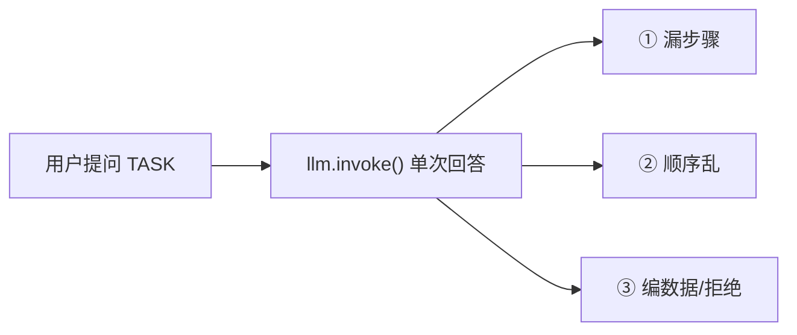
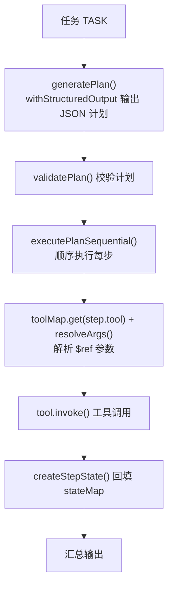
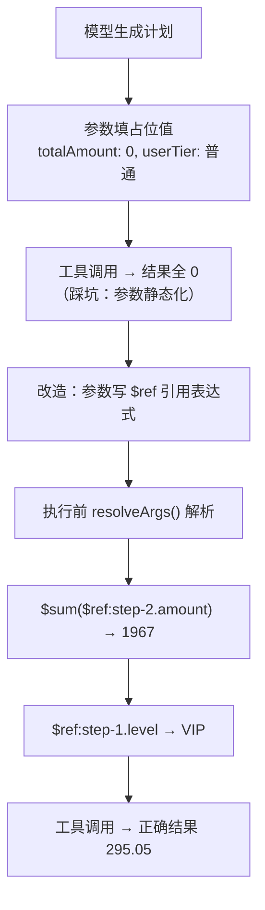
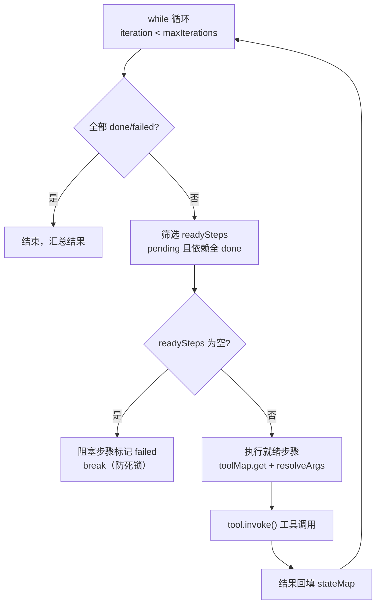
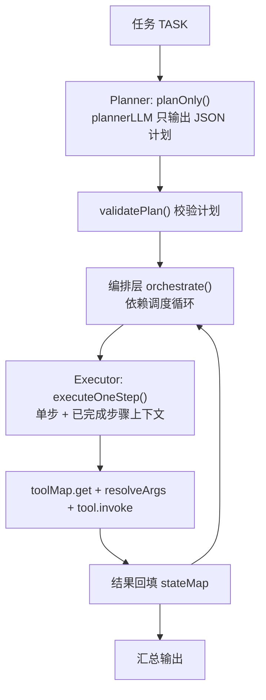
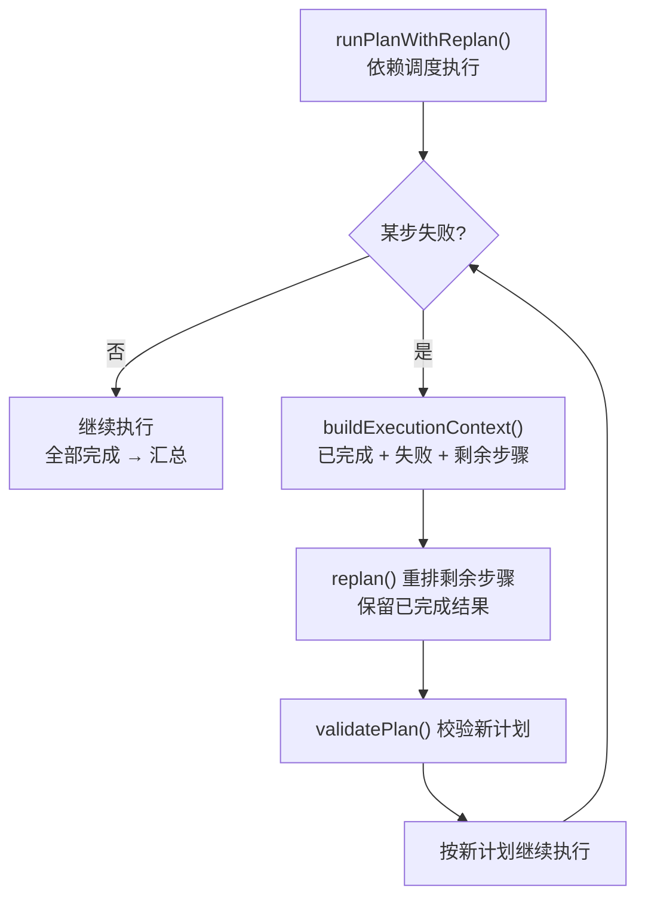
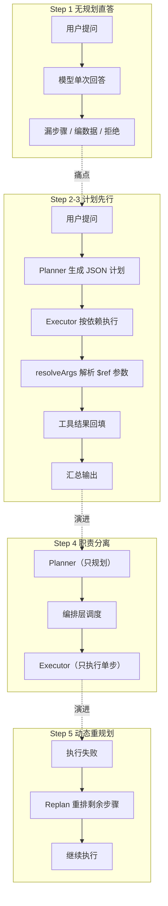

# Agent 怎么先想再做？从直答到 Plan-and-Execute 的动态规划

## 上篇我们让 Agent 学会了"带工具检索"，这次让它学会"先想清楚再动手"

上节我们做了 Agentic RAG：Agent 自己判断要不要检索、检索什么。但还有一个更基础的问题没解决——**多步任务**。

用户说"查一下张三的信息和订单，算算他能打几折，最后生成一份报告"。如果你直接把这句话丢给模型，会发生什么？

```text
任务：「查询用户张三的信息和他的订单历史，计算他应得的折扣金额，然后生成一份简明报告。」

模型回答：
好的，我理解您的任务。不过，作为电商助手，我目前无法直接访问
您的数据库或系统来查询用户"张三"的具体信息、订单历史或计算折扣。
要完成这个任务，我需要您提供以下数据或授权：...
```

模型很诚实——它没有编数据，而是直接说"我做不到"。因为要完成这个任务需要 4 个步骤：查用户 → 查订单 → 算折扣 → 生成报告，而且步骤之间有依赖（算折扣必须先有订单金额）。模型单次回答根本做不了。

这就是这篇要解决的：**让 Agent 先拆计划、再按步骤执行、失败还能重来**。代码仓库：[github.com/huzhiwu1/ai-agent-code-examples](https://github.com/huzhiwu1/ai-agent-code-examples)，articles/agent-planning 目录，7 步渐进式，每步可独立运行。

## Step 1：先看"不规划"的基线——模型单次回答多步任务

<callout emoji="💡">
**上下文**：本步不写任何规划代码，只用 shared.ts 的两个基础导出：`llm`（ChatOpenAI 实例）和 `TASK`（演示任务常量）。没有工具、没有计划，直接单次调用。
</callout>



第一步先不写任何规划逻辑，就是把任务直接问模型，看它怎么答。上面那段就是真实输出。

观察三个点：

- **① 步骤完整吗？** 信息 → 订单 → 折扣 → 报告，四件事单次回答根本做不全
- **② 顺序对吗？** 折扣必须依赖订单金额，单次回答无法表达这种依赖
- **③ 数据哪来的？** 没有工具，模型要么编造（幻觉），要么诚实拒绝——这次它选了后者

这个基线告诉我们：多步任务必须拆开做。拆开后还需要一套机制来管理"先做谁、后做谁、结果怎么传递"。这就是接下来的内容。

## Step 2：先列计划再执行——Plan-then-Execute 雏形

<callout emoji="💡">
**上下文**：这一步开始用 shared.ts 的公共设施：`llm`（ChatOpenAI 实例）、`PlanStepSchema`/`PlanSchema`（Zod 计划 Schema）、`toolMap`（4 个模拟工具）、`generatePlan()`（计划生成）、`validatePlan()`（计划校验）、`resolveArgs()`（参数解析）、`createStepState()`（状态初始化）。本步新增：`executePlanSequential()`——按 steps 数组顺序逐条执行（简化版，不做依赖调度）。
</callout>



最简单有效的做法：**让模型先把任务拆成 JSON 计划（只规划，不执行），然后按计划逐条执行**。

计划用 Zod schema 定义，包含步骤 id、描述、工具、参数、依赖关系：

```typescript
const PlanStepSchema = z.object({
  id: z.string().describe("步骤唯一标识，如 step-1"),
  description: z.string().describe("该步骤做什么的简短描述"),
  tool: z.string().describe("要调用的工具名称"),
  args: z.record(z.string(), z.any()).describe("传给工具的参数"),
  depends_on: z.array(z.string()).describe("依赖的步骤 ID 列表"),
});

const PlanSchema = z.object({
  reasoning: z.string().describe("为什么这么规划"),
  steps: z.array(PlanStepSchema),
});
```

然后用 `withStructuredOutput` 让模型输出符合 schema 的 JSON 计划：

```typescript
const planLLM = llm.withStructuredOutput(PlanSchema, {
  method: "functionCalling",
  name: "generate_plan",
});

const result = await planLLM.invoke([
  new SystemMessage(PLANNER_SYSTEM_PROMPT),
  new HumanMessage(task),
]);
const steps = (result as unknown as { steps: PlanStep[] }).steps;
```

真实运行，模型输出了 4 步计划，依赖关系完全正确：

```text
计划步骤 (4 步):

 step-1: 查询用户张三的信息 [无依赖]
 工具: get_user_info, 参数: {"userId":"张三"}
 step-2: 查询用户张三的订单历史 [无依赖]
 工具: get_orders, 参数: {"userId":"张三"}
 step-3: 根据用户等级和订单总金额计算折扣 [依赖: step-1, step-2]
 工具: calculate_discount, 参数: {"totalAmount":"$sum($ref:step-2.amount)","userTier":"$ref:step-1.level"}
 step-4: 生成简明报告 [依赖: step-1, step-2, step-3]
 工具: generate_report, 参数: {"sections":["$ref:step-1","$ref:step-2","$ref:step-3"]}
```

注意 step-3 的参数——`"totalAmount":"$sum($ref:step-2.amount)"`，这不是普通字符串，是**参数引用语法**。后面会专门讲为什么需要它。

## Step 3：为什么参数要写 \$ref？——计划参数静态化的坑

<callout emoji="💡">
**上下文**：沿用 shared.ts 的 `PlanSchema`、`toolMap`、`stateMap`（Map<string, StepState>）。本步核心新增 `resolveArgs()`（含内部辅助 `resolveValue()`、`getRefData()`）——执行前把 \$ref 引用解析成真实值。
</callout>



写到这里我们发现一个真实世界的大坑：**模型生成计划的时候，根本不知道执行后才会有的数据**。

step-3 要算折扣，需要订单总金额。但计划生成阶段订单还没查，模型怎么知道总金额是多少？如果让它填数字，它只能填 0 或者瞎猜——这就是"计划参数静态化"问题。

早期版本真实踩坑：

```text
step-3: 计算折扣 [依赖: step-1, step-2]
 工具: calculate_discount, 参数: {"totalAmount":0,"userTier":"普通"}   ← 占位值！
 ← 结果: {"originalAmount":0,"discountRate":0,"discountAmount":0}    ← 全 0

流程跑通了，但结果是错的——这就是"参数静态化"。
```

解决办法：**让模型在参数里写引用表达式，执行前再解析成真实值**。我们实现了 `resolveArgs`：

```typescript
export function resolveArgs(
  args: Record<string, unknown>,
  stepStates: Map<string, StepState>
): Record<string, unknown> {
  const resolved: Record<string, unknown> = {};
  for (const [key, value] of Object.entries(args)) {
    resolved[key] = resolveValue(value, stepStates);
  }
  return resolved;
}

function resolveValue(value: unknown, stepStates: Map<string, StepState>): unknown {
  if (typeof value === "string") {
    // $sum($ref:step-2.amount)：对引用结果（数组）求和
    const sumMatch = value.match(/^\$sum\(\$ref:([\w.-]+)\)$/);
    if (sumMatch) {
      const data = getRefData(sumMatch[1], stepStates);
      if (Array.isArray(data)) {
        return data.reduce((sum, item) => sum + (Number(item) || 0), 0);
      }
      return 0;
    }
    // $ref:step-1 或 $ref:step-1.level：取引用值
    const refMatch = value.match(/^\$ref:([\w.-]+)$/);
    if (refMatch) {
      const data = getRefData(refMatch[1], stepStates);
      // 对象/数组自动转 JSON 字符串（如 generate_report 的 sections: string[]）
      if (data !== undefined && typeof data === "object") {
        return JSON.stringify(data);
      }
      return data;
    }
    return value;
  }
  // 数组/对象递归解析
  if (Array.isArray(value)) return value.map((v) => resolveValue(v, stepStates));
  if (value && typeof value === "object") {
    const obj: Record<string, unknown> = {};
    for (const [k, v] of Object.entries(value)) {
      obj[k] = resolveValue(v, stepStates);
    }
    return obj;
  }
  return value;
}
```

支持三种引用语法：

- `"$ref:step-1"` → step-1 的完整结果（JSON 解析后）
- `"$ref:step-1.level"` → step-1 结果里的 level 字段
- `"$sum($ref:step-2.amount)"` → 对 step-2 结果（订单数组）的所有 amount 求和

执行时在调用工具前先解析：

```typescript
const tool = toolMap.get(step.tool);
// 参数引用解析：$ref:step-1 / $sum($ref:step-2.amount) → 真实值
const resolvedArgs = resolveArgs(step.args, stateMap);
const rawResult = await tool.invoke(resolvedArgs);
```

修复后，真实输出：

```text
▶ step-3: 根据用户等级和订单总金额计算折扣
 工具: calculate_discount, 参数: {"totalAmount":"$sum($ref:step-2.amount)","userTier":"$ref:step-1.level"}
 ← 结果: {"originalAmount":1967,"discountRate":0.15,"discountAmount":295.05,"finalAmount":1671.95}
 ✅ step-3 完成
```

`$sum($ref:step-2.amount)` 被解析成 1967（299+1580+88），`$ref:step-1.level` 解析成 "VIP"，折扣 295.05 正确算出来了。这就是 LLMCompiler 里的 **\$ref 依赖引用**思想——计划参数在执行时动态解析，而不是计划时写死。

## Step 4：闭环执行——依赖调度 + 结果回填

<callout emoji="💡">
**上下文**：沿用 shared.ts 的 `PlanStep`/`StepState` 类型、`toolMap`、`resolveArgs()`。本步新增 `executePlanClosedLoop()`——带状态机的依赖调度闭环（pending → in_progress → done/failed），替代 Step 2 的顺序执行。
</callout>



有了参数引用，还需要一个执行器来管理"先做谁、后做谁"。我们实现依赖调度闭环：

```typescript
while (iteration < maxIterations) {
  iteration++;
  // 是否全部结束
  const allDone = [...stateMap.values()].every((s) => s.status === "done" || s.status === "failed");
  if (allDone) break;

  // 找出当前可执行的步骤：pending 且所有依赖已完成
  const readySteps = [...stateMap.values()].filter((s) => {
    if (s.status !== "pending") return false;
    return s.step.depends_on.every((depId) => {
      const dep = stateMap.get(depId);
      return dep && dep.status === "done";
    });
  });

  if (readySteps.length === 0) {
    // 有 pending 但依赖不满足 → 环或前置失败
    const blocked = [...stateMap.values()].filter((s) => s.status === "pending");
    for (const s of blocked) {
      s.status = "failed";
      s.error = "依赖步骤未完成或失败，无法执行";
    }
    console.log("  ⚠️ 存在阻塞步骤，标记为失败（依赖未满足）");
    break;
  }

  // 执行就绪步骤
  for (const stepState of readySteps) {
    stepState.status = "in_progress";
    const { step } = stepState;
    try {
      const tool = toolMap.get(step.tool);
      if (!tool) throw new Error(`未知工具: ${step.tool}`);
      const resolvedArgs = resolveArgs(step.args, stateMap);
      const rawResult = await tool.invoke(resolvedArgs);
      stepState.result = rawResult;
      stepState.status = "done";
    } catch (err) {
      stepState.status = "failed";
      stepState.error = (err as Error).message;
    }
  }
}
```

核心机制：

- **步骤状态机**：pending → in_progress → done / failed
- **依赖检查**：depends_on 全部 done 才允许执行
- **结果回填**：每步结果存 stateMap，后续步骤的参数引用可解析
- **阻塞检测**：有 pending 但依赖不满足 → 标记失败（防死锁）

真实输出：4 步全部成功，依赖调度正确（step-3 等 step-1/2 完成后才跑）：

```text
=== 计划执行结果汇总 ===
总步骤: 4 | 成功: 4 | 失败: 0
✅ step-1 [done] 查询用户张三的信息
✅ step-2 [done] 查询用户张三的订单历史
✅ step-3 [done] 根据用户等级和订单总金额计算折扣
   结果: {"originalAmount":1967,"discountRate":0.15,"discountAmount":295.05}
✅ step-4 [done] 生成包含用户信息、订单和折扣结果的简明报告
```

## Step 5：规划器/执行器分离——职责单一

<callout emoji="💡">
**上下文**：沿用 shared.ts 的 `PlanSchema`、`validatePlan()`、`toolMap`、`resolveArgs()`。本步把"规划"和"执行"拆成两个角色：`plannerLLM`（只规划的 LLM）、`planOnly()`（Planner）、`executeOneStep()`（Executor，单步执行 + 已完成上下文）、`orchestrate()`（编排层调度）。
</callout>



第 4 步的闭环是"一个 LLM 既规划又执行"。更进一步：**把规划能力和执行能力拆成两个独立角色**。

- **Planner**：只负责把任务拆成步骤计划（输出 Plan JSON），不执行任何工具
- **Executor**：只负责执行单步（输入：一个步骤 + 已完成的结果上下文），不重新规划
- **编排层**：Planner 生成计划 → 循环调度 Executor 执行 → 汇总

对应真实设计：deepagents 的 createDeepAgent、LangGraph Plan-and-Execute 教程的 planner/executor 双节点。

```typescript
const plannerLLM = llm.withStructuredOutput(PlanSchema, {
  method: "functionCalling",
  name: "generate_plan",
});

const PLANNER_SYSTEM_PROMPT = new SystemMessage(
  "你是一个任务规划器。你的唯一职责：把用户的多步任务拆成步骤计划。\n" +
    "你【不执行】任何工具，也不回答任务本身，只输出 JSON 计划。\n\n" +
    // ... 工具参数 + $ref 引用语法说明 ...
    "重要：args 必须填写工具所需的全部参数，不要留空。"
);
```

真实输出：Planner 输出 4 步计划，Executor 按依赖逐步执行，每步都拿到"已完成步骤上下文"：

```text
── 阶段 1: Planner 生成计划 ──
计划步骤 (4 步):
 step-1: 查询用户张三的信息 [无依赖]
 step-2: 查询用户张三的订单历史 [无依赖]
 step-3: 根据用户等级和订单总金额计算折扣 [依赖: step-1, step-2]
 step-4: 生成包含用户信息、订单和折扣结果的简明报告 [依赖: step-3]

── 阶段 2: 编排层调度 Executor 执行 ──
 ▶ step-1: 查询用户张三的信息
 💬 执行器上下文（已完成步骤）: (无)
 ▶ step-3: 根据用户等级和订单总金额计算折扣
 💬 执行器上下文（已完成步骤）:
   step-1 (查询用户张三的信息): {"id":"张三","name":"张三","level":"VIP",...}
   step-2 (查询用户张三的订单历史): [{"id":"ORD-...","amount":299},...]
 ← 结果: {"originalAmount":1967,"discountRate":0.15,"discountAmount":295.05}
 ✅ step-3 完成
```

## Step 6：失败了怎么办？动态重规划

<callout emoji="💡">
**上下文**：沿用 shared.ts 的 `generatePlan()`、`validatePlan()`、`toolMap`、`resolveArgs()`。本步新增 `replan()`（重规划入口）、`buildExecutionContext()`（收集已完成/失败/剩余步骤），主流程在 `runPlanWithReplan()` 里。
</callout>



前面的步骤都假设工具一定成功。真实世界不是这样——网络超时、权限不足、参数非法，随时可能失败。

最差的做法是整条链路重来。更好的做法：**把已完成步骤的结果 + 失败步骤的错误 + 剩余步骤，重新喂给 LLM，让它只重排剩余步骤**。

```typescript
async function replan(
  originalTask: string,
  context: { done: ...; failed: ... },
  remainingSteps: PlanStep[]
): Promise<PlanStep[]> {
  const planLLM = llm.withStructuredOutput(PlanSchema, {
    method: "functionCalling",
    name: "replan",
  });

  const contextStr = [
    "## 已完成步骤",
    ...context.done.map((d) => `  ${d.id}: ${d.result.slice(0, 100)}`),
    "",
    "## 失败步骤",
    ...context.failed.map((f) => `  ${f.id}: ${f.error}`),
    "",
    "## 剩余待执行步骤",
    ...remainingSteps.map((s) => `  ${s.id}: ${s.description} [工具: ${s.tool}]`),
  ].join("\n");

  const result = await planLLM.invoke([
    new SystemMessage(REPLAN_SYSTEM_PROMPT),  // 含 $ref 引用语法说明
    new HumanMessage(`原始任务: ${originalTask}\n\n当前执行状态:\n${contextStr}`),
  ]);
  return (result as unknown as { steps: PlanStep[] }).steps;
}
```

真实输出：get_orders 第一次调用模拟超时 → 触发 replan → 重试成功后继续执行，4 步全部恢复：

```text
── 阶段 2: 依赖调度执行（get_orders 模拟失败）──
 ▶ step-2: 查询用户张三的订单历史
 ⚠️ 模拟失败：get_orders 调用超时（网络异常）
 ❌ step-2 失败: 调用超时：get_orders 请求超时，目标服务不可达

── 阶段 3: 触发重规划 ──
 已完成: 1 步 | 失败: 1 步 | 待重规划: 3 步

 重规划后新计划 (3 步):
 step-2: 重试查询用户张三的订单历史 [依赖: step-1]
 工具: get_orders, 参数: {"userId":"$ref:step-1.id"}
 step-3: 根据用户等级和订单总金额计算折扣 [依赖: step-1, step-2]
 工具: calculate_discount, 参数: {"totalAmount":"$sum($ref:step-2.amount)","userTier":"$ref:step-1.level"}
 step-4: 生成简明报告 [依赖: step-3]
 工具: generate_report, 参数: {"sections":["$ref:step-1","$ref:step-3"]}

── 阶段 4: 依赖调度执行重规划后的计划 ──
 ▶ step-2: 重试查询用户张三的订单历史
 ✅ step-2 完成
 ▶ step-3: 根据用户等级和订单总金额计算折扣
 ✅ step-3 完成: {"originalAmount":1967,"discountRate":0.15,"discountAmount":295.05}
 ▶ step-4: 生成简明报告
 ✅ step-4 完成

=== 计划执行结果汇总 ===
总步骤: 4 | 成功: 4 | 失败: 0
```

注意重规划的几个细节：

- **已完成结果被保留**——step-1 的用户信息没有重复查询
- **replan 也会用 \$ref 语法**——重规划生成的参数同样引用已完成步骤
- **依赖优化**——step-4 从依赖 3 步优化成只依赖 step-3（报告直接引用 step-1/step-3 结果）

## 原理收束：从 ReAct 到 Plan-and-Execute 的演进

把 6 步串起来看，规划能力的演进路径很清晰：



你可以记成三层：**Planner 负责拆任务**，**Executor 负责跑步骤**，**Replan 负责局部修正**。ReAct 是"走一步看一步"的单层循环，Plan-and-Execute 是"先规划、再执行、失败重排"的分层流水线。任务越长、依赖越多，后者越占便宜。

还有两个生产级细节值得记住：

- **计划验证（validatePlan）**：执行前检查工具是否存在、依赖是否合法、有无循环依赖，避免运行时崩溃
- **硬上限**：单 turn 最大 step 数、最大重规划次数——防止 LLM 反复失败死循环（真实 harness 靠工具结果 concludesTurn + 拦截器 + 取消来终止）

## 总结

如果任务只是查一条信息，直接问模型就够了。但多步、强依赖的任务必须规划。

最小可用的规划 Agent 只需要三样东西：JSON 计划 Schema（表达步骤和依赖）、按依赖执行的闭环、失败后的重规划入口。

做规划型 Agent 最容易踩的坑是**计划参数静态化**——模型在计划阶段不知道执行后的数据，只能填占位值。解法是 \$ref 引用语法 + 执行时解析，这也是 LLMCompiler 等真实框架的做法。

再进一步，规划器/执行器职责分离、LangGraph 状态图编排、Reflection 自评，都是在这个骨架上加的能力。先把骨架搭对，剩下的都是增量。

## 面试考点

- **Q：Planning 和 ReAct 的区别是什么？** ReAct 是边想边做的闭环（reason → act → observe），适合探索式任务；Planning 先产出步骤再按依赖执行（plan → execute），适合多步、强依赖任务。ReAct 灵活但无全局蓝图，Planning 有蓝图但计划可能过时，所以生产环境常两者结合。
- **Q：计划参数静态化是什么问题？怎么解决？** 模型生成计划时不知道执行后的数据（如订单总金额），只能填占位值 0，导致流程跑通但结果全错。解决：\$ref 引用语法（如 "\$sum(\$ref:step-2.amount)"）+ 执行前 resolveArgs 动态解析。对应 LLMCompiler 的依赖引用设计。
- **Q：某一步执行失败了，为什么不是整条链路重来？** 因为已完成步骤的结果是可信的、有成本的。局部重规划只重排剩余步骤，保留已完成结果，减少 token 消耗、避免回滚。注意 replan 也要用 \$ref 引用已完成步骤。
- **Q：你项目里怎么做的规划？** 参考 articles/agent-planning：withStructuredOutput 产出 JSON 计划（含 depends_on 依赖），Executor 按依赖调度闭环执行，resolveArgs 解析 \$ref 参数引用，失败时 replan 只重排剩余步骤。7 步渐进式代码全部可跑，真实输出见文章。

## 相关资料

- [ai-agent-code-examples（articles/agent-planning）](https://github.com/huzhiwu1/ai-agent-code-examples)
- [Deep Agents overview（LangChain JS）](https://docs.langchain.com/oss/javascript/deepagents/overview)
- [LangGraph State 文档](https://docs.langchain.com/oss/javascript/langgraph/state)
- [Hello-Agents（DataWhale）](https://github.com/datawhalechina/hello-agents)
