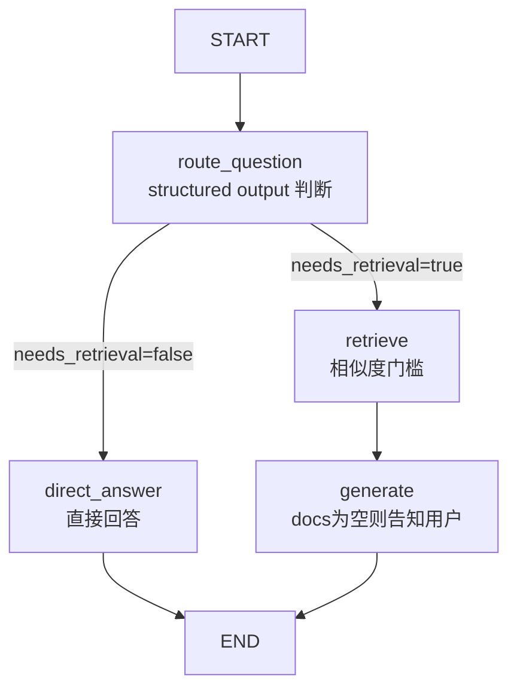
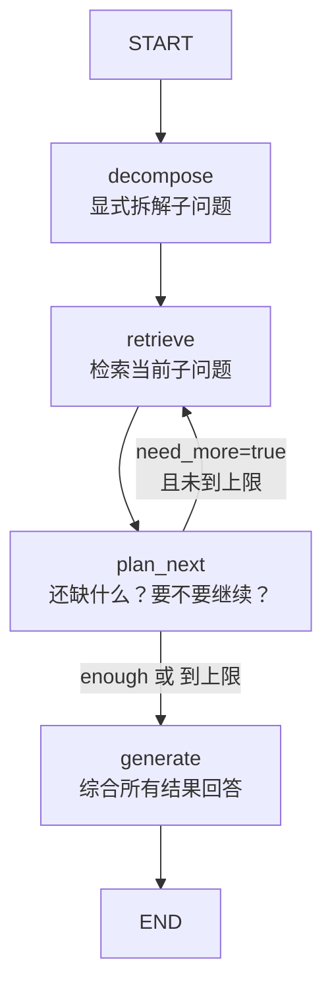

# Agent 怎么带着工具去检索知识？从简单 RAG 到 Agentic RAG

## 你做的 RAG 真的用对了吗？

上节我们聊了怎么让 Agent 记住多轮对话，这次来看一个更常见的问题：知识库问答。

你做了一个 RAG 管线：用户提问 → 向量检索 → 把检索结果塞进 prompt → 大模型回答。用起来挺顺，直到你发现了一个细节——

用户问 "1+1 等于几"，你的 RAG 也去向量库里搜了一圈，然后才回答。搜出来的文档跟问题毫无关系，白白浪费了一次 Embedding 调用和一轮检索。

这就是简单 RAG 的盲扫：**不管需不需要，先检索再说**。Agentic RAG 要解决的就是这个：让 Agent 自己判断要不要检索、检索什么、什么时候停。

代码仓库：[github.com/huzhiwu1/ai-agent-code-examples](https://github.com/huzhiwu1/ai-agent-code-examples)，articles/agentic-rag 目录。clone 下来跑一遍就能看到每一步的真实输出。

## Step 1：先看最简单 RAG 长什么样

一个最简 RAG 管线只需要两个节点：retrieve 和 generate。先准备好 LLM、Embedding、文档和向量库：

```typescript
import { ChatOpenAI, OpenAIEmbeddings } from "@langchain/openai";
import { Document } from "@langchain/core/documents";
import { MemoryVectorStore } from "@langchain/classic/vectorstores/memory";

const llm = new ChatOpenAI({ temperature: 0, model: "deepseek-chat" });
const embeddings = new OpenAIEmbeddings({ model: "text-embedding-v3" });

const documents = [
  new Document({ pageContent: "光光是一个活泼开朗的小男孩...", metadata: { chapter: 1 } }),
  new Document({ pageContent: "东东是光光最好的朋友...", metadata: { chapter: 2 } }),
  // ... 共 6 条故事片段
];

const vectorStore = await MemoryVectorStore.fromDocuments(documents, embeddings);
const retriever = vectorStore.asRetriever({ k: 3 });
```

然后用 LangGraph 的 StateGraph 来搭：

```typescript
import { Annotation, StateGraph, START, END } from "@langchain/langgraph";
import { MemoryVectorStore } from "@langchain/classic/vectorstores/memory";

const GraphState = Annotation.Root({
  question: Annotation&lt;string&gt;(),
  documents: Annotation&lt;string[]&gt;(),
  answer: Annotation&lt;string&gt;(),
});

const retrieve = async (state) =&gt; {
  const docs = await retriever.invoke(state.question);
  return { documents: docs.map((d) =&gt; d.pageContent) };
};

const generate = async (state) =&gt; {
  const context = state.documents.map((c, i) =&gt; `[${i + 1}] ${c}`).join("\n");
  const resp = await llm.invoke(`基于以下片段回答问题...\n${context}\n问题：${state.question}`);
  return { answer: resp.content };
};

const graph = new StateGraph(GraphState)
  .addNode("retrieve", retrieve)
  .addNode("generate", generate)
  .addEdge(START, "retrieve")
  .addEdge("retrieve", "generate")
  .addEdge("generate", END)
  .compile();
```

这个图只有一条路径：START → retrieve → generate → END。跑一下看看：

```text
问题1: "光光最好的朋友是谁？"
  [检索] 命中 3 条文档
  [生成] 东东...
  📌 最终回答: 东东

问题2: "1+1 等于几？"
  [检索] 命中 3 条文档      ← 看到了吗？没必要检索也搜了！
  [生成] 故事里没提到。
  📌 最终回答: 故事里没提到。
  ⚠️ 问题2 不需要检索知识库，但简单 RAG 仍然检索了——这是浪费。
```

问 "1+1 等于几" 也检索了 3 条文档，返回的都是跟问题无关的故事片段。一次 Embedding 调用 + 一轮 LLM 推理，全浪费了。

## Step 2：把检索变成 Agent 的一个工具

Agentic RAG 的核心思路很简单：**检索不再是管线里的固定步骤，而是 Agent 可以自己决定调不调用的一个工具**。

我们改一下。首先，Step 1 的 vectorStore 这里换一种用法——不再用 `asRetriever`，而是直接用 `similaritySearch`，因为检索结果要作为 tool 的返回值：

```typescript
// 沿用 Step 1 的 llm / embeddings / documents，但换一种方式用 vectorStore：
const vectorStore = await MemoryVectorStore.fromDocuments(documents, embeddings);
// 不再调 asRetriever()，而是直接 similaritySearch —— 检索结果作为 tool 的返回值
```

然后把 retrieve 从固定节点变成 tool，让 LLM 用 Function Calling 来决定要不要搜：

```typescript
import { tool } from "@langchain/core/tools";
import { z } from "zod";
import { ToolNode } from "@langchain/langgraph/prebuilt";

const retrieveTool = tool(
  async ({ query }: { query: string }) =&gt; {
    const docs = await vectorStore.similaritySearch(query, 3);
    return docs.map((d, i) =&gt; `[${i + 1}] ${d.pageContent}`).join("\n");
  },
  {
    name: "search_knowledge_base",
    description: "搜索故事知识库。当你需要回答关于故事内容的问题时调用此工具。",
    schema: z.object({ query: z.string().describe("检索查询语句") }),
  }
);

// 沿用 Step 1 的 llm，绑定检索工具
const llmWithTools = llm.bindTools([retrieveTool]);

// callModel：agent 推理节点，调用绑了工具的 LLM
const callModel = async (state) =&gt; {
  const response = await llmWithTools.invoke(state.messages);
  return { messages: [response] };
};

// routeTools：agent 返回了 tool_calls 就去执行工具，否则结束
const routeTools = (state) =&gt; {
  const lastMsg = state.messages[state.messages.length - 1];
  const toolCalls = lastMsg.tool_calls ?? [];
  return toolCalls.length &gt; 0 ? "tools" : END;
};
```

关键变化：

- **简单 RAG**：START → retrieve → generate → END，每条路径都走检索
- **Agentic RAG**：START → agent（LLM 判断）→ 要么调 tool 检索，要么直接 END

整个 Agent 循环用 LangGraph 的 MessagesAnnotation + ToolNode 就能搭：

```typescript
const graph = new StateGraph(MessagesAnnotation)
  .addNode("agent", callModel)
  .addNode("tools", new ToolNode([retrieveTool]))
  .addEdge(START, "agent")
  .addConditionalEdges("agent", routeTools)
  .addEdge("tools", "agent")
  .compile();
```

跑一下看看效果：

```text
问题1: "光光最好的朋友是谁？"
  [检索工具] 查询 "光光最好的朋友" → 命中 3 条
  📌 回答: 根据故事知识库的信息，**光光最好的朋友是东东**。
  东东是一个安静而聪明的小男孩，喜欢读书和画画。他们从幼儿园就认识了...

问题2: "1+1 等于几？"
  📌 回答: 1+1 等于 **2**。
  ✅ 问题2 agent 没有调用检索工具，直接回答——节省了一轮检索。
```

问 "1+1 等于几" 时，Agent 看到 tool 的描述是"搜索故事知识库"，判断这是数学题不需要调，直接回答。省了一轮检索——这就是 Agentic RAG 和简单 RAG 的核心差异。

## Step 3：复杂问题要多跳检索怎么办？

上面的例子只处理了"要不要检索"的二元决策。现实中的复杂问题往往需要多步检索：

"光光最好的朋友是谁？他后来成为了什么？他们之间发生了什么故事？"

这个问题**隐含了三层信息需求**：

1. 光光的朋友是谁？→ 东东
2. 东东后来成为了什么？→ 插画师
3. 他们之间发生了什么故事？→ 一起踢球、友谊加深

简单 RAG 用整句去检索，可能只命中第一层。Agentic RAG 的做法是：**Agent 自己拆解问题，分多次调用检索工具，每次只查一个子问题，最后综合所有结果回答**。

不需要额外写拆解逻辑——LLM 在 ReAct 循环里自然会：调用一次 search_knowledge_base → 拿到结果 → 发现还不够 → 再调用一次 → 够了 → 回答。这就是 LangGraph 的 agent → tools → agent 循环自带的特性。

Step 3 几乎完全复用 Step 2 的代码：**沿用 Step 2 的 llmWithTools 和 vectorStore，图结构不变**，只改两个地方——给 agent 加一个 system prompt 引导它分步检索，topK 从 3 提到 4（多跳检索每次多拿一点）：

```typescript
// 沿用 Step 2 的 llmWithTools / vectorStore / retrieveTool / routeTools / graph 结构
// 只改 callModel：加一个 system prompt 引导 agent 分步检索
const systemMsg = {
  role: "system",
  content: "你是故事问答助手。对于复杂问题，用 search_knowledge_base 分步检索，" +
    "每次查一个子问题，然后综合所有检索结果回答。",
};

const callModel = async (state) =&gt; {
  const response = await llmWithTools.invoke([systemMsg, ...state.messages]);
  return { messages: [response] };
};

// 图结构、routeTools 和 Step 2 完全一样，topK 改成 4
const graph = new StateGraph(MessagesAnnotation)
  .addNode("agent", callModel)
  .addNode("tools", new ToolNode([retrieveTool]))
  .addEdge(START, "agent")
  .addConditionalEdges("agent", routeTools)
  .addEdge("tools", "agent")
  .compile();
```

真实运行结果——Agent 自动调了 3 次工具：

```text
问题: "光光最好的朋友是谁？他后来成为了什么？他们之间发生了什么故事？"
  [检索工具] 查询 "光光最好的朋友是谁" → 命中 4 条
  [检索工具] 查询 "光光的朋友后来成为了什么" → 命中 4 条
  [检索工具] 查询 "光光和他朋友之间的故事" → 命中 4 条

  📌 最终回答:
  光光最好的朋友是**东东**。东东安静而聪明，喜欢读书和画画。
  后来光光成为了**职业足球运动员**，东东成为了**插画师**。
  他们之间的故事：从幼儿园就认识，一起参加足球比赛，多年后东东还为光光设计了球衣图案。
```

Agent 自动拆解了问题，分三次检索，最后综合所有结果给出了完整回答。

## Step 4：Step 2 的漏洞 —— Agent 判断不准怎么办？

Step 2 跑得挺顺，但有个隐患：**Agent 要不要检索，完全依赖 tool description 和 LLM 当时的状态**。description 写得太宽泛，Agent 可能乱检索；写得太窄，该检索的时候不检索。而且 LLM 的判断本身不稳定——同一个问题，不同温度、不同模型，结果可能不同。

解决思路两个：**A) 路由前置**——在 Agent 循环之前加一个专门的分类节点，用 structured output 做确定性判断；**B) 相似度门槛**——检索后检查结果质量，低质量直接丢弃。

Step 4 回到 Step 1 的 StateGraph 模式（不用 MessagesAnnotation 的 agent 循环了），**沿用 Step 1 的 llm 和 vectorStore**，但 vectorStore 的用法变了——需要 `similaritySearchWithScore` 拿相似度分数，而且不是用 `asRetriever` 中转：

### B) 相似度门槛：检索了不一定有用

即使路由判断"需要检索"，检索结果也可能跟问题无关。比如用户问"王五是谁？"，路由判断需要检索，但知识库里没有王五——返回的文档相似度极低。

在检索节点里加一个相似度门槛：用 \`similaritySearchWithScore\` 拿到分数，低于阈值就丢弃结果，直接告知用户：

```typescript
const SIMILARITY_THRESHOLD = 0.5;

const retrieve = async (state) =&gt; {
  const results = await vectorStore.similaritySearchWithScore(state.question, 3);
  // similaritySearchWithScore 返回的是余弦相似度（0~1），越大越相似
  const topScore = results[0][1];

  if (topScore &lt; SIMILARITY_THRESHOLD) {
    console.log(`⚠️ 最高相似度 ${topScore.toFixed(4)} &lt; 阈值，检索结果不可靠`);
    return { documents: [], top_score: topScore };
  }
  return { documents: results.map(([doc]) =&gt; doc.pageContent) };
};

// 生成节点兜底：documents 为空 → 直接告知用户
const generate = async (state) =&gt; {
  if (!state.documents || state.documents.length === 0) {
    return { answer: `知识库中没有找到与"${state.question}"相关的内容。` };
  }
  // ... 正常 RAG 生成
};
```

路由前置 + 相似度门槛，两张网兜底：路由拦截"不该检索的问题"，阈值拦截"检索了也没用的结果"。跑一下：

```text
问题1: "光光最好的朋友是谁？"
  [路由] needs_retrieval=true (涉及故事人物关系，需要检索)
  [检索] 命中 3 条，最高相似度: 0.7961
  [生成] 东东...
  📌 最终回答: 东东

问题2: "1+1 等于几？"
  [路由] needs_retrieval=false (数学计算，不涉及故事内容)
  [直接回答] 跳过检索
  [直接回答] 1+1 = 2。...
  📌 最终回答: 1+1 = 2。

问题3: "王五是谁？"
  [路由] needs_retrieval=true (涉及人物身份信息)
  [检索] 命中 3 条，最高相似度: 0.3619
  ⚠️ 最高相似度 0.3619 &lt; 阈值 0.5，检索结果不可靠
  [生成] 检索结果为空或不相关，告知用户
  📌 最终回答: 知识库中没有找到与"王五是谁？"相关的内容。

✅ 路由前置+相似度门槛双重保障，Agent 不再误判。
```

对比 Step 2：Step 2 问"王五是谁"会检索到不相关的故事片段，然后 LLM 只能说"故事里没提到"。Step 4 在检索阶段就拦截了——相似度不够，直接告知，不浪费 LLM 生成。

Step 4 的图结构也比 Step 2 更丰富：



```
style A fill:#52c41a,color:#fff
style F fill:#faad14,color:#fff
style B fill:#1890ff,color:#fff
style C fill:#722ed1,color:#fff
style D fill:#13c2c2,color:#fff
style E fill:#eb2f96,color:#fff
```

</whiteboard>

## Step 5：Step 3 的漏洞 —— 多跳检索靠"感觉"不靠谱

Step 3 的多跳检索依赖 ReAct 循环的隐式行为：LLM 拿到结果后"觉得还不够"就再调一次，"觉得够了"就停止。这个"觉得"有三个风险：

- **不自知**：用整句检索"光光的朋友后来成为了什么"，但不知道"光光的朋友"是"东东"，检索质量差
- **提前终止**：搜了一轮觉得够了，但实际上还缺关键信息
- **过度检索**：搜了 5 轮还在搜，token 烧飞了

解决思路三个：**A) 显式拆解**——在检索之前用 structured output 把问题拆成子问题列表；**B) plan_next 自检**——每轮检索后显式判断"还缺什么？要不要继续？"；**C) 硬上限**——maxRetrievals 防止无限循环。

**沿用 Step 1 的 llm**（复用 withStructuredOutput）和 Step 4 的 **vectorStore + similaritySearchWithScore**（需要分数做去重合并）。

### A) 显式拆解：把问题拆成有序的子问题列表

在检索之前加一个 decompose 节点，用 structured output 强制 LLM 输出子问题列表。每条子问题独立可检索，不使用指代：

```typescript
const DecomposeSchema = z.object({
  sub_questions: z.array(z.string()).min(1).max(6),
  reason: z.string(),
});

const decompose = async (state) =&gt; {
  const decomposer = llm.withStructuredOutput(DecomposeSchema, { method: "functionCalling" });
  const result = await decomposer.invoke(
    `将用户问题拆解为有序的子问题列表，每个子问题独立可检索。
规则：链式推理必须拆成多条；每条用完整中文问句，禁止"他/她/此人"等指代。

用户问题：${state.question}`
  );
  return { sub_questions: result.sub_questions, current_sub_idx: 0 };
};
```

拆解输出示例："光光最好的朋友是谁？他后来成为了什么？"→ 拆成 3 条子问题："光光是谁？光光最好的朋友是谁？"、"光光最好的朋友后来成为了什么？"、"光光和他最好的朋友之间发生了什么故事？"。注意第一条包含了"光光是谁"作为前置事实——拆解时 LLM 会先推理出需要先知道人物身份，再用它构造后续查询语句。

### B) plan_next 自检：显式判断要不要继续

每轮检索后，加一个 plan_next 节点，用 structured output 输出 `need_more: boolean`：

```typescript
const PlanNextSchema = z.object({
  need_more: z.boolean(),
  reason: z.string(),
});

const planNext = async (state) =&gt; {
  const planner = llm.withStructuredOutput(PlanNextSchema, { method: "functionCalling" });
  const result = await planner.invoke(
    `已检索 ${state.retrieval_count} 轮，剩余 ${remaining} 条子问题。
已召回文档：${state.documents.slice(0, 5).join("\n")}
判断：已有足够依据回答用户问题吗？`
  );
  return result.need_more ? {} : { /* 强制进入生成 */ };
};
```

plan_next 不是让 LLM 在 ReAct 循环里"感觉够了"，而是显式地问"还缺什么？"。而且 plan_next 有**硬边界**：剩余子问题数为 0 时直接跳过，不浪费一次 LLM 调用。

### C) 硬上限：maxRetrievals 防止无限循环

```typescript
const afterPlan = (state) =&gt; {
  if (state.current_sub_idx &gt;= state.sub_questions.length) return "generate";
  if (state.retrieval_count &gt;= state.max_retrievals) return "generate"; // 硬上限
  return "retrieve";
};
```

真实运行结果——显式拆解 3 条子问题，每轮 plan_next 自检：

```text
[拆解] 3 条子问题:
  1. 光光是谁？光光最好的朋友是谁？
  2. 光光最好的朋友后来成为了什么？
  3. 光光和他最好的朋友之间发生了什么故事？

[检索 1/6] 子问题 1/3: "光光是谁？光光最好的朋友是谁？"
  命中 3 条
[plan_next] need_more=false (已有足够依据回答，无需继续检索)

[检索 2/6] 子问题 2/3: "光光最好的朋友后来成为了什么？"
  命中 3 条
[plan_next] need_more=false (文档已充分覆盖)

[检索 3/6] 子问题 3/3: "光光和他最好的朋友之间发生了什么故事？"
  命中 3 条
[plan_next] 所有子问题已检索完毕 (3/3)，进入生成

[生成] 综合 3 轮检索结果 (9 条去重文档)

📌 最终回答: 光光最好的朋友是**东东**。东东后来成为了一名**插画师**。
他们从幼儿园就认识，光光后来成为职业足球运动员，东东为光光设计了球衣图案。

✅ 显式拆解 + plan_next 自检 + 硬上限，多跳不失控。
```

注意：plan_next 在第 1 轮就判断"已有足够依据"，但系统仍然检索完了全部 3 条子问题——因为 afterPlan 检查"剩余子问题数 > 0"就继续检索。这是有意为之：plan_next 的判断是咨询性的，**最终决策权在硬边界（子问题列表 + 硬上限）**。plan_next 的价值在于：如果 LLM 真的提前判断够了，它会记录理由，方便你审查和调试。

完整图结构：



```
style A fill:#52c41a,color:#fff
style F fill:#faad14,color:#fff
style B fill:#1890ff,color:#fff
style C fill:#722ed1,color:#fff
style D fill:#13c2c2,color:#fff
style E fill:#eb2f96,color:#fff
```

</whiteboard>

## 五步全景：从盲扫到可控

回顾这五步的演进，每一步解决了上一层的什么问题：

- **Step 1**：能检索，但不管需不需要都检索（盲扫）
- **Step 2**：Agent 自己判断要不要检索（但判断不稳定）
- **Step 3**：复杂问题多跳检索（但拆解靠 ReAct 隐式行为）
- **Step 4**：路由前置 + 相似度门槛，让"要不要检索"的决策**显式化、可审查**
- **Step 5**：显式拆解 + plan_next 自检 + 硬上限，让"怎么检索"的过程**结构化、不失控**

核心思路只有一个：**把 LLM 的隐式判断变成显式的、可审查的决策点**。路由用 structured output 而不是 tool_calls，拆解用 structured output 而不是 ReAct 循环的"感觉"，每步检索后用 plan_next 显式确认而不是"觉得够了"。每多一个显式决策点，Agent 的可控性就进一层。

## 生产化细节：代码里还有几个值得注意的模式

上面五步讲的是概念和架构，但代码里还藏了几个生产化的细节，值得单独提出来：

### 共享向量库：五步只用一次 Embedding

五个 Step 共用同一个 MemoryVectorStore 实例，通过 `getVectorStore()` 惰性初始化：

```typescript
let sharedVectorStore = null;

async function getVectorStore() {
  if (!sharedVectorStore) {
    sharedVectorStore = await MemoryVectorStore.fromDocuments(documents, embeddings, {
      similarity: cosineSimilarity, // 用余弦相似度替代默认的 L2 距离
    });
  }
  return sharedVectorStore;
}
```

五个 Step 都调用同一个实例，文档只做一次向量化，后面四次复用。如果每个 Step 独立构建，文档会被重复 embedding 5 次，6 条文档还好，但生产环境成千上万条文档时就差远了。

### 余弦相似度：为什么不用默认的 L2 距离？

MemoryVectorStore 默认用 L2 距离，值越小越相似。L2 距离对向量长度敏感，同一个查询对不同文档库的 L2 距离不具可比性——你没法设一个统一的阈值。

余弦相似度（值域 [0,1]，越大越相似）对向量长度不敏感，更适合作为跨查询可比的相似度门槛。Step 4 的阈值 0.5 就是基于余弦相似度设的：

```typescript
function cosineSimilarity(a: number[], b: number[]): number {
  let dot = 0, normA = 0, normB = 0;
  for (let i = 0; i &lt; a.length; i++) {
    dot += a[i] * b[i];
    normA += a[i] * a[i];
    normB += b[i] * b[i];
  }
  return dot / (Math.sqrt(normA) * Math.sqrt(normB));
}
```

如果你用 L2 距离，阈值需要根据文档库大小和 embedding 维度动态调整，很麻烦。余弦相似度一个 0.5 的阈值可以直接跨库使用。

### buildAgentGraph：Step 2 和 Step 3 共享同一个图构建器

Step 2（基础 Agentic RAG）和 Step 3（多跳 Agentic RAG）的图结构完全相同——都是 agent → tools → agent 循环。区别只在于 Step 3 多传了一个 system prompt：

```typescript
function buildAgentGraph(vectorStore, topK, systemPrompt?) {
  const retrieveTool = tool(/* ... */);
  const llmWithTools = llm.bindTools([retrieveTool]);
  const callModel = async (state) =&gt; {
    const messages = systemPrompt
      ? [{ role: "system", content: systemPrompt }, ...state.messages]
      : state.messages;
    const response = await llmWithTools.invoke(messages);
    return { messages: [response] };
  };

  return new StateGraph(MessagesAnnotation)
    .addNode("agent", callModel)
    .addNode("tools", new ToolNode([retrieveTool]))
    .addEdge(START, "agent")
    .addConditionalEdges("agent", routeAfterAgent)
    .addEdge("tools", "agent")
    .compile();
}

// Step 2：无 system prompt，agent 自行判断
const graph2 = buildAgentGraph(store, 3);

// Step 3：带 system prompt，引导 agent 分步检索
const graph3 = buildAgentGraph(store, 4, "你是故事问答助手...");
```

这个模式很实用：**图结构不变，只变 prompt 和参数**。以后要加新的检索策略，不用重写图，只改 system prompt 和 topK 就行。

## 总结

简单 RAG 的盲扫问题是：不管需不需要，先检索再说。Agentic RAG 把检索从固定步骤变成 agent 的一个工具，让 LLM 自己决定要不要搜、搜什么、搜几轮。

生产级 Agentic RAG 需要两道防线：路由前置（structured output 判断要不要检索）+ 相似度门槛（检索结果质量兜底）。多跳检索需要显式拆解（子问题列表）+ plan_next 自检（每轮确认是否继续）+ 硬上限（防止无限循环）。

最小实现只需要三步：把 vectorStore 的检索包装成 tool → 用 bindTools 绑定到 LLM → 用 LangGraph 的 ToolNode 搭 agent → tools → agent 循环。复杂问题多跳检索不需要额外写拆解逻辑，Agent 在 ReAct 循环里自然会分步调用工具。

生产环境要注意：检索工具的描述（description）要写清楚什么情况下该用，这是 Agent 判断"要不要检索"的唯一依据。路由前置和相似度门槛是两道防线，前者拦截不该检索的问题，后者拦截检索了也没用的结果。

## 面试考点

**1. 简单 RAG 和 Agentic RAG 的核心区别是什么？** [题库 A：工具调用篇 Q5]

简单 RAG 的检索是管线里的固定步骤，每条问题都走 retrieve → generate。Agentic RAG 把检索变成 agent 的一个 tool，LLM 通过 Function Calling 自己决定要不要检索、检索什么、检索几轮。本质区别是谁在决策——管线是预定义的，Agent 是自主决策的。

**2. 多跳检索（Multi-hop Retrieval）的 Agent 是怎么"知道"还要再搜一轮的？** [题库 A：工具调用篇 Q12]

Agent 的核心机制是 ReAct 循环：LLM 推理 → 调工具拿结果 → 看到结果后再次推理。如果拿到结果后发现信息还不够回答原问题，LLM 会自己决定再调一次工具（换一个查询语句）。这个过程不需要额外编码，Agent 循环本身就会迭代直到 LLM 认为够了。

**3. 你项目里 Agentic RAG 遇到过什么坑？** [项目经验]

检索工具的描述（description）没写好，Agent 在问"1+1 等于几"时也调了检索——因为描述是"搜索知识库"，Agent 觉得任何问题都可以搜。修正：把描述改成"搜索故事知识库，获取故事人物的信息和情节"，明确限定知识域，Agent 就知道非故事类问题不调这个工具。

**4. 怎么防止 Agentic RAG 在多跳检索时陷入无限循环？** [作者归纳]

三个机制：显式拆解（decompose 节点输出子问题列表，每个子问题检索一次，不会无限循环）；plan_next 自检（每轮检索后显式判断是否继续，用 structured output 而不是 LLM 的"感觉"）；硬上限（maxRetrievals 强制停止）。三者组合，多跳检索不失控。

## 相关资料

- [LangGraph JS Quickstart —— 包含 tool-calling Agent 的完整示例](https://langchain-ai.github.io/langgraphjs/tutorials/quickstart/)
- [LangChain Agents 文档 —— createAgent 和 tool 的用法](https://docs.langchain.com/oss/javascript/langchain/agents)
- [LangGraph Agentic Concepts —— Agent 架构模式概览](https://langchain-ai.github.io/langgraphjs/concepts/agentic_concepts/)
- [LangChain 文档索引 —— 完整文档导航](https://docs.langchain.com/llms.txt)

## 参考来源

- LangGraph JS Quickstart：https://langchain-ai.github.io/langgraphjs/tutorials/quickstart/（tool-calling Agent 示例）
- LangChain Agents 文档：https://docs.langchain.com/oss/javascript/langchain/agents（createAgent、tool 定义）
- LangGraph Agentic Concepts：https://langchain-ai.github.io/langgraphjs/concepts/agentic_concepts/（Agent 架构模式）
- 神光课程代码：rag-test/hello-rag.mjs（简单 RAG）、advanced-rag/rag-multihop.mjs（多跳 RAG）
