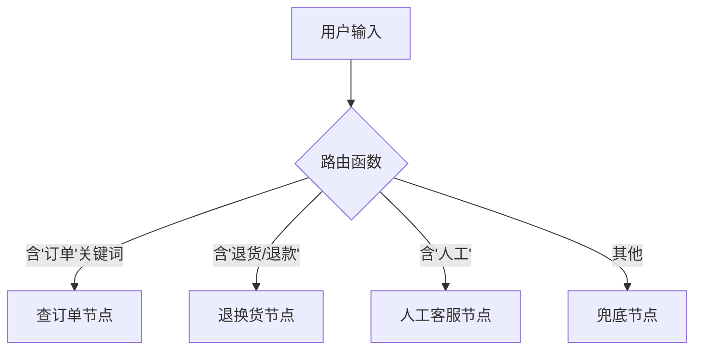

# 全栈 AI Agent 工程师 · 08-15 · 条件路由：让执行路径由状态决定，而不是写死

上节我们学了 StateGraph 怎么把节点连起来，但所有边都是固定的——A 走完一定去 B，不管输入是什么。真实场景里，用户输入不同，执行路径也应该不同：查订单走一条路，退货走另一条路，搞不定的走人工。这就是条件路由要解决的问题。

还有一个更隐蔽的需求：终止条件。图里如果有一个循环（比如 ReAct 的"思考→调工具→再思考"），没有条件边来终止它，图就会一直跑下去——直到撞上框架的 recursionLimit 强行报错，或者更糟，线上无限循环烧 token。

## 先看没有终止条件会怎样

写一个最简单的图：只有一个 classify 节点，条件边永远返回自己——没有任何出口分支指向 END：

```typescript
const graph = new StateGraph(State)
  .addNode("classify", async (state) => ({
    log: [`进入 classify`],
  }))
  // 路由函数永远返回 "loop"，条件边把 classify 指向自己
  // 没有任何分支指向 END —— 图永远跑不完
  .addConditionalEdges("classify", () => "loop", { loop: "classify" })
  .addEdge(START, "classify")
  .compile();

try {
  await graph.invoke({}, { recursionLimit: 8 });
} catch (err) {
  // GraphRecursionError: recursionLimit(8) 强制终止了死循环
}
```

```bash
复现成功：recursionLimit(8) 强制终止了死循环
→ 路由函数永远返回自己，没有出口分支
```

recursionLimit 是 LangGraph 的安全网——最多迭代 N 步就强制终止，防止无限循环吃光 token。但它不是设计，是兜底。正确的做法是路由函数返回 END，让循环自己停下来。

## 从规则路由开始：关键词分叉

最简单的路由是正则匹配：含"退货"走退货节点，含"查订单"走查订单节点，都不匹配走兜底。先写一个纯函数路由器：

```typescript
function ruleRouter(input: string): string {
  const t = input.toLowerCase();
  if (/退|换|退款|退货/.test(t)) return "return";
  if (/查.*订单|订单.*查|物流|到哪/.test(t)) return "order";
  if (/人工|转人工|客服|投诉/.test(t)) return "human";
  return "fallback"; // 所有规则都没命中，走兜底
}
```

然后把这个路由器挂到条件边上。addConditionalEdges 的三个参数：源节点、路由函数（读 state 返回分支名）、分支名到目标节点的映射表：

```typescript
.addConditionalEdges(
  "classify",                     // 源节点
  (state) => state.category,      // 路由函数：读 state 返回分支名
  {                               // 分支名 → 目标节点
    order: "handle_order",
    return: "handle_return",
    human: "human_agent",
    fallback: "fallback",
  },
)
```

跑四个不同输入，看路由效果：

```bash
"我要查订单 ORD-001 到哪了" → 分类: order → [查订单] 返回订单状态
"这件衣服不合适，想退货退款" → 分类: return → [退换货] 生成退货单
"转人工客服投诉配送太慢"   → 分类: human → [人工] 创建工单
"今天天气怎么样"           → 分类: fallback → [兜底] 无法识别
```

四个输入，四条不同的执行路径——同一个图，不需要 if/else 大段代码。路由函数是纯函数，只读不写，这个设计很重要：如果路由函数里偷偷调了 API 或写了数据库，状态重放时就会重复执行副作用。

## 核心原理：条件边是怎么跑的

LangGraph 执行到条件边时，会调路由函数、读返回值、查映射表、走对应节点。如果返回值不在映射表里，框架直接报错——不会静默走默认分支。

在 ReAct 循环里，终止条件就是条件边：路由函数检查 state 里还有没有待执行的 tool_calls，有就继续走工具节点，没有就返回 END。加上迭代计数，就是完整的循环控制：



## ReAct 循环怎么停下来

没有终止条件的循环是死循环，有终止条件的就是可控循环。在 state 里加一个 step 计数器，每次进 agent 节点 +1，达到上限就走 end：

```typescript
const MAX_ITERATIONS = 3;

.addConditionalEdges(
  "agent",
  (state) => (state.steps < MAX_ITERATIONS ? "continue" : "end"),
  { continue: "agent", end: END },
)
```

```bash
[第1步] 还要调工具 → [第2步] 还要调工具 → [第3步] 回答完成
总步数: 3, 最大迭代: 3
```

三重防护是生产底线：① state 内迭代计数 ② 计数达上限强制走 END ③ 图级 recursionLimit 兜底。缺一不可。

## 规则路由 vs LLM 路由：什么时候该让模型来判断

规则路由快、省、可解释，但关键词覆盖不到的情况会误判。比如"订单显示已签收但实际没收到"——规则匹配不到任何关键词，走 fallback；但 LLM 能理解这是一个订单问题：

```bash
"订单显示已签收但实际没收到" → 规则:fallback | LLM:order
"退单后多久能收到钱"       → 规则:return | LLM:return
```

第一句规则没命中（fallback），LLM 正确识别为 order 问题。第二句规则匹配了"退"字判为 return，但其实是个退款时效查询——LLM 也判了 return，说明规则和 LLM 对这类边界句子的判断可能不同。

生产推荐的做法是"规则先兜底，LLM 处理模糊输入"：规则能覆盖的走快路径，走到 fallback 的再交给 LLM 分类。这样大部分请求零成本路由，只有边界句子才走模型。

## 对比：三种路由方式

| 方案          | 优点                       | 代价                       | 适用                           |
| ------------- | -------------------------- | -------------------------- | ------------------------------ |
| 固定边（A→B） | 最简单，不需要任何判断     | 不响应不同输入             | 固定步骤的工作流               |
| 规则路由      | 快、零成本、可解释         | 边界外的句子误判           | 关键词明确的分流               |
| LLM 路由      | 语义理解强，模糊输入也能分 | 有延迟、有费用、有不确定性 | 意图模糊、规则兜底后的二轮判断 |

## 总结

条件路由的本质是让执行路径由状态决定，而不是写死在代码里。addConditionalEdges 三个参数：源节点、路由函数（读 state 返回分支名）、映射表（分支名指向目标节点）。路由函数必须是纯函数，只读不写，副作用放节点里。

没有终止条件的循环是危险的。生产环境必须三重防护：state 内迭代计数、上限强制走 END、图级 recursionLimit 兜底。不是"可以加"，是"必须加"。

规则路由和 LLM 路由不互斥。规则快省可解释，LLM 语义强但贵——生产环境用规则先兜底，走到 fallback 的句子再交给 LLM 判断，这是成本和质量的最优平衡。

## 面试考点

- **addConditionalEdges 三个参数是什么？** 源节点、路由函数（读 state 返回分支名）、分支名到目标节点的映射表。路由函数返回的 key 不在映射表里会直接报错。
- **ReAct 循环怎么防死循环？** 三重防护：state 内迭代计数 → 上限强制走 END → 图级 recursionLimit 兜底。缺一不可。
- **规则路由和 LLM 路由怎么选？** 不互斥。规则先兜底大部分请求（零成本），走到 fallback 的交给 LLM。路由函数必须纯函数，副作用放节点里。
- **路由函数里能调外部 API 吗？** 不能。路由函数会被框架多次调用（状态重放），如果里面有副作用就会重复执行。副作用必须放在节点里。

## 参考来源

- [LangGraph JS：Branching（条件边）](https://langchain-ai.github.io/langgraphjs/how-tos/branching/)
- [LangGraph JS：Edges（普通边与条件边）](https://langchain-ai.github.io/langgraphjs/concepts/low_level/#edges)
