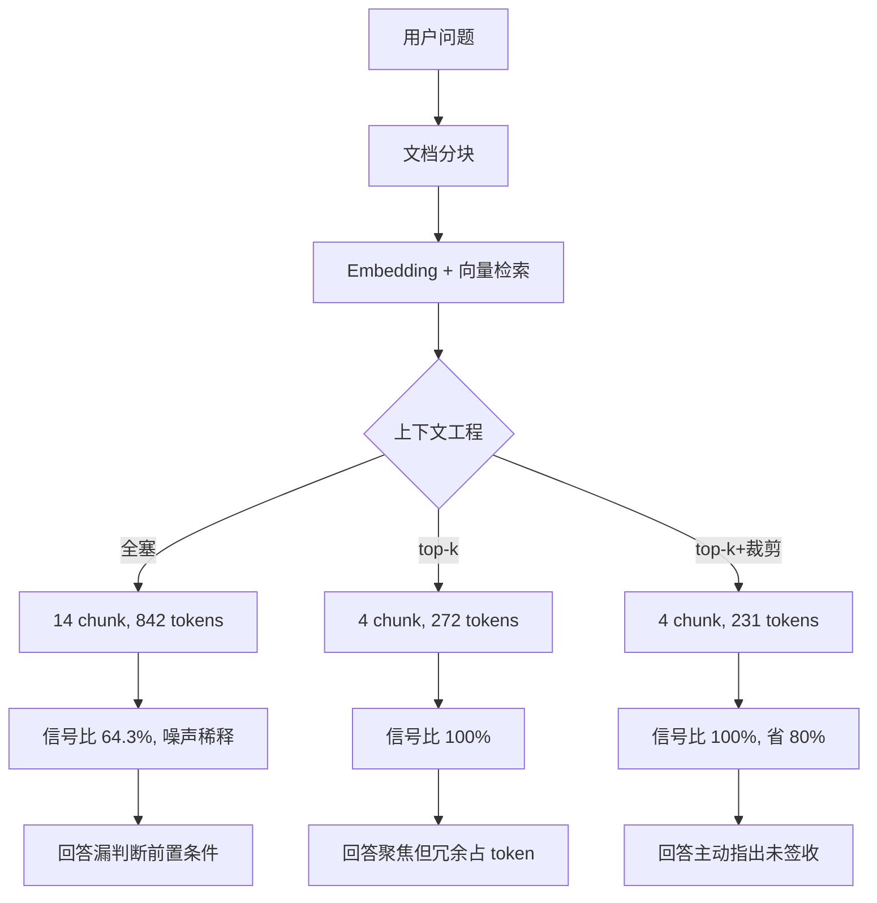

# 全栈 AI Agent 工程师 · 08-15 · 上下文工程：模型窗口有限，放进去什么比提示词怎么写更重要

你写过这样的 RAG 应用吗：检索返回 14 段文档片段，你全塞进上下文，模型回答却跑偏了——把会员积分规则当成退货政策来答。不是模型笨，是上下文被污染了：信息量太大，模型找不到重点。

Anthropic 2025 年的工程博客把这个现象叫 **context rot（上下文腐烂）**：token 越多，模型从上下文中准确召回信息的能力越差。重要原因之一是 Transformer 架构下注意力预算被摊薄——每个 token 要和窗口里所有其他 token 建立关系，token 一多注意力就分散。所以上下文不是越大越好，它是有限资源。这篇文章用真实 RAG 管道演示：同一批检索结果，三种组装策略，效果差多少。

## 完整的可运行示例：从文档到三种策略

先建一个自包含的最小 RAG 管道。10 篇电商知识库文档，分块后向量检索，再分别用三种策略组装上下文。代码在 `~/workspace/ai-agent-code-lab/articles/context-eng/`（monorepo 里独立包，`npm run run:context-eng` 直接跑）：

```typescript
import dotenv from "dotenv";
import path from "path";
dotenv.config({ path: path.resolve(__dirname, "../../../.env") });
import { RecursiveCharacterTextSplitter } from "@langchain/textsplitters";
import { MemoryVectorStore } from "@langchain/classic/vectorstores/memory";
import { OpenAIEmbeddings } from "@langchain/openai";
import { Document } from "@langchain/core/documents";
import { SystemMessage, HumanMessage } from "@langchain/core/messages";
import { ChatOpenAI } from "@langchain/openai";

// 生产级 Embedding：阿里云 DashScope（OpenAI 兼容端点）
// key 配置：仓库根 .env 的 EMBEDDING_API_KEY / EMBEDDING_BASE_URL / EMBEDDING_MODEL
const embeddings = new OpenAIEmbeddings({
  apiKey: process.env.EMBEDDING_API_KEY ?? process.env.API_KEY,
  model: process.env.EMBEDDING_MODEL ?? "text-embedding-v3",
  batchSize: 10, // DashScope 单批上限 10 条
  configuration: {
    baseURL: process.env.EMBEDDING_BASE_URL ?? "https://dashscope.aliyuncs.com/compatible-mode/v1",
  },
});

// 10 篇知识库文档：退货政策、退款规则、订单查询、会员积分、支付、客服、优惠券、账号安全、配送、售后
const KNOWLEDGE_BASE = [
  `退货政策 3.0（2026-08-01 修订）\n退货期限：签收后 7 天内支持无理由退货，商品需保持完好。\n退货流程：订单详情页 → 申请售后 → 选择退货退款 → 提交申请。`,
  `退款时效与规则（2026-06-15 生效）\n退款到账时间：支付宝/微信 1-3 个工作日，银行卡 3-7 个工作日。\n退款路径：原路退回，不支持更换退款账户。`,
  `订单查询与物流追踪\n订单号格式：ORD-YYYYMMDD-XXX。\n查询入口：我的订单 → 输入订单号查看详情。`,
  `会员积分体系（2026 版）\n积分获取：消费 1 元累计 1 积分。\n积分有效期：12 个月，过期清零。`,
  `平台支付方式说明\n支持：微信支付、支付宝、花呗、银行卡。\n分期付款：花呗支持 3/6/12 期免息。`,
  `客服体系与投诉处理\n在线客服：9:00-24:00。\n投诉流程：提交 → 2 小时内响应 → 72 小时内结案。`,
  `促销活动与优惠券规则\n优惠券类型：满减券、折扣券、免邮券。\n使用规则：每笔订单限用一张。`,
  `账号安全与隐私保护\n账号注册：手机号实名注册。\n隐私政策：数据加密存储，不向第三方出售。`,
  `配送与收货规则\n配送时效：一线城市次日达，偏远地区 5-7 天。\n签收规则：当面验货，破损可拒收。`,
  `售后与维修服务\n售后期限：签收后 7 天可退，15 天可换。\n维修时效：收到商品后 3-5 个工作日。`,
];

async function main() {
  // 1. 文档分块
  const splitter = new RecursiveCharacterTextSplitter({ chunkSize: 150, chunkOverlap: 20 });
  const chunks = await splitter.splitDocuments(
    KNOWLEDGE_BASE.map(
      (text, i) => new Document({ pageContent: text, metadata: { docId: `doc-${i + 1}` } })
    )
  );
  console.log(`分块: ${KNOWLEDGE_BASE.length} 篇 → ${chunks.length} 个 chunk`);

  // 2. 向量化 + 检索（embeddings 实例见上方，OpenAIEmbeddings）
  const vectorStore = await MemoryVectorStore.fromDocuments(chunks, embeddings);
  const QUESTION = "我的订单 ORD-20260815-001 发货 3 天了，想退货，退款多久到账？";
  const rawResults = await vectorStore.similaritySearchWithScore(QUESTION, 20);
  console.log(`检索: ${rawResults.length} 个 chunk\n`);

  // 3. 三种策略组装上下文（见下文对比）
  // ...bad/mid/good 三个版本，每个调用真实 LLM 回答
}
main();
```

这个骨架是完整可跑的：分块 → 向量化 → 检索 → 组装 → 调 LLM。注意 `MemoryVectorStore` 是**内存型向量库**（进程内，重启丢失），这里只用来演示全链路；生产环境要换成持久化向量库（如 pgvector、Milvus、Qdrant）。下面只看三种策略的核心差异，完整可运行代码在 `~/workspace/ai-agent-code-lab/articles/context-eng/src/index.ts`（monorepo 独立包，`npm run run:context-eng` 直接跑）。

## 坏策略：全塞进去，模型被噪声稀释

```typescript
// 14 个 chunk 全塞进 HumanMessage，不做筛选不裁剪
const badContext = rawResults.map((r, i) => `【${i + 1}】${r[0].pageContent}`).join("\n\n");
const messages = [
  new SystemMessage("你是电商客服助手。只依据提供的文档片段回答问题。"),
  new HumanMessage(`以下是检索到的文档片段：\n\n${badContext}\n\n请回答用户问题：${QUESTION}`),
];
```

14 个 chunk 里，和"退货退款"真正相关的只有 9 个，剩下 5 个（会员积分、支付、客服、配送、售后）是检索召回噪声。信号比 64.3% 意味着约三分之一的 chunk 是检索噪声。真实 LLM 回答虽然答对了退款时间，但注意它**没有判断"是否已签收"这个退货前置条件**——注意力被噪声稀释，模型漏掉了关键细节。

## 中策略：top-k 筛选，信号比立刻到 100%

向量检索返回带相似度分数，按分数取 top-4 就能筛掉大部分噪声：

```typescript
const top4 = rawResults.sort((a, b) => b[1] - a[1]).slice(0, 4);
const midContext = top4.map((r, i) => `【${i + 1}】${r[0].pageContent}`).join("\n\n");
```

```bash
chunk 数: 4, ~272 tokens, 信号比: 100.0%, token 节省 68%
```

只取最相关的 4 段，噪声清零。但每段还是完整保留——即使 chunk 本身相关，内部也可能有背景说明、重复句、跨主题内容（比如退货政策里夹了一句"跨境商品不退货"），这些冗余仍然占 token。这就是第三步要解决的。

## 好策略：top-k + 生产级语义裁剪，信息密度最大化

top-k 之后 chunk 本身仍可能冗余（背景说明、重复句、跨主题内容）。裁剪要解决这个：但**不能用字符数估算**——实测 227 字符的中文 chunk，字符/2 估算 114 token，js-tiktoken 精确计数是 199 token，**误差 43%**。生产环境用 LangChain 官方的 `trimMessages` + js-tiktoken 按真实 token 预算裁剪：

```typescript
import { trimMessages, HumanMessage } from "@langchain/core/messages";
import { getEncoding } from "js-tiktoken";

const enc = getEncoding("cl100k_base"); // OpenAI 兼容编码器

async function trimChunk(chunk: string, maxTokens: number): Promise<string> {
  const trimmed = await trimMessages([new HumanMessage(chunk)], {
    maxTokens, // 按精确 token 预算裁剪
    strategy: "last", // 保留消息尾部（最新信息优先）
    tokenCounter: (msgs) =>
      // 精确 token 计数，替代字符数估算
      msgs.reduce(
        (sum, m) => sum + enc.encode(typeof m.content === "string" ? m.content : "").length,
        0
      ),
    includeSystem: false,
    allowPartial: true, // 允许截断在 token 边界
  });
  return typeof trimmed[0].content === "string" ? trimmed[0].content : chunk;
}
```

```bash
chunk 字符数: 227
① 字符数估算 token: 114     ← 旧方法
② js-tiktoken 精确 token: 199 ← 真实值
   误差: 85 (43%)           ← 字符估算不可靠的证据

trimMessages 裁剪后 (maxTokens=60):
  字符: 64, token: 52      ← 精确落在预算内
  内容: 退回地址：审核通过后系统自动推送退货地址，用户需在 3 天内寄出商品。
        签收确认：商家收到退货商品后 48 小时内完成签收确认。...
```

注意 `strategy: "last"` 保留的是消息**尾部**——因为对话/文档里越靠后的信息越新，对当前问题通常更重要。生产环境还常用 **摘要压缩**：超过阈值时用 LLM 把旧内容总结成几行摘要，保留最近 N 条原文，而不是硬截断。

```bash
chunk 数: 4, ~171 tokens, 信号比: 100.0%, token 节省 80%

好上下文回答（真实 LLM，deepseek-v4-flash）：
根据文档片段，您需要先确认是否符合退货条件：退货需在签收后 7 天内且
商品保持完好。您提到发货 3 天但未说明是否已签收，若已签收且符合条件，
可申请退货。退款到账时间：支付宝/微信 1-3 个工作日，银行卡 3-7 个工作日…
（回答主动指出了"未说明是否已签收"这个前置条件）
```

同一个模型、同一个问题，仅仅因为上下文组装方式不同，回答质量就差了一档——好策略主动做了"是否签收"的前置判断。这就是信息密度带来的差异。

## 信号比是怎么算的：一个演示指标

文章里的"信号比"= 相关 chunk 数 / 总 chunk 数。这里的"相关"判定用的是**关键词匹配**，工程代码里是一个 3 行的纯函数：

```typescript
// 判断 chunk 是否与问题主题相关：内容里命中任一关键词即算相关
function isRelevant(pageContent: string, keywords: string[]): boolean {
  return keywords.some((kw) => pageContent.includes(kw));
}

// 本文的关键词：与"退货退款"问题主题强相关
const RELEVANT_KEYWORDS = ["退货", "退款", "订单", "售后"];

// 坏策略 14 个 chunk 里 9 个相关 → 信号比 9/14 = 64.3%
// 中/好策略 top-4 全相关 → 信号比 4/4 = 100%
```

注意：信号比是**chunk 级**指标（相关 chunk 数 / 总 chunk 数），不是 token 级——"64.3%"说的是约三分之一的 chunk 是噪声，不直接等于 token 占比。它是演示用简化指标，真实生产环境衡量上下文质量更常用端到端评测（LLM 回答准确率、检索命中率），但信号比足够直观地展示"噪声稀释信号"这个机制。

## 核心原理：上下文工程 = 提高信号比

Anthropic 给的定义：上下文工程是"找到最小可能的高信号 token 集合，最大化期望行为的概率"。三板斧：

- **筛选（Filter）**：先从候选信息里挑最相关的（top-k，生产环境用 rerank 交叉编码器重打分），无关的不进上下文。
- **裁剪（Trim）**：对冗长片段做语义边界截断或摘要，去掉重复、过时、冲突的信息。
- **滑动窗口（Sliding Window）**：多轮对话只保留最近 N 轮，旧消息滑出窗口（或压缩成摘要，需要时再检索回来）。



## 不只是检索片段：工具定义和消息历史也要管理

上下文工程不只管检索片段。Anthropic 列出了上下文的所有组成部分，每一块都需要工程化：

- **System Prompt**：用 XML 标签或 Markdown 标题分区（<instructions> / <output_format>），让模型区分"规则"和"资料"。先上极简版，根据失败模式逐步加指令。
- **工具定义**：工具描述也占上下文。工具多时按意图只注入相关工具（tool routing）——比如用户问天气就只注入天气工具，不注入订单工具。
- **Few-shot 示例**：选几个典型、多样化的例子（"这是正确回答的样式"），别塞边缘案例大全。
- **消息历史**：滑动窗口是最基本的；更早的对话用"轻量引用 + 动态加载"，需要时再取回完整内容。

## 总结

上下文工程和提示词工程是不同的问题域：提示词决定"怎么说"，上下文决定"放什么进去"。context rot 的根因是注意力被摊薄，所以上下文不是越大越好，它是有限资源。

三板斧落地：筛选（top-k / rerank）、裁剪（trimMessages 按 token 预算 + 摘要压缩）、滑动窗口（只留最近 N 轮）。本文实测：同样的检索结果，只做 top-4 + 生产级裁剪，token 从 842 降到 171（省 80%），信号比从 64.3% 到 100%。注意裁剪不是越狠越好：本例好策略的回答更谨慎（"文档中仅提到 7 个工作日"），说明信息被裁到临界——生产环境要用端到端回答质量校准裁剪阈值，不能只看 token 数。

先做上下文工程，还不够再考虑上下文压缩或长上下文模型——贵的方案放最后。信号比是直观的演示指标，生产环境用端到端评测（回答准确率、检索命中率）衡量上下文质量。

## 面试考点

- **context rot 是什么？** 随着 token 增加，模型从上下文中准确召回信息的能力下降。根因是 Transformer 的 n² 注意力机制，attention budget 被摊薄。所有 Transformer 架构 LLM 都有。
- **上下文工程和提示词工程什么区别？** 前者决定什么信息进窗口（筛选/裁剪/滑窗），后者优化指令表达。RAG 场景质量瓶颈更多在上下文工程。
- **检索结果怎么注入才不容易污染？** 筛选（rerank/top-k）+ 裁剪（语义边界截断）+ 独立消息承载，别全塞。信号比（相关 chunk 占比）是直观指标。
- **工具定义也占上下文怎么办？** 按意图动态注入相关工具（tool routing）。Anthropic 原话：如果人类工程师都无法确定某个场景该用哪个工具，AI agent 也不会做得更好。

## 参考来源

- [Anthropic：Effective Context Engineering for AI Agents（context rot、attention budget、三板斧）](https://www.anthropic.com/engineering/effective-context-engineering-for-ai-agents)
- [LangGraph JS：Memory（短期 thread-scoped / 长期 cross-thread store）](https://docs.langchain.com/oss/javascript/langgraph/memory)
- [LangChain JS：How to trim messages（trimMessages + tokenCounter）](https://docs.langchain.com/oss/javascript/langchain/messages-trim)
- [《深入理解 AI Agent》第 2 章：上下文工程](https://bojieli.github.io/ai-agent-book/book/chapter2/)
