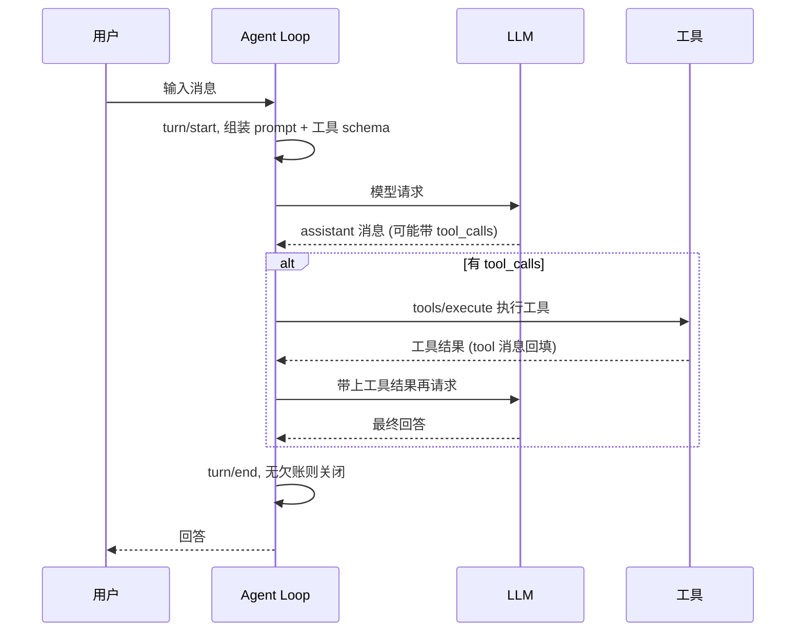

<title>全栈 AI Agent 工程师 · 08-16 · DeepSeek Harness 工程拆解</title>

# 全栈 AI Agent 工程师 · 08-16 · DeepSeek Harness 工程拆解

<callout emoji="💡">
Model + Harness = Agent。模型负责思考推理，Harness 负责让思考落地——工具调用循环、上下文管理、会话存储、沙箱权限、任务调度，全是模型之外的那一半。DeepSeek 在 2026-08-13 开源了 Harness v0.1（MIT，基于 Cordis 插件元框架，"一切皆插件"），本文拆它的工程结构，并手写一个最小 agent loop 验证底层机制。
</callout>

## 为什么需要这个东西

纯 LLM 只能输出文本。你让模型"算一下 42 乘 8"，它要么口算（可能算错），要么回你一句"我无法执行计算"——它没有执行环境。要让 AI 真正干活：读文件、跑命令、查网页、改代码、把结果写回系统，缺一不可的是模型之外的那套运行设施。DeepSeek 官方给出的公式就是 Model + Harness = Agent：模型是大脑，Harness 是身体。

没有 harness 的代价，agent-coze-workflow 项目里体会过：10 个工具（clarify_question、read_file、plan_workflow、generate_workflow、save_to_coze…）要自己注册、自己写循环、自己管理多轮上下文、自己处理工具结果回填，这些代码和业务逻辑混在一起，每个新项目都要重写一遍。Harness 要解决的正是这个问题：把"模型怎么调用工具、上下文怎么管理、会话怎么持久化、权限怎么控制"沉淀成可复用的基础设施，业务只写工具本身。

DeepSeek Harness 把这件事做到了极端：不止是代码库，而是一整套本地 Agent 工作台——\`npx @deepseek-ai/dsh web\` 一条命令拉起 Web UI，对标 Claude Code、Pi-Agent，走模型无关的开放路线，全部源码 MIT 开源。

## 核心原理

Harness 的核心是 agent loop：一次请求进来，模型可能直接回答，也可能先调用工具。调了工具就要把结果回填给它，让它基于结果继续决策，直到它不再调用工具为止。dsh 把循环拆成两个层级：step 和 turn。

- **step（步）**：一次模型请求加上它发起的全部工具调用。
- **turn（轮）**：零个或多个 step。从拿到第一个输入开始，到"没有欠账"（模型不再调工具、也没有新输入）结束。

一次完整 turn 的生命周期：turn/start → 组装 prompt 段落和工具 schema → agent/pre-step（可以改写或拒绝输入）→ step/start → LLM 流式返回 → 如果有 tool_calls 就进入工具执行管线（pre-execute → execute → post-execute）→ 工具结果回填 → 还有欠账就开下一个 step → turn/end。



六大组件缺一不可：模型适配器（把各家模型接进统一接口）、工具注册表（模型能看到哪些能力）、会话日志（所有事实的持久化源头）、上下文组装（prompt 段落 + 工具 schema 怎么拼）、沙箱与权限（工具能碰什么）、调度（后台任务、定时、子代理）。dsh 的 npm 包依赖清单就是这张地图：60 多个插件包，每个包管一个能力——dsh-tool-bash、dsh-tool-fs、dsh-tool-web、dsh-tool-subagent、dsh-session-persistence-jsonl、dsh-compaction-basic、dsh-mcp-client，一目了然。

## 底层实现原理

dsh 的底座是 Cordis 插件元框架。Cordis 的核心模型：插件向共享 context 贡献服务（services）、类型化事件（events）和可逆副作用（reversible effects）。注意"可逆"——插件卸载时，它注册的一切自动回滚，所以系统里没有特权核心，任何部分都能被替换：模型适配器是插件、工具注册表是插件、会话日志是插件、连 agent loop 本身都是插件（dsh-agent-loop 就是默认驱动，实现 Agent 接口）。

配置层面是 profile → bundle → patch 的分层叠加：profile 是命名组合（web、headless 是内置模板），bundle 是"配置行 + 代码"的发行格式，patch 是用户的覆盖层。启动时从空根开始，依次叠加各 bundle 的 patch、profile 自己的 cordis.patch.yml、home 级的、最后是 --patch 指定的。任何一行配置都能被上层 patch 替换——用 `dsh --profile web --dump-config` 能看到本机真实启动的完整插件树。

会话层有一条硬不变式：Model-visible means logged——凡是模型能看到的东西，必须能从会话日志重建。日志是 append-only 的 SessionEvent 流，模型历史、fork、resume、遥测全都从这条流派生。这就是为什么 dsh 要求新增模型可见输入必须先定义新的 SessionEvent，而不是随手塞进 prompt。

能力接入走 seam（接缝）模式：一个可替换能力 = Service Definition（接口声明）+ Service Provider（实现）+ Consumer（消费方，通常是模型可见的工具）。换文件系统实现，不用改任何工具代码，因为 Bash、PTY 都通过同一个 seam 指向新的 provider。

agent loop 的机制到底长什么样，直接手写一个最小版本最直观——不依赖框架，原生 fetch 调 DeepSeek API，把"系统提示 + 工具 schema → LLM → tool_calls → 执行 → 回填 → 再 LLM"的循环写出来（完整文件 harness-loop-fetch.ts，ai-tools-demo 仓库）：

```typescript
async function main() {
  const messages: Array<Record<string, unknown>> = [
    { role: "system", content: "你是计算助手。遇到计算必须调用 calculator 工具，不要自己口算。" },
    { role: "user", content: "计算 42 * 8" },
  ];

  let round = 0;
  while (round < 5) {
    // 循环上限：防止模型无限调工具
    round++;
    const msg = await callLLM(messages);
    const toolCalls = msg.tool_calls ?? [];
    // assistant 消息（含 tool_calls）必须入历史，tool 消息才能跟在其后
    messages.push({ role: "assistant", content: msg.content ?? "", tool_calls: toolCalls });

    if (toolCalls.length === 0) {
      break; // 不再调工具 → 循环结束，这就是 turn/end
    }
    for (const tc of toolCalls) {
      const result = runTool(tc.function.name, tc.function.arguments);
      // tool 消息通过 tool_call_id 关联到对应的 assistant 调用
      messages.push({ role: "tool", tool_call_id: tc.id, content: result });
    }
  }
}
```

真实运行输出（2026-08-16 实测，DeepSeek 官方 API）：

```bash
=== 第 1 轮 ===
模型输出:
工具调用: calculator({"expression": "42 * 8"})
工具返回: 336

=== 第 2 轮 ===
模型输出: 42 * 8 = **336**
没有工具调用 → 循环结束

最终回答: 42 * 8 = **336**
```

两轮循环完整展示了 harness 的机制：第一轮模型只发工具调用没有正文（这是正常的），工具结果 336 作为 tool 消息回填，第二轮模型基于真实计算结果回答。注意协议细节：tool 消息必须跟在它对应的 assistant 消息后面，靠 tool_call_id 关联——这就是为什么 harness 必须自己管理消息历史，而不是简单拼接。

## 对比其他方案

| 方案                       | 形态                                              | 扩展方式                                    | 适合谁                                                   |
| -------------------------- | ------------------------------------------------- | ------------------------------------------- | -------------------------------------------------------- |
| DeepSeek Harness (dsh)     | 本地 Agent 工作台（插件化，有 Web UI / headless） | 写 Cordis 插件，配置层 patch 叠加，不碰源码 | 要完整工作台、要自定义每个模块、能接受 v0.1 预览版不稳定 |
| LangGraph createReactAgent | 嵌入式 SDK（代码库，嵌进你的 NestJS 服务）        | 代码里加工具、加 node、加 checkpoint        | 要把 agent 嵌进自己的产品/API，要精确控制循环            |
| Claude Code / Pi-Agent     | 闭源产品（CLI / IDE）                             | 不可扩展（黑盒）                            | 直接用，不折腾，但不可定制                               |
| 手写循环                   | 几十行代码（见上文）                              | 全自己写                                    | 学习原理、极简场景、不想引依赖                           |

判断：产品形态要嵌入自己服务，选 LangGraph 或手写；要一个开箱即用的本地工作台且愿意折腾插件，选 dsh；两者不冲突——dsh 是"工作台产品"，LangGraph 是"构建工作台的积木"。ai-tools-demo 的 react-agent 服务就是 LangGraph 形态，dsh 可以当对照实验跑。

## 适用场景 / 不适用场景

- **适用**：本地编程助手 / 代码 Agent（dsh 标准模式全套工具）；需要长周期任务协作、多 Agent 编排、定时调度的工作台；想研究插件化 Agent 架构（Cordis 是极好的教学样本）；体验 DeepSeek 官方 agent 能力（headless 模式一条命令跑任务）。
- **不适用**：要嵌进自己产品的场景（dsh 是工作台不是库，嵌进 NestJS API 会很别扭）；生产环境求稳（v0.1 预览版官方明示会有兼容性破坏变更）；只需要"模型 + 两三个工具"的轻量服务（手写循环或 LangGraph 更轻）。

## 示例

场景：同一个问题"计算 42 \* 8"，分别用 dsh（工作台形态）和手写循环（嵌入式形态）跑一遍，对比两种 harness 的使用方式。dsh 全部命令与输出为 2026-08-16 实测。

**步骤 1：装并看 dsh 的命令面**

```bash
$ npx -y @deepseek-ai/dsh --help
Usage: dsh [options] [command] [args...]
Options:
  --profile <name>            the profile under $DSH_HOME/profiles to boot
  --patch <path>              extra patch-list overlay applied after the profile layer
  --dump-config               print the composed profile tree and exit
Commands:
  web [options] [args...]     boot the web profile
  plugin [options] [args...]  manage a profile's plugins (forwarded to pnpm)
```

**步骤 2：看 headless profile 的插件树（harness 由哪些插件组成）**

```bash
- id: llm                      name: '@deepseek-ai/dsh-llm'
- id: session                  name: '@deepseek-ai/dsh-session'
- id: agent                    name: '@deepseek-ai/dsh-agent'
- id: agent-default-model      name: '@deepseek-ai/dsh-agent-default-model'
  config: { provider: deepseek-official, model: deepseek-v4-flash }
- id: sandbox-policy           name: '@deepseek-ai/dsh-sandbox-policy'
  config: { mode: workspace-write, workspaceRoot: process.cwd() }
- id: session-persistence-jsonl name: '@deepseek-ai/dsh-session-persistence-jsonl'
- id: credentials              name: '@deepseek-ai/dsh-credentials-local'
```

**步骤 3：headless 跑真实任务（harness 自动完成：bash 工具 → 结果回填 → 回答）**

```bash
$ DEEPSEEK_API_KEY=sk-... npx -y @deepseek-ai/dsh --profile headless "用 bash 计算 42 * 8，然后告诉我结果"
用 bash 计算 `42 * 8` 的结果是 **336**。
```

**步骤 4：LangGraph 版嵌入式 harness 代码模板**（完整文件 harness-minimal.ts，ai-tools-demo 仓库 src/code-and-doc/）——和你的 agent-coze-workflow 同一个形态：

```typescript
import { ChatOpenAI } from "@langchain/openai";
import { createReactAgent } from "@langchain/langgraph/prebuilt";
import { tool } from "@langchain/core/tools";
import { z } from "zod";

const calculator = tool(
  async ({ expression }: { expression: string }) => {
    if (!/^[\d+\-*/().\s]+$/.test(expression)) return "非法表达式";
    // eslint-disable-next-line no-new-func
    return String(Function(`"use strict"; return (${expression})`)());
  },
  {
    name: "calculator",
    description: "计算一个数学表达式并返回结果，例如 42 * 8",
    schema: z.object({ expression: z.string() }),
  }
);

const agent = createReactAgent({
  llm: new ChatOpenAI({
    model: "deepseek-v4-flash",
    apiKey: process.env.LLM_API_KEY,
    baseURL: process.env.LLM_BASE_URL,
    temperature: 0,
  }),
  tools: [calculator],
});

// streamMode: "updates" 观察循环：agent 节点决策 → tools 节点执行
const stream = await agent.stream(
  { messages: [new HumanMessage("计算 42 * 8 并告诉我结果")] },
  { streamMode: "updates" }
);
```

**实测环境说明（真实坑）**：2026-08-16 凌晨本机跑 LangGraph 版时，openai SDK（v6.45.0）与 LLM 网关的 TLS 握手持续 ECONNRESET，无论直连、走代理、官方 API 还是 dachensky 网关；同一时间原生 undici fetch POST 到 api.deepseek.com 返回 200。诊断结论：不是网络不通，是 SDK 的请求链路（连接池/keep-alive）被中间设备重置。这正是 harness 工程里"LLM 客户端链路"的经典排查场景——先 curl 验证网络层，再 raw fetch 验证传输层，最后才怀疑 SDK。

## 生产环境注意事项

- **上下文膨胀是头号问题**：工具结果动辄几千字符，多轮循环后 prompt 指数增长。dsh 的做法是 compaction 插件（thresholdChars 8192 时裁剪工具结果，保留 head/tail）——生产环境必须配上下文压缩，否则 token 成本先爆。
- **循环必须有硬上限**：模型可能陷入"调工具 → 看结果 → 再调"的死循环。手写循环要 while 上限（示例里 5 轮），dsh 靠 turn/end 语义和工具策略兜底，你的 createReactAgent 也要配 recursionLimit。
- **沙箱权限不能默认全开**：dsh 默认 workspace-write（只能写当前工作区），bash 工具能执行任意命令。生产环境按最小权限给：文件系统只读、命令白名单、敏感操作人工审批（interrupt/HITL）。
- **v0.1 预览版别上生产**：官方明示 compatibility-breaking changes 随时来，插件 API、profile 格式都可能变。想用 dsh 就跑在隔离环境，别把它当稳定依赖。
- **可观测性要留痕**：会话日志是 harness 的审计基础——谁在什么时候调了什么工具、传了什么参数，都要能从日志重建（dsh 的 Model-visible means logged 就是这个设计）。

## 面试考点

- **怎么理解 Model + Harness = Agent？** 高分要点：模型只有推理能力，落地执行（工具调用循环、上下文、存储、沙箱、调度）全是 harness 的职责；没有 harness 的模型只是聊天接口。举自己的项目：agent-coze-workflow 的 createReactAgent + 10 工具就是嵌入式 harness。
- **agent loop 怎么实现？工具结果为什么要回填？** 高分要点：循环 = LLM 返回 tool_calls → 执行 → 以 tool 消息回填（tool_call_id 关联）→ 再请求 → 直到无 tool_calls；回填是因为模型每次请求只看到消息历史，工具结果必须作为新消息进入历史它才能"知道结果"。
- **为什么说"一切皆插件"是架构决策而不是噱头？** 高分要点：可逆副作用让插件卸载即回滚，所以没有特权核心；任何模块（含 agent loop 本身）都能被替换；配置层 patch 叠加让扩展不碰源码。代价是学习成本高、抽象层多。
- **追问：你的项目里 harness 和业务代码怎么分界？** 要点：工具注册、循环编排、上下文组装归 harness；工具内部实现（save_to_coze、generate_workflow）是业务。换 harness 不动业务代码，前提是工具按统一接口（name + description + schema + 执行函数）暴露。

## 常见坑

- **SDK 链路 TLS 重置但网络是通的**：症状 openai SDK 报 read ECONNRESET，curl 和原生 fetch 都正常。原因中间设备对 SDK 连接池/keep-alive 的重置。解法逐层诊断：curl → raw fetch → SDK，别一上来怀疑 key 或网络。
- **模型口算不调工具**：症状给了 calculator 工具，模型还是自己算。原因工具描述不够强。解法 system prompt 明确"必须调用工具，不要自己算"，工具描述里写清触发条件（示例就是这么写的）。
- **tool 消息顺序错乱**：症状 API 报 400（tool message 没有前置 assistant message）。原因 tool 消息必须跟在带对应 tool_call_id 的 assistant 消息之后，且 assistant 消息必须保留 tool_calls 字段。
- **headless 首次运行要初始化**：症状第一次跑 dsh --profile headless 慢或报错。原因 profile 模板首次使用才从随包模板生成。解法先跑一次 --dump-config 预热，再跑正式任务。
- **工具结果过大撑爆上下文**：症状多轮后 token 飞涨、回答变差。原因大文件/大输出直接进历史。解法工具结果截断/摘要（dsh 的 tool-result-pruner：超 8192 字符只留 head 4096 + tail 1024）。

## 学习延伸

- DeepSeek Harness 源码与架构文档：https://github.com/deepseek-ai/deepseek-harness（README + docs/architecture.md，Cordis 插件模型、turn/step 生命周期、capability seam 都在这里）
- npm 包 @deepseek-ai/dsh（v0.1.0-rc.6）：https://www.npmjs.com/package/@deepseek-ai/dsh
- Cordis 插件元框架：https://github.com/cordiverse/cordis
- LangGraph TS 对照阅读：Tool calling — https://langchain-ai.github.io/langgraphjs/how-tos/tool-calling/
- LangGraph TS 对照阅读：Persistence（checkpoint 让 harness 记住多轮会话）— https://langchain-ai.github.io/langgraphjs/concepts/persistence/
- 学完这篇，下一篇可以学：Cordis 的插件生命周期与可逆副作用——为什么"卸载即回滚"能让系统没有特权核心；或者对照 LangGraph 的 StateGraph 状态机，看两种 harness 的上下文管理哲学差异。

## 参考来源

- DeepSeek Harness 官方 README（GitHub，master 分支）：Run from npm / Developer preview 说明 — https://github.com/dezhiepseek-ai/deepseek-harness
- @deepseek-ai/dsh npm 包 README.zh.md（v0.1.0-rc.6）：入口模式、profile 配置层叠、参数解析规则 — https://www.npmjs.com/package/@deepseek-ai/dsh
- DeepSeek Harness 架构文档 docs/architecture.md：Cordis、Profiles and bundles、Core packages、Turn flow、Session log、Capability seams — https://github.com/deepseek-ai/deepseek-harness/blob/master/docs/architecture.md
- cordis-plugin-development SKILL.md（dsh 随包技能）：插件开发工作流、Host/Client 平台选择、工具注册 — npm 包 config/agent-presets/cordis/skills/
- dsh 命令行实测输出（2026-08-16）：--help、--profile headless --dump-default-config、headless 任务运行
