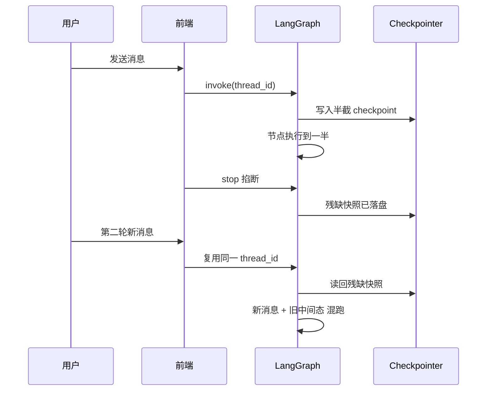

<title>全栈 AI Agent 工程师 · 08-15 · 脏状态清理</title>

# 脏状态：中断现场怎么检测、怎么清理

<callout emoji="💡">
脏状态 = LangGraph 的 checkpoint 里躺着半截执行现场：节点写到一半被掐断，messages、pending 任务、执行位置停在中间态。下一轮复用同一个 thread_id 时，LangGraph 会把这份旧现场恢复出来继续执行，新消息就和旧状态搅在一起。
</callout>

## 为什么需要这个东西

Agent 从单轮问答变成多步流程后，问题就不再是"能不能答"，而是"断了以后怎么接着答"。LangGraph 默认把每一步状态写进 checkpoint，这是恢复能力的基础，但也是脏状态的温床：写进去了，不等于写完整了。

在 ai-tools-demo 里这个坑很典型。前端允许用户中途 stop，但后端并不知道这次停是"正常结束"还是"半路撤退"。如果继续复用同一个 thread_id，模型会读到上一轮残留的 messages、pending 任务、节点进度，看起来像记忆很好，实际上是在吃脏数据。

## 核心原理

LangGraph 把执行状态拆成两层看：checkpoint 负责记录"跑到哪了"（节点位置、pending 任务、未结算写入），应用层 messages 负责记录"用户说过什么"。resume 时框架按 thread_id 找到 checkpoint，把 State 恢复出来继续执行。

脏状态的根本来源是**写入时机**。节点执行过程中框架就会把中间态落盘，而不是等整个节点成功才写。节点跑一半被掐断（工具超时、进程被杀、前端 stop），checkpoint 里留下的就是残缺现场。



## 底层实现原理：checkpoint 里到底存了什么

官方文档把 checkpoint 定义成"每个 super-step 保存的状态快照"，运行时用 `StateSnapshot` 对象表示。理解脏状态，先看懂这个对象里五个字段各管什么：

- **values**：当前 State 通道的值。messages、自定义字段都在这里，是"用户说了什么、流程算到哪"的直接载体。
- **next**：下一步要执行的节点名元组。它是脏状态检测的关键——非空说明图还没跑完，执行位置停在中间。
- **tasks**：待执行任务（`PregelTask`）列表。节点跑过但没成功时，这里会带错误信息；interrupt 暂停时，这里带中断数据。
- **metadata**：这次写入的元信息，比如 `source: 'loop'`、`step: 2`、本轮各节点写入了什么。
- **config**：`thread_id` + `checkpoint_id` + `checkpoint_ns`，定位"这份快照属于哪个线程、哪个版本"。

一个正常跑完两节点的图会留下 4 份 checkpoint：空的起点快照（next=START）→ 收到用户输入的快照（next=nodeA）→ nodeA 输出后的快照（next=nodeB）→ 结束快照（next=[]）。**脏状态就是最后一环没走到**：next 还指向某个节点，tasks 里还挂着未结算任务。

运行时两个方法直接关系脏状态处理：`getState(config)` 返回 thread 的最新 `StateSnapshot`，新消息进来先调它就能看到 `next` 和 `values.dirty`；`updateState(config, values)` 编辑状态，注意它**会走 reducer**——有 reducer 的通道是追加不是覆盖，标脏时选没有 reducer 的通道更稳。

## 什么情况下会出现脏状态

脏状态不是偶发 bug，是几种固定场景的必然结果，列出来对号入座：

- **前端流式 stop**：用户看到一半点停止，前端断开流，但后端 graph 可能已经执行了几个节点，checkpoint 落了半截。这是最常见的来源。
- **工具调用超时或抛错**：节点里调外部 API，超时后节点异常退出，但它之前对 State 的修改已经写进去了。
- **interrupt 后用户放弃**：human-in-the-loop 的 interrupt 点会保存暂停状态，用户一直没回复或明确取消，暂停现场就悬空在 checkpoint 里。
- **同一 thread_id 开新话题**：用户上一轮聊订单，这一轮问天气，代码还是复用 chat-001，旧订单现场就被带进新对话。
- **并发重复提交**：同一个 thread 被并发 invoke，两次执行互相覆盖 State，产生两个执行现场的杂交体。

## 脏状态不处理会怎样

不处理不是"多存了点数据"，是会让系统行为变得不可信。下面用真实运行结果演示最典型的一条，其余几条列出后果：

- **旧消息污染新话题**：模型读到上一轮残留 messages，把"查天气"当成"继续聊订单"，回答驴唇不对马嘴。下面的示例会真实复现这一条。
- **pending 任务复活**：中断前未完成的 tool call 记录还在，resume 时被当成待办继续执行，可能重复写库、重复扣款。
- **节点位置错乱**：checkpoint 记录"上次跑到 clarify 节点"，新消息就直接从 clarify 继续，跳过了本应重新开始的入口校验。
- **假记忆误导用户**：模型"记得"上一轮内容，用户以为它在认真续聊，实际是脏数据在演戏，比不记得更糟。
- **排查地狱**：行为随机——有时带旧状态有时不带，复现不了，修不动。

## 如何处理脏状态

处理分三层，从检测到清理到防御，缺一层都会漏：

**第一层：检测**。给 State 加一个 dirty 标记，新消息进来时先 getState 读 checkpoint 判断它干不干净。干净就续跑，脏就走清理分支。更稳妥的检测是组合判断：dirty 标记 + checkpoint 的 next 字段非空（说明有未完成的节点），两个条件任一成立就算脏。

**第二层：清理**。脏了之后选一种策略：最彻底的是换新 thread_id，旧现场直接废弃，物理隔离；或者保留 thread_id 但重建图，把 State 重置成初始值再跑。判断标准很简单：用户明确开新话题 = 硬中断，清；框架设计的 interrupt 暂停点 = 可恢复，留。

**第三层：防御**。减少脏状态产生：外部调用加超时和重试上限，超时就标记失败而不是留半截；关键写操作设计成幂等（同一笔工具调用执行两次结果相同），这样即使复活也不出事；stop 事件从前端同步到后端，让后端主动标脏，而不是等下一轮才发现。

## 对比其他方案

| 方案                    | 恢复能力               | 防脏能力               | 适用场景                       |
| ----------------------- | ---------------------- | ---------------------- | ------------------------------ |
| 直接重跑                | 无，失败就重来         | 天然无脏状态           | 短流程、低成本任务             |
| 只存 messages           | 能续聊，不能续执行     | 脏面小，但无执行恢复   | 纯聊天、无状态工具             |
| Checkpoint + dirty flag | 能恢复，也能隔离脏     | 检测靠标记，防御靠约定 | 多步 Agent、人工打断、长任务   |
| Checkpoint + 版本号     | 能恢复，能隔离，抗并发 | 最强的检测和隔离       | 并发高、需要严格会话隔离的系统 |

流程短就别上重武器，流程长、工具多、还会被人中途打断，就得认真做 checkpoint 加脏处理。不是省事，是把事故往后拖。

## 适用场景 / 不适用场景

- 适合：多轮 Agent、人工介入审批、工具链执行、长流程工作流、前端 stop 后还要继续对话的场景。
- 适合：ai-tools-demo 里先规划、再调工具、再回写结果的对话线程。
- 不适合：一次性问答、无状态批处理、每次请求可独立完成的任务。
- 不适合：你根本不打算恢复，只想失败就丢掉的流程。

## 示例一：先复现事故，再修复

场景是 ai-tools-demo 的聊天线程：用户先发"帮我查订单 12345"，工具调用超时中断；用户等不到结果，又发了"今天天气怎么样"。下面分两步，第一步故意不做脏处理，让事故真实发生；第二步在服务层检测并修复。代码是完整可运行的，跑完对照文中的真实输出验证。

**第一步：复现事故——不处理脏状态会怎样**

核心是两点：messages 用 reducer 追加（真实项目标准做法，这样旧消息才会被保留下来）；callTool 节点第一次调用必抛异常，模拟工具超时。第一轮中断后 checkpoint 里躺着半截现场，第二轮直接复用同一 thread_id，看会发生什么。

```typescript
import { Annotation, MemorySaver, START, END, StateGraph } from "@langchain/langgraph";

// messages 用 reducer 追加（真实项目标准做法），脏状态才会真实复现
const State = Annotation.Root({
  messages: Annotation<string[]>({
    default: () => [],
    reducer: (a, b) => [...a, ...b],
  }),
  pendingTool: Annotation<string | null>({ default: () => null }),
  dirty: Annotation<boolean>({ default: () => false }),
});

// 构建"工具第一次调用必超时"的图，模拟外部 API 不稳定
function buildGraph() {
  let toolAttempts = 0;
  return new StateGraph(State)
    .addNode("ingest", async (state) => ({
      pendingTool: `query:${state.messages[state.messages.length - 1]}`,
    }))
    .addNode("callTool", async (state) => {
      toolAttempts += 1;
      if (toolAttempts === 1) {
        throw new Error("工具超时：调用外部 API 30s 无响应");
      }
      return {
        messages: [`工具返回：${state.pendingTool} 执行成功`],
        pendingTool: null,
      };
    })
    .addNode("finish", async (state) => ({ messages: ["流程正常结束"] }))
    .addEdge(START, "ingest")
    .addEdge("ingest", "callTool")
    .addEdge("callTool", "finish")
    .addEdge("finish", END)
    .compile({ checkpointer: new MemorySaver() });
}

async function main() {
  // ===== 场景 A：中断后直接复用 thread，不做脏处理 =====
  console.log("===== 场景 A：中断后直接复用 thread =====");
  const graphA = buildGraph();
  const cfgA = { configurable: { thread_id: "chat-A" } };
  try {
    await graphA.invoke({ messages: ["帮我查订单 12345"] }, cfgA);
  } catch (e) {
    console.log("第一轮中断:", (e as Error).message);
  }
  const stA = await graphA.getState(cfgA);
  console.log(
    "第一轮后 checkpoint:",
    JSON.stringify(stA.values),
    "| next:",
    JSON.stringify(stA.next)
  );

  const resultA = await graphA.invoke({ messages: ["今天天气怎么样"] }, cfgA);
  console.log("第二轮 messages:", JSON.stringify(resultA.messages));
  console.log("→ 新话题被第一轮残留污染，两轮消息混在同一个 thread");

  // ===== 场景 B：服务层检测 dirty + 换 thread 重建 =====
  console.log("\n===== 场景 B：服务层检测 dirty + 换 thread 重建 =====");
  const graphB = buildGraph();
  const cfgB = { configurable: { thread_id: "chat-B" } };
  try {
    await graphB.invoke({ messages: ["帮我查订单 12345"] }, cfgB);
  } catch (e) {
    console.log("第一轮中断:", (e as Error).message);
  }
  // 前端 stop 事件 → 服务端标脏
  await graphB.updateState(cfgB, { dirty: true });
  const stB = await graphB.getState(cfgB);
  console.log(
    "标脏后 checkpoint:",
    JSON.stringify(stB.values),
    "| next:",
    JSON.stringify(stB.next)
  );

  const isDirty = stB.values.dirty === true || stB.next.length > 0;
  console.log("服务层检测 →", isDirty ? "脏，换新 thread 重建" : "干净，续跑");
  if (isDirty) {
    const freshCfg = { configurable: { thread_id: "chat-B-fresh" } };
    const resultB = await graphB.invoke({ messages: ["今天天气怎么样"] }, freshCfg);
    console.log("重建后 messages:", JSON.stringify(resultB.messages));
    console.log("→ 干净：只有新话题，无第一轮残留");
  }
}

main().catch((e) => {
  console.error("main failed:", e);
  process.exitCode = 1;
});
```

运行 **npx tsx dirty-checkpoint.ts**，真实输出：

```text
===== 场景 A：中断后直接复用 thread =====
第一轮中断: 工具超时：调用外部 API 30s 无响应
第一轮后 checkpoint: {"messages":["帮我查订单 12345"],"pendingTool":"query:帮我查订单 12345"} | next: ["callTool"]
第二轮 messages: ["帮我查订单 12345","今天天气怎么样","工具返回：query:今天天气怎么样 执行成功","流程正常结束"]
→ 新话题被第一轮残留污染，两轮消息混在同一个 thread
```

看第二轮 messages：用户的新话题"今天天气怎么样"前面，还挂着第一轮的"帮我查订单 12345"。checkpoint 的 next 是 ["callTool"]，说明执行位置停在中断处，第二轮从断点续跑。模型如果拿这份 messages 去回答，会把两个话题混在一起——这就是不处理的直接后果。

**第二步：修复——服务层检测 + 换 thread 重建**

修复的关键不是改图，而是**在服务层拦一道**：新消息进来先 getState 检查，dirty 为 true 或 next 非空（有未完成任务）就判定为脏，换一个新 thread_id 从头跑，旧现场物理废弃。前端 stop 事件到达时，服务端用 updateState 把 dirty 标 true，这样下一轮一定能检测到。

```typescript
async function main() {
  // ===== 场景 B：服务层检测 dirty + 换 thread 重建 =====
  const graphB = buildGraph();
  const cfgB = { configurable: { thread_id: "chat-B" } };
  try {
    await graphB.invoke({ messages: ["帮我查订单 12345"] }, cfgB);
  } catch (e) {
    console.log("第一轮中断:", (e as Error).message);
  }

  // 前端 stop 事件 → 服务端主动标脏，下一轮一定能检测到
  await graphB.updateState(cfgB, { dirty: true });
  const stB = await graphB.getState(cfgB);
  console.log(
    "标脏后 checkpoint:",
    JSON.stringify(stB.values),
    "| next:",
    JSON.stringify(stB.next)
  );

  // 新消息进来：先检测，再决定续跑还是重建
  const isDirty = stB.values.dirty === true || stB.next.length > 0;
  console.log("服务层检测 →", isDirty ? "脏，换新 thread 重建" : "干净，续跑");
  if (isDirty) {
    const freshCfg = { configurable: { thread_id: "chat-B-fresh" } };
    const resultB = await graphB.invoke({ messages: ["今天天气怎么样"] }, freshCfg);
    console.log("重建后 messages:", JSON.stringify(resultB.messages));
  }
}

main().catch((e) => {
  console.error("main failed:", e);
  process.exitCode = 1;
});
```

把场景 A 和场景 B 拼成一个文件运行，真实输出：

```text
===== 场景 B：服务层检测 dirty + 换 thread 重建 =====
第一轮中断: 工具超时：调用外部 API 30s 无响应
标脏后 checkpoint: {"messages":["帮我查订单 12345"],"pendingTool":"query:帮我查订单 12345","dirty":true} | next: ["callTool"]
服务层检测 → 脏，换新 thread 重建
重建后 messages: ["今天天气怎么样","工具返回：query:今天天气怎么样 执行成功","流程正常结束"]
→ 干净：只有新话题，无第一轮残留
```

对照两个场景的输出，差异一目了然：场景 A 的 messages 里混着第一轮残留，场景 B 重建后只有新话题的完整流程。检测逻辑放在服务层而不是图内部，是因为脏标记是外部事件（前端 stop、工具超时）设置的，图自己无法感知"用户放弃"。

1. 第一轮 invoke：ingest 记录 pendingTool，callTool 第一次调用抛异常中断，checkpoint 落下半截现场（messages + pendingTool + next=["callTool"]）。
2. 前端收到中断信号，服务端 updateState 把 dirty 标 true（场景 B）。
3. 新消息进来：getState 检查，dirty=true 或 next 非空 → 判定脏。
4. 脏则换新 thread_id 重建，旧 thread 废弃；干净才续跑。

## 示例二：打断 LLM 思考——和脏状态有什么关系

上一个示例讲的是"上一轮 run 已结束、留下残缺 checkpoint"。这个场景不一样：**LLM 正在思考，用户发现想错了，手动打断，然后发提醒**。打断的是还在进行的 run，不是已经结束的 run——处理逻辑和脏状态有同有异。

下面用同一个图跑三个场景：A 不打断正常跑完（对照）；B 思考中打断，看 checkpoint 留下什么；C 打断 + 发提醒 → 清洗状态 → 带纠正重跑。完整代码在 **src/code-and-doc/interrupt-thinking.ts**，运行 **npx tsx interrupt-thinking.ts**。

```typescript
import { Annotation, MemorySaver, START, END, StateGraph } from "@langchain/langgraph";

const State = Annotation.Root({
  messages: Annotation<string[]>({
    default: () => [],
    reducer: (a, b) => [...a, ...b],
  }),
  // 打断标记：用户手动打断思考时为 true
  interrupted: Annotation<boolean>({ default: () => false }),
  // 提醒内容：用户打断后发的纠正信息
  reminder: Annotation<string | null>({ default: () => null }),
});

const sleep = (ms: number) => new Promise((r) => setTimeout(r, ms));

/**
 * 模拟 LLM 思考：4 步，每步 400ms，逐步把"思考过程"追加进 messages。
 * 生产环境替换为真实流式：const stream = await llm.stream(prompt, { signal }); ...
 */
async function thinkNode(state: typeof State.State, config: { signal?: AbortSignal }) {
  const thoughts = [
    "[思考] 用户问的是订单 12345 的状态。",
    "[思考] 我打算直接查数据库返回结果。",
    "[思考] 等一下，用户可能想问退款进度而不是物流。",
    "[回答] 您的订单 12345 当前状态：已发货，预计明天送达。",
  ];
  const updates: string[] = [];
  for (const t of thoughts) {
    // 每步开始前检查是否被打断——这就是"用户手动打断 LLM 思考"的落点
    if (config.signal?.aborted) {
      throw new Error("ABORTED_BY_USER");
    }
    await sleep(400);
    updates.push(t);
    console.log("  LLM:", t);
  }
  return { messages: updates };
}

function buildGraph() {
  return new StateGraph(State)
    .addNode("think", thinkNode)
    .addEdge(START, "think")
    .addEdge("think", END)
    .compile({ checkpointer: new MemorySaver() });
}

async function runWithAbort(graph, cfg, abortAfterMs: number) {
  const ac = new AbortController();
  const run = (async () => {
    const stream = await graph.stream(
      { messages: ["帮我查订单 12345"] },
      { ...cfg, signal: ac.signal }
    );
    for await (const _ of stream) {
      /* 消费流 */
    }
  })();
  // 用户在第 N 毫秒发现 LLM 想错了，手动打断
  await sleep(abortAfterMs);
  ac.abort();
  try {
    await run;
    return { aborted: false };
  } catch (e) {
    return { aborted: true, error: (e as Error).message };
  }
}

async function main() {
  // ===== 场景 A：不打断，正常跑完（对照） =====
  const graphA = buildGraph();
  const cfgA = { configurable: { thread_id: "t-A" } };
  const rA = await runWithAbort(graphA, cfgA, 10_000);
  const stA = await graphA.getState(cfgA);
  console.log("最终 messages:", JSON.stringify(stA.values.messages));
  console.log("next:", JSON.stringify(stA.next), "| 结果:", rA.aborted ? "被打断" : "正常完成");

  // ===== 场景 B：思考中打断 =====
  const graphB = buildGraph();
  const cfgB = { configurable: { thread_id: "t-B" } };
  const rB = await runWithAbort(graphB, cfgB, 1000); // 1s 后打断（第 2 步思考中途）
  const stB = await graphB.getState(cfgB);
  console.log("打断结果:", JSON.stringify(rB));
  console.log("打断后 messages:", JSON.stringify(stB.values.messages));
  console.log("打断后 next:", JSON.stringify(stB.next), "（非空 = 执行现场没跑完）");

  // ===== 场景 C：打断 + 用户发提醒 → 状态清洗 → 带纠正重跑 =====
  const graphC = buildGraph();
  const cfgC = { configurable: { thread_id: "t-C" } };
  const rC = await runWithAbort(graphC, cfgC, 1000);
  console.log("第一次 run 打断:", JSON.stringify(rC));

  // 用户提醒来了：服务层标记 interrupted + 记录提醒（updateState 走 reducer，messages 通道是追加）
  await graphC.updateState(cfgC, { interrupted: true, reminder: "我其实想问退款进度，不是物流" });
  const stC = await graphC.getState(cfgC);
  console.log("标脏后 interrupted:", stC.values.interrupted, "| reminder:", stC.values.reminder);
  console.log("标脏后 next:", JSON.stringify(stC.next), "（还挂着旧现场）");

  // 状态清洗：旧 thread 物理废弃（换新 thread_id = 重置执行位置），
  // 但 messages 保留（对话脉络有用）+ 追加用户提醒 → 重新思考
  const freshCfg = { configurable: { thread_id: "t-C-fresh" } };
  const stream2 = await graphC.stream(
    { messages: [...stC.values.messages, `[用户提醒] ${stC.values.reminder}`] },
    freshCfg
  );
  for await (const _ of stream2) {
    /* 消费流 */
  }
  const stC2 = await graphC.getState(freshCfg);
  console.log("重跑后 messages:", JSON.stringify(stC2.values.messages));
  console.log("→ 干净：旧思考被丢弃，提醒生效，从零重新思考");
}

main().catch((e) => {
  console.error("main failed:", e);
  process.exitCode = 1;
});
```

真实输出（npx tsx interrupt-thinking.ts）：

```text
===== 场景 A：不打断，正常跑完（对照） =====
  LLM: [思考] 用户问的是订单 12345 的状态。
  LLM: [思考] 我打算直接查数据库返回结果。
  LLM: [思考] 等一下，用户可能想问退款进度而不是物流。
  LLM: [回答] 您的订单 12345 当前状态：已发货，预计明天送达。
最终 messages: ["帮我查订单 12345","[思考] 用户问的是订单 12345 的状态。","[思考] 我打算直接查数据库返回结果。","[思考] 等一下，用户可能想问退款进度而不是物流。","[回答] 您的订单 12345 当前状态：已发货，预计明天送达。"]
next: [] | 结果: 正常完成

===== 场景 B：LLM 思考中，用户手动打断 =====
  LLM: [思考] 用户问的是订单 12345 的状态。
  LLM: [思考] 我打算直接查数据库返回结果。
打断结果: {"aborted":true,"error":"This operation was aborted"}
打断后 messages: ["帮我查订单 12345"]
打断后 next: ["think"] （非空 = 执行现场没跑完）

===== 场景 C：打断 + 发提醒 → 清洗状态 → 带纠正重跑 =====
第一次 run 打断: {"aborted":true,"error":"This operation was aborted"}
标脏后 interrupted: true | reminder: 我其实想问退款进度，不是物流
标脏后 next: ["think"] （还挂着旧现场）
重跑后 messages: ["帮我查订单 12345","[用户提醒] 我其实想问退款进度，不是物流","[思考] 用户问的是订单 12345 的状态。","[思考] 我打算直接查数据库返回结果。","[思考] 等一下，用户可能想问退款进度而不是物流。","[回答] 您的订单 12345 当前状态：已发货，预计明天送达。"]
→ 干净：旧思考被丢弃，提醒生效，从零重新思考
```

三个场景对照看：场景 A 的 next 是空数组，图完整跑完；场景 B 在 1 秒处打断，checkpoint 的 next 还指向 think——**执行现场没跑完，和脏状态的机制一样**。但注意场景 B 的 messages 只有用户原始输入：思考过程是节点返回时才写进 state，节点被掐断时这次写入整体丢失，不会留下半截思考。

场景 C 是完整处理链路：用户打断后发提醒，服务层把 interrupted + reminder 写进 state（updateState 走 reducer），然后**换新 thread_id 重跑，但 messages 带着旧对话脉络 + 用户提醒**。这就是打断思考和脏状态最本质的区别：脏状态是"整个旧现场都不要"，打断思考是"要对话脉络，不要错误方向"。

| 维度     | 脏状态                                 | 打断 LLM 思考                                                   |
| -------- | -------------------------------------- | --------------------------------------------------------------- |
| 中断对象 | 上一轮 run 已结束，留下残缺 checkpoint | 当前 run 还在进行（LLM 正在生成）                               |
| 用户意图 | 开新话题，旧现场完全无用               | 纠偏，旧对话脉络有用，只是方向错了                              |
| 处理策略 | 检测到就弃掉重建（换 thread_id）       | 中止当前 run，保留 messages，追加提醒后重跑                     |
| 技术手段 | getState 检测 next/dirty → 换 thread   | AbortController 取消 stream → 标 interrupted → 清洗后带提醒重跑 |

共同点也别忘了：两者都靠 checkpoint 的 next 字段暴露"没跑完"，处理不好都会让旧执行污染新执行。打断思考处理不当（比如忘了清 next 就直接复用 thread_id），就会退化成脏状态。

## 生产环境注意事项

- thread_id 不要随便变，也不要所有用户共用一个；生成规则要稳定（用户 id + 会话 id），否则就是串线事故。
- 前端 stop 和后端 interrupt 不要混为一谈：前者是硬中断要清理，后者是框架设计的可恢复暂停，清了反而丢功能。
- checkpoint 体积会涨，消息太长要裁剪，不然存储和恢复都慢；裁剪时注意别把还没结算的 pending 任务裁掉。
- 脏线程一定要有重建策略，别让旧状态永久霸占同一个会话；重建动作要可观测（日志里能看出"这次是重建后运行"）。
- 生产环境用持久化 checkpointer（Postgres/Redis），不要用 MemorySaver——进程一重启，所有 checkpoint 和脏状态一起消失，恢复能力名存实亡。

## 面试考点

- 问：为什么 LangGraph 要单独有 checkpoint，而不是直接把 messages 存数据库？答：checkpoint 还保存执行位置（next）、未完成写入（tasks）和恢复边界（checkpoint_id），messages 只够聊天，不够恢复工作流。
- 问：脏状态一般从哪来？答：前端流式 stop、工具超时、interrupt 后放弃、同一 thread_id 开新话题、并发重复提交，五类场景，根源是节点执行中途状态已落盘。
- 问：StateSnapshot 里哪些字段跟脏状态相关？答：next 非空说明图没跑完，tasks 挂未结算任务，values.dirty 是业务标记；getState 拿最新快照，updateState 编辑状态（注意走 reducer）。
- 问：你在项目里怎么处理脏状态？答：三层——State 里加 dirty 标记做检测（配合 next 字段判断未完成任务），脏了换新 thread_id 或重建图，外部调用加超时和幂等做防御。
- 追问：为什么不直接清空所有 checkpoint？答：那会丢掉可恢复场景，正确做法是区分可恢复暂停和硬中断，只清理后者。
- 问：用户打断 LLM 思考和脏状态是一回事吗？答：机制同源（都靠 next 暴露未完成现场），但处理不同——脏状态是开新话题要弃掉旧现场；打断思考是纠偏，要保留对话脉络，中止当前 run 后带着提醒重跑。分不清就会把纠偏场景当脏状态清掉，丢上下文。

## 常见坑

- 症状：用户第二轮说新话题，模型却一直提上一轮订单号。原因：同一个 thread_id 复用了脏 checkpoint。解决：进入前先判断 dirty。
- 症状：工具失败后 resume 结果更乱。原因：节点写了一半 State 就被打断，未完成写入和完成写入混在一起。解决：工具调用加超时，失败就标记整个节点失败。
- 症状：消息越聊越慢。原因：checkpoint 里塞了过长历史。解决：只保留必要上下文，旧消息下沉到存储层。
- 症状：测试环境没问题，生产里频繁串线。原因：thread_id 生成规则不稳定。解决：按用户会话和业务线程稳定映射。
- 症状：stop 后还能继续跑旧动作。原因：前端只停了流，没通知后端标脏。解决：stop 事件同步到服务端状态。
- 症状：updateState 标脏后字段没生效。原因：该通道定义了 reducer，updateState 走 reducer 变成了追加。解决：dirty 用无 reducer 的通道，或显式覆盖。
- 症状：用户打断思考后发提醒，LLM 还接着旧思路答。原因：只取消了前端流，没处理后端 checkpoint 里挂着的 next，新 run 从断点续跑而不是重新思考。解决：打断后换新 thread_id 或先 getState 确认 next 已清，再把提醒追加进 messages 重跑。

## 学习延伸

落地位置：ai-tools-demo 的对话线程管理、前端 stop/resume、后端工作流重启逻辑。下一篇建议学 human-in-the-loop 人工审批（interrupt 的正确使用姿势），或者 checkpoint + store 的记忆分层。

[LangGraph persistence](https://langchain-ai.github.io/langgraphjs/concepts/persistence/)[LangGraph 添加持久化教程](https://langchain-ai.github.io/langgraphjs/how-tos/persistence/)[LangGraph interrupts](https://langchain-ai.github.io/langgraphjs/concepts/human_in_the_loop/)[OpenGPTs 示例仓库](https://github.com/langchain-ai/opengpts)

## 参考来源

- LangGraph JS 官方文档：Persistence（Threads / Checkpoints / Get state / Update state）— https://langchain-ai.github.io/langgraphjs/concepts/persistence/
- LangGraph JS 官方教程：How to add thread-level persistence to your graph — https://langchain-ai.github.io/langgraphjs/how-tos/persistence/
- LangGraph JS 官方文档：Human-in-the-loop（interrupt 与暂停恢复）— https://langchain-ai.github.io/langgraphjs/concepts/human_in_the_loop/
