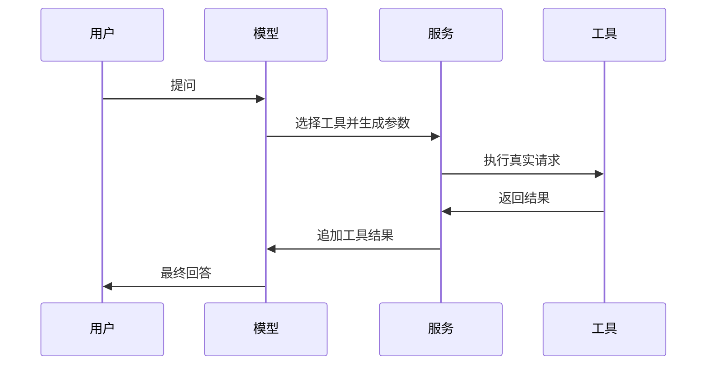
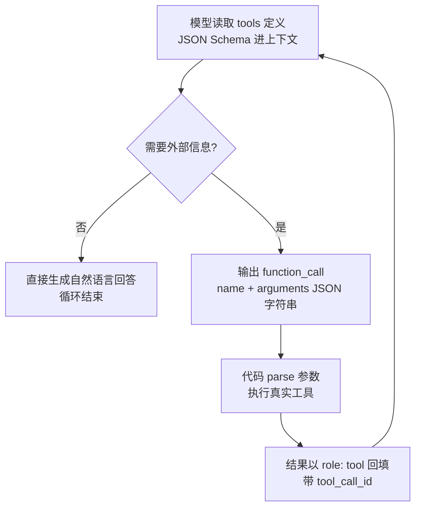

<title>全栈 AI Agent 工程师 · 08-13 · Function Calling</title>

# 知识点：Function Calling

<callout emoji="💡">
Function Calling 是让模型按 JSON Schema 选择并填充工具参数的机制，模型负责判断“要不要调用、调哪个、怎么传参”，真正执行仍然交给你的代码。
</callout>

## 为什么需要这个东西

只靠自然语言对话，Agent 最多只能“说得像会做事”，一旦碰到天气、订单、知识库、数据库这类真实数据，就必须把模型的输出接到外部工具上。没有 Function Calling，开发者只能自己解析模型文本，靠正则去猜“它是不是想调用工具”，这一步又脆又难调，模型一改口气，整条链路就碎。

在 Agent 项目里，这个问题绕不开，因为任务天然分两类，一类是纯生成，比如写总结，另一类是需要外部动作，比如查库存、查知识库、发起审批、写入工单。Function Calling 的作用不是让模型“更聪明”，而是把“判断”和“执行”拆开，模型负责决策，你的服务负责落地。

在 ai-tools-demo 这种项目里，它特别适合做“先问一嘴，再查一把”的入口，用户一句“帮我找上次那个优惠规则”，模型先判断要不要查知识库，再把检索参数按结构化格式吐出来，后端不用猜。

## 核心原理

核心就三步，模型先读你的工具定义，再决定是否发起 tool call，然后把工具返回值带回上下文继续生成。关键不在“会不会调用”，而在“参数格式被约束住了”，这让你的系统可以稳定接管执行层。



如果把它拆成简易模型，就是“模型出主意，代码干活，结果再喂回模型”。如果拆成详细机制，模型其实在做两件事：一是根据 prompt 和工具说明决定是否触发工具，二是根据 JSON Schema 约束输出参数结构。你给的 schema 越清楚，模型越不容易胡填字段。

## 底层实现原理

一条工具调用从模型到你的函数，也要穿越三层：最外层是 **API 协议**（tool_calls 在请求/响应里长什么样），中间是 **SDK/框架层**（帮你解析、校验、回填），最底层是 **HTTP 传输**（这些 JSON 字节怎么往返）。逐层拆开看。

### 第一层：API 协议——tool_calls 长什么样

模型侧的 Function Calling 不是魔法，它在 API 层面就是两种结构化数据：

- **请求里的 tools 定义**——你声明的工具清单，每个工具包含 name、description、parameters（JSON Schema），模型靠它知道“有哪些工具、各自什么参数”。
- **响应里的 function_call**——模型决定调用时输出的对象，包含 call_id、name、arguments（一个 **JSON 字符串**，注意是字符串不是对象）。

一次完整的工具调用在 API 层长这样：

```python
import json
import os
from langchain_openai import ChatOpenAI
from langchain_core.tools import tool
from langchain_core.messages import HumanMessage, ToolMessage

model = ChatOpenAI(
    model="gpt-4.1-mini",
    openai_api_key=os.getenv("OPENAI_API_KEY"),
)


@tool
def get_weather(location: str) -> dict:
    """Get current weather by city name"""
    if not location.strip():
        raise ValueError("location is required")
    return {"location": location, "temperature_c": 32, "condition": "sunny"}


model_with_tools = model.bind_tools([get_weather])


def main() -> None:
    try:
        response = model_with_tools.invoke("广州今天适合出门吗？")

        tool_call = response.tool_calls[0] if response.tool_calls else None
        if tool_call is None:
            print(response.content)
            return

        result = get_weather.invoke(tool_call["args"])
        follow_up = model_with_tools.invoke([
            HumanMessage(content="广州今天适合出门吗？"),
            ToolMessage(
                tool_call_id=tool_call["id"],
                content=json.dumps(result, ensure_ascii=False),
            ),
        ])
        print(follow_up.content)
    except Exception as exc:
        print(f"Function calling failed: {exc}")
        raise


if __name__ == "__main__":
    main()

```

关键约束有两个：arguments 是字符串，必须 JSON.parse 才能拿参数；回填必须带 tool_call_id，模型才能把结果和这次调用对上。协议层只负责定义数据结构，真正把这两个请求发出去的是第三层。

### 第二层：SDK/框架层——帮你把协议细节藏起来

手写也完全可行：fetch 两次、自己解析 output 数组、自己拼 tool 角色消息。OpenAI SDK 帮你做的，是把这些封装成 create() 调用：序列化 tools、解析响应暴露 output 数组、自动处理请求头。但它没帮你做参数校验、重试、并发控制，这些还是要自己写。

```typescript
import { ChatOpenAI } from "@langchain/openai";
import { tool } from "@langchain/core/tools";
import { HumanMessage, ToolMessage } from "@langchain/core/messages";
import { z } from "zod";

const model = new ChatOpenAI({
  model: "gpt-4.1-mini",
  apiKey: process.env.OPENAI_API_KEY,
});

const getWeather = tool(
  async ({ location }: { location: string }) => {
    if (!location.trim()) throw new Error("location is required");
    return { location, temperatureC: 32, condition: "sunny" };
  },
  {
    name: "get_weather",
    description: "Get current weather by city name",
    schema: z.object({ location: z.string().describe("City name") }),
  }
);

const modelWithTools = model.bindTools([getWeather]);

async function main() {
  try {
    const response = await modelWithTools.invoke("广州今天适合出门吗？");

    const toolCall = response.tool_calls?.[0];
    if (!toolCall) {
      console.log(response.content);
      return;
    }

    const result = await getWeather.invoke(toolCall.args);
    const followUp = await modelWithTools.invoke([
      new HumanMessage("广州今天适合出门吗？"),
      new ToolMessage({ tool_call_id: toolCall.id!, content: JSON.stringify(result) }),
    ]);

    console.log(followUp.content);
  } catch (error) {
    console.error("Function calling failed:", error);
    process.exitCode = 1;
  }
}

main();
```

```python
import json
import os
from langchain_openai import ChatOpenAI
from langchain_core.tools import tool
from langchain_core.messages import HumanMessage, ToolMessage

model = ChatOpenAI(
    model="gpt-4.1-mini",
    openai_api_key=os.getenv("OPENAI_API_KEY"),
)


@tool
def get_weather(location: str) -> dict:
    """Get current weather by city name"""
    if not location.strip():
        raise ValueError("location is required")
    return {"location": location, "temperature_c": 32, "condition": "sunny"}


model_with_tools = model.bind_tools([get_weather])


def main() -> None:
    try:
        response = model_with_tools.invoke("广州今天适合出门吗？")

        tool_call = response.tool_calls[0] if response.tool_calls else None
        if tool_call is None:
            print(response.content)
            return

        result = get_weather.invoke(tool_call["args"])
        follow_up = model_with_tools.invoke([
            HumanMessage(content="广州今天适合出门吗？"),
            ToolMessage(
                tool_call_id=tool_call["id"],
                content=json.dumps(result, ensure_ascii=False),
            ),
        ])
        print(follow_up.content)
    except Exception as exc:
        print(f"Function calling failed: {exc}")
        raise


if __name__ == "__main__":
    main()

```

### 第三层：模型侧机制与调用循环——模型怎么调用工具

Function Calling 不是 HTTP 层面的特殊机制，它发生在模型内部：模型在训练阶段见过大量“问题 → 工具调用 → 结果 → 回答”的数据，学会了在需要外部信息时输出结构化的 function_call，而不是自然语言。推理时，模型把 tools 定义（JSON Schema）作为上下文的一部分，按 token 概率决定是否触发工具、生成什么参数。

所以客户端侧的调用循环是：

```text
while True:
    response = llm(input + tools)      # 请求模型
    if response 里没有 function_call:  # 模型给出最终答案，循环结束
        return response
    # 模型要调工具：解析参数，执行，回填，继续循环
    args = json.loads(response.function_call.arguments)
    result = execute(response.function_call.name, args)
    input.append({"role": "tool", "content": result})

```

三个关键点：**第一**，模型输出里的 arguments 是 JSON 字符串而不是对象，因为模型按 token 生成，天然是文本流，parse 是你的职责。**第二**，回填必须带 tool_call_id，模型才能把结果和这次调用对上，否则上下文就断了。**第三**，整个循环里 HTTP 只是普通的请求-响应，真正决定“调不调、调哪个、怎么传参”的，是模型对 tools 定义（输入结构）的理解和对 function_call（输出结构）的生成——这就是本篇文章的核心。



1. 用户输入“广州今天适合出门吗”。
2. 模型先判断这不是纯生成题，而是要查实时天气。
3. 模型按 schema 生成 tool_call，并把 location 填成“广州”。
4. 服务端校验参数后调用真实天气函数。
5. 把工具结果回填给模型，模型再组织成自然语言回答。

运行方式：`npm i @langchain/openai @langchain/core zod`` && OPENAI_API_KEY=xxx node function-calling.ts`，Python 版则是 `pip install openai && OPENAI_API_KEY=xxx python function-calling.py`。

## 对比其他技术 / 方案

| 方案               | 优点                             | 代价 / 适用场景                             |
| ------------------ | -------------------------------- | ------------------------------------------- |
| Function Calling   | 结构稳定，参数可校验，适合工具链 | 依赖模型遵守 schema，复杂编排还要自己管状态 |
| 纯文本解析         | 实现快，接任何模型都能试         | 脆，提示词一变就坏，不适合生产              |
| Agent 框架自动编排 | 状态、重试、分支更省心           | 抽象更重，排障要理解框架内部                |

我的判断很直接，单次工具调用选 Function Calling，多步流程选框架。别一上来就把简单需求做成一台编排机器，那个味道太冲了。

## 适用场景 / 不适用场景

- **适合**：知识库检索、查天气、查订单、创建工单、参数固定的后端操作。
- **适合**：前端聊天入口里把自然语言转成结构化请求，再交给服务端执行。
- **不适合**：一步里要做很多轮决策、强依赖状态回写的长流程。
- **不适合**：工具定义含糊、输入字段经常变化、或者你还没想清楚真实业务边界的场景。

## 生产环境注意事项

**第一，**工具参数一定要做服务端校验，模型会填错字段名，也会漏必填项。**第二，**工具调用要有超时和重试，但重试前得确认操作幂等，不然一次失败重试成两次扣费或者两次下单。**第三，**日志里要记录 tool name、参数摘要、耗时和错误码，不然出了问题你只能猜。

**第四，**不要把所有工具一股脑塞给模型，工具越多，选择越乱，prompt 也越长，成本和误判都会上去。把工具按业务域拆开，先路由，再调用，通常更稳。

## 面试考点

- Function Calling 和普通文本生成的区别是什么，高分回答要点是“结构化输出、参数可校验、执行权在服务端”。
- 模型选错工具怎么办，高分回答要点是“缩小工具集、加强描述、增加路由层、记录失败样本回放”。
- 工具返回结果太长怎么办，高分回答要点是“先裁剪，再摘要，再回填，别把原始大文本全塞回上下文”。
- 你项目里怎么用过，高分回答要点是“把自然语言转成检索参数或审批参数，前后端都能看见结构化字段，排障快很多”。

常见追问：如果模型胡编参数怎么办，能不能只信模型输出？答案是不能，服务端必须校验；如果工具调用失败，模型还能继续吗，答案是能，但要把失败原因明确回填，不然它会瞎猜。

## 常见坑

- 症状：模型说要调用工具，但参数缺字段。原因：schema 太松，描述太短。解决：补 required、补 description、补示例。
- 症状：工具执行了两次。原因：重试逻辑没做幂等。解决：给每次请求加 requestId，后端做去重。
- 症状：回答越来越慢。原因：把完整工具原文塞回上下文。解决：只回填必要字段，长文本先摘要。
- 症状：一加新工具，旧工具命中率掉了。原因：工具描述彼此太像。解决：拆分工具边界，写清适用条件。
- 症状：线上偶发 500。原因：把 JSON.parse 当成绝不会失败。解决：工具参数解析和校验都要 try-catch。

## 小实验

1. 把一个天气函数接到 OpenAI Responses API，观察模型什么时候会发 tool call。
2. 把 schema 里的 required 删掉，再试一次，看模型开始怎么胡填。
3. 刻意让天气函数抛错，观察你是否能把错误回填给模型而不是直接断流。
4. 把工具返回值扩大 10 倍，感受上下文和延迟的变化。

## 学习延伸

在 ai-tools-demo 里，Function Calling 可以放在 chat service 的第一层，先把自然语言转成检索、写入、审批这类结构化动作，再交给 LangGraph 或后端任务流继续跑。下一篇可以继续学“tool routing”，也就是多个工具怎么先分流，再决定具体执行哪个。  
[Function Calling 指南](https://platform.openai.com/docs/guides/function-calling)  
[Structured Outputs](https://platform.openai.com/docs/guides/structured-outputs)  
[Streaming responses](https://platform.openai.com/docs/guides/streaming-responses)
