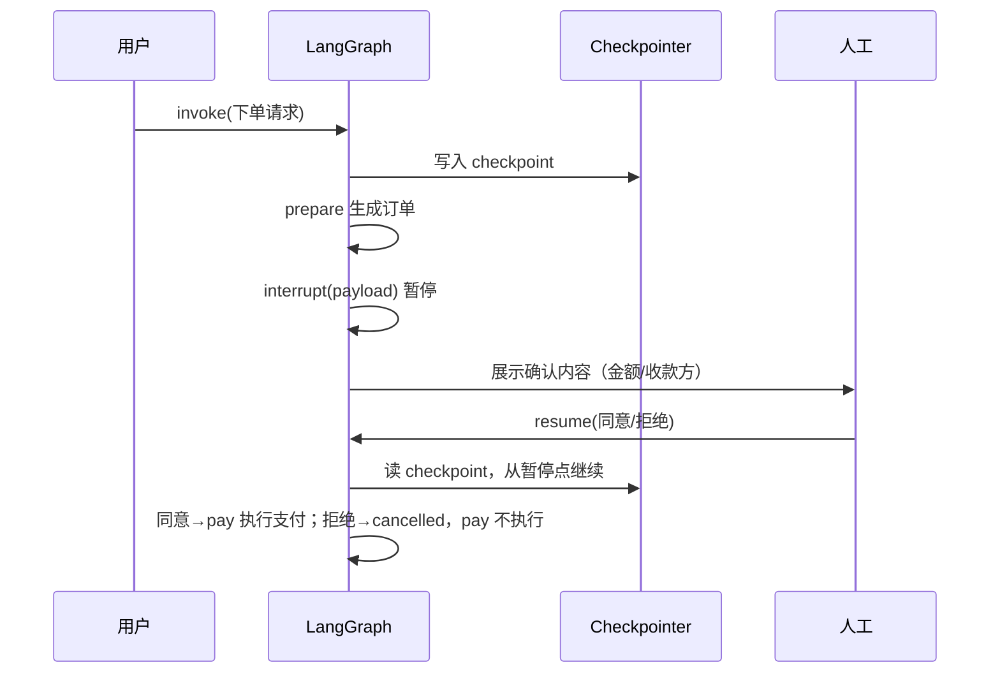

<title>全栈 AI Agent 工程师 · 08-15 · 危险操作执行前，怎么让 Agent 停下来等确认？</title>

# Interrupt / Human-in-the-loop：危险操作前必须停下来等人工确认

<callout emoji="💡">
interrupt 是 LangGraph 的暂停点——图执行到关键步骤停下来，把状态展示给人工确认，确认后从暂停点继续，而不是重跑。它适合支付、下单、发消息、写库等带副作用的操作。
</callout>

## 先看一个危险场景：Agent 已经准备扣款

Agent 根据用户的自然语言生成了订单：金额 2999 元，收款方是某个商家。接下来它只要调用支付工具，流程就结束了。问题是，用户可能只是让 Agent“准备订单”，并没有授权它真的扣款。

如果支付节点直接执行，错误判断会变成真实副作用。正确做法不是把所有权限都收走，而是在不可逆动作前插入一个人工确认点：机器准备数据，人确认边界。

LangGraph 的 interrupt 正好解决这个问题：第一次执行到暂停点时保存 checkpoint，外部确认后用 Command({resume}) 恢复同一个 thread。它不是重新调用一遍图，而是从保存的执行位置继续。

## 核心原理

interrupt 的使用姿势：编译图时传 **checkpointer**（保存执行位置），在危险节点前调用 **interrupt(payload)** 暂停（payload 是要展示给前端确认的内容），人工确认后 **invoke(new Command({ resume: 结果 }))** 从暂停点继续。

关键机制：第一次执行到 interrupt 时，图抛 GraphInterrupt 暂停，checkpoint 记录"跑到哪了"；resume 时框架读 checkpoint，从暂停点之后的节点继续执行——**前面已经执行的节点不会重跑**，副作用不重复。



## 底层实现原理

interrupt 依赖 checkpoint 的两样东西：**state 快照**（暂停时的状态值）和 **next 指针**（下一个要执行的节点）。resume 时框架不是从头跑，而是恢复快照、从 next 指向的节点继续——这就是"断点续跑"的实现。

可以用 getState() 查看暂停点：values 是当前状态（含 interrupt payload 和业务字段），next 是 resume 后要执行的节点列表。生产环境还可以在人工介入时用 updateState 修改状态（比如人工改了金额），再 resume——这是 HITL 的高级用法。

注意：interrupt 必须配合 checkpointer，否则框架无法保存"暂停到哪了"，直接报 MISSING_CHECKPOINTER 错误。

## 什么时候该用 interrupt？

| 方案                     | 恢复能力       | 副作用               | 适用场景           |
| ------------------------ | -------------- | -------------------- | ------------------ |
| 不用暂停直接执行         | 无             | 危险操作无把关       | 只读、低风险操作   |
| 应用层审批（外部流程）   | 要自己维护状态 | 状态割裂、易脏       | 已有审批系统的场景 |
| interrupt + checkpointer | 原生断点续跑   | 需 checkpointer 配合 | Agent 内嵌人工把关 |
| 人工改状态再 resume      | 能改执行参数   | 高级用法，要设计好   | 需要人工修正数据   |

判断标准只有一个：暂停点前后是否存在需要人工授权的副作用。支付、下单、发消息、删数据、写入正式库，适合用 interrupt；纯查询、低风险格式转换，没有必要每次都打断。

## 适用边界：别把 Agent 变成审批表单

- **适合**：支付、下单、发消息、删数据、写入正式库；人工修正参数；合规要求留痕的流程。
- **不适合**：只读查询、低风险格式转换、需要无人值守的高吞吐批处理。
- **不要滥用**：不是每个节点都要确认。确认点太多，Agent 会变成一步一审批，自动化价值反而没了。

## 完整示例：支付前确认，拒绝就不执行

下面用一个独立的支付示例演示完整链路，不依赖任何业务仓库。先运行没有 interrupt 的坏例子，再运行带确认的版本：同样的订单，只有人工批准后才会进入 pay 节点。

```typescript
import {
  Annotation,
  StateGraph,
  START,
  END,
  MemorySaver,
  interrupt,
  Command,
  GraphValueError,
} from "@langchain/langgraph";

/* ------------------------------------------------------------------ */
/* 1. 真实世界：支付工具（mock）                                         */
/* ------------------------------------------------------------------ */

function mockPay(amount: number, payee: string): string {
  return `✅ 支付成功：¥${amount.toFixed(2)} 已转给 ${payee}`;
}

/* ------------------------------------------------------------------ */
/* 2. 坏例子：没有 interrupt，危险操作直接执行                            */
/* ------------------------------------------------------------------ */

const DangerousState = Annotation.Root({
  amount: Annotation<number>({ default: () => 0 }),
  payee: Annotation<string>({ default: () => "" }),
  log: Annotation<string[]>({
    default: () => [],
    reducer: (a, b) => [...a, ...b],
  }),
});

function buildDangerousGraph() {
  return new StateGraph(DangerousState)
    .addNode("prepare", async () => ({
      amount: 2999.0,
      payee: "深圳某某数码专营店",
      log: ["[prepare] 生成订单：¥2999.00"],
    }))
    .addNode("pay", async (state) => ({
      log: [`[pay] 直接调用支付工具：${mockPay(state.amount, state.payee)}`],
    }))
    .addEdge(START, "prepare")
    .addEdge("prepare", "pay")
    .addEdge("pay", END)
    .compile();
}

async function badExample() {
  console.log("========== 坏例子：无 interrupt，危险操作直接执行 ==========");
  const graph = buildDangerousGraph();
  const result = await graph.invoke({});
  console.log("执行日志：", result.log.join(" → "));
  console.log("→ 用户根本没确认，钱就被扣了。这显然不能上生产。\n");
}

/* ------------------------------------------------------------------ */
/* 3. 好例子：interrupt 暂停 + 人工确认 + resume 继续                     */
/* ------------------------------------------------------------------ */

const OrderState = Annotation.Root({
  orderId: Annotation<string>({ default: () => "" }),
  amount: Annotation<number>({ default: () => 0 }),
  payee: Annotation<string>({ default: () => "" }),
  approved: Annotation<boolean | null>({ default: () => null, reducer: (_a, b) => b }),
  status: Annotation<string>({ default: () => "created", reducer: (_a, b) => b }),
  log: Annotation<string[]>({
    default: () => [],
    reducer: (a, b) => [...a, ...b],
  }),
});

function buildHitlGraph() {
  return (
    new StateGraph(OrderState)
      .addNode("prepare", async (state) => ({
        orderId: state.orderId,
        amount: 2999.0,
        payee: "深圳某某数码专营店",
        status: "awaiting_approval",
        log: ["[prepare] 生成订单：¥2999.00，收款方：深圳某某数码专营店"],
      }))
      .addNode("confirm", async (state) => {
        // interrupt() 是暂停点：
        //   第一次执行 → 抛出 GraphInterrupt，图停在 confirm 节点，等待外部 resume
        //   外部 resume 后 → interrupt() 的返回值就是 resume 传入的值
        const decision = interrupt<
          { type: string; amount: number; payee: string },
          {
            approved: boolean;
            note?: string;
          }
        >({
          type: "payment_approval",
          amount: state.amount,
          payee: state.payee,
        });
        return {
          approved: decision.approved,
          status: decision.approved ? "approved" : "cancelled",
          log: [
            `[confirm] 收到人工确认：${decision.approved ? "同意" : "拒绝"}${decision.note ? `（备注：${decision.note}）` : ""}`,
          ],
        };
      })
      .addNode("pay", async (state) => ({
        status: "paid",
        log: [`[pay] 执行支付：${mockPay(state.amount, state.payee)}`],
      }))
      // 条件边：批准才支付，拒绝直接结束（订单取消，钱不动）
      .addConditionalEdges("confirm", (state) => (state.approved ? "yes" : "no"), {
        yes: "pay",
        no: END,
      })
      .addEdge(START, "prepare")
      .addEdge("prepare", "confirm")
      .addEdge("pay", END)
      // 关键：interrupt 依赖 checkpointer 保存暂停点状态，编译时必须传
      .compile({ checkpointer: new MemorySaver() })
  );
}

async function goodExample() {
  console.log("========== 好例子：interrupt 暂停 → 人工确认 → resume ==========");
  const graph = buildHitlGraph();
  const config = { configurable: { thread_id: "order-20260815-001" } };

  // ① 第一次 invoke：跑到 confirm 的 interrupt() 时图暂停。
  // 注意版本差异：LangGraph v1.4+ 的 invoke 不抛异常，而是正常返回，
  // 返回的 state 里带 __interrupt__ 字段（早期版本是抛 GraphInterrupt）。
  const paused = await graph.invoke({ orderId: "ORD-20260815-001" }, config);
  const interrupts = (paused as { __interrupt__?: Array<{ value: unknown }> }).__interrupt__;
  if (interrupts && interrupts.length > 0) {
    console.log("① 图已暂停。暂停点要求人工确认：");
    console.log("   ", JSON.stringify(interrupts[0].value));
  } else {
    console.log("（意外：图没有暂停）");
  }

  // ② getState：查看暂停点的完整状态（values + 下一步 next）
  const snapshot = await graph.getState(config);
  console.log("② getState 暂停点快照：");
  console.log("   values：", JSON.stringify(snapshot.values));
  console.log("   next（下一步要执行的节点）：", JSON.stringify(snapshot.next));
  console.log("   （next 指向 confirm，说明 resume 后从 confirm 继续，而不是从头重跑）");

  // ③ 人工点了"同意" → Command(resume) 从暂停点继续
  const approvedResult = await graph.invoke(
    new Command({ resume: { approved: true, note: "人工已核对金额" } }),
    config
  );
  console.log("③ 人工同意后 resume，执行日志：", approvedResult.log.join(" → "));
  console.log("   最终状态：", approvedResult.status);

  // ④ 换一个 thread，人工点"拒绝" → 不支付，直接取消
  console.log("");
  const rejectConfig = { configurable: { thread_id: "order-20260815-002" } };
  await graph.invoke({ orderId: "ORD-20260815-002" }, rejectConfig);
  const rejectedResult = await graph.invoke(
    new Command({ resume: { approved: false, note: "金额不对，拒绝" } }),
    rejectConfig
  );
  console.log("④ 人工拒绝后 resume，执行日志：", rejectedResult.log.join(" → "));
  console.log("   最终状态：", rejectedResult.status, "（pay 节点从未执行，钱没动）");
  console.log("");
}

/* ------------------------------------------------------------------ */
/* 4. 补充：忘了传 checkpointer 会怎样                                    */
/* ------------------------------------------------------------------ */

async function noCheckpointerExample() {
  console.log("========== 补充：不传 checkpointer 的后果 ==========");
  const graph = new StateGraph(OrderState)
    .addNode("confirm", async (state) => {
      const decision = interrupt({
        type: "payment_approval",
        amount: state.amount,
        payee: state.payee,
      });
      return { approved: decision.approved };
    })
    .addEdge(START, "confirm")
    .addEdge("confirm", END)
    .compile(); // 没传 checkpointer！

  try {
    await graph.invoke({ amount: 1, payee: "x" });
  } catch (err) {
    if (err instanceof GraphValueError) {
      console.log("报错信息：", err.message);
      console.log("→ interrupt 必须配合 checkpointer 才能保存'暂停到哪了'，这是设计使然。");
    } else {
      console.log("（抛出了非预期错误）", (err as Error).message);
    }
  }
  console.log("");
}

/* ------------------------------------------------------------------ */
/* 5. main                                                             */
/* ------------------------------------------------------------------ */

async function main() {
  await badExample();
  await goodExample();
  await noCheckpointerExample();

  console.log("========== 结论 ==========");
  console.log(
    "Human-in-the-loop 的正确姿势：\n" +
      "  1. 编译时传 checkpointer（MemorySaver / 生产用 PostgresSaver）；\n" +
      "  2. 危险节点前调用 interrupt(payload) 暂停，payload 展示给前端；\n" +
      "  3. 前端确认后 invoke(new Command({ resume: 结果 })) 从暂停点继续；\n" +
      "  4. getState() 可随时查看暂停点状态（next 表示 resume 后从哪个节点继续）。"
  );
}

main().catch((err) => {
  console.error("main 执行失败：", err);
  process.exitCode = 1;
});
```

这段代码展示了两条路径：

- 坏例子：prepare 之后直接进入 pay，用户没有确认也会执行支付。
- 好例子：prepare → confirm（interrupt）→ 人工 resume；同意才走 pay，拒绝直接结束。

这里的关键不是 mockPay，而是 **副作用节点 pay 被放在 interrupt 之后**。确认之前，支付函数根本没有机会被调用。

## 接到真实服务时，还要补上四层保护

- **持久化 checkpoint**：MemorySaver 适合本地实验，生产要换 PostgresSaver 等持久化实现，否则服务重启后找不到待确认任务。
- **审批任务管理**：保存 pending 状态、创建时间、审批人和 thread_id，让前端可以查询“还有哪些待确认”。
- **超时与幂等**：超过 10 分钟未确认就自动取消；支付、发消息等副作用还要带业务幂等键，避免重复 resume。
- **信息脱敏与审计**：interrupt payload 只放需要展示的字段；记录谁在什么时候确认了什么，不能把整个 state 原样暴露给前端。

## 面试考点

- **interrupt 和普通暂停有什么区别？** interrupt 会把状态和执行位置写入 checkpoint，之后可用 Command({resume}) 从同一 thread 恢复；普通暂停需要业务层自己保存和恢复。
- **为什么必须传 checkpointer？** 因为框架需要保存暂停时的 state、next 和 interrupt payload；没有它就没有可恢复的断点。
- **resume 后前面的节点会重跑吗？** 正常 resume 不会从 START 重跑，但要注意：包含 interrupt 的节点在恢复时会重新执行该节点函数，因此 interrupt 前不要放不可幂等的副作用。
- **人工想修改执行参数怎么办？** 可以用 updateState 修改状态后再 resume，但金额、收款方等敏感字段必须重新校验并写入审计日志。

## 最容易踩的坑

- **没有 checkpointer**：interrupt 直接报错。开发用 MemorySaver，生产换持久化实现。
- **把副作用放在 interrupt 前面**：节点恢复时可能重新执行，副作用必须幂等，最好把真正的支付/写库放在确认之后。
- **把普通新输入当 resume**：恢复暂停图必须传 Command({resume})，并使用原来的 thread_id。
- **无限等待人工**：没有超时和取消机制，pending 任务会越积越多。
- **payload 过度暴露**：不要把完整 state 直接塞进 interrupt，只展示脱敏后的确认信息。

## 参考来源

- [LangGraph JS：Human-in-the-loop / Interrupts](https://langchain-ai.github.io/langgraphjs/concepts/human_in_the_loop/)
- [LangGraph JS：How to wait for user input](https://langchain-ai.github.io/langgraphjs/how-tos/wait-user-input/)
- [LangGraph JS：Persistence and checkpointers](https://langchain-ai.github.io/langgraphjs/concepts/persistence/)
