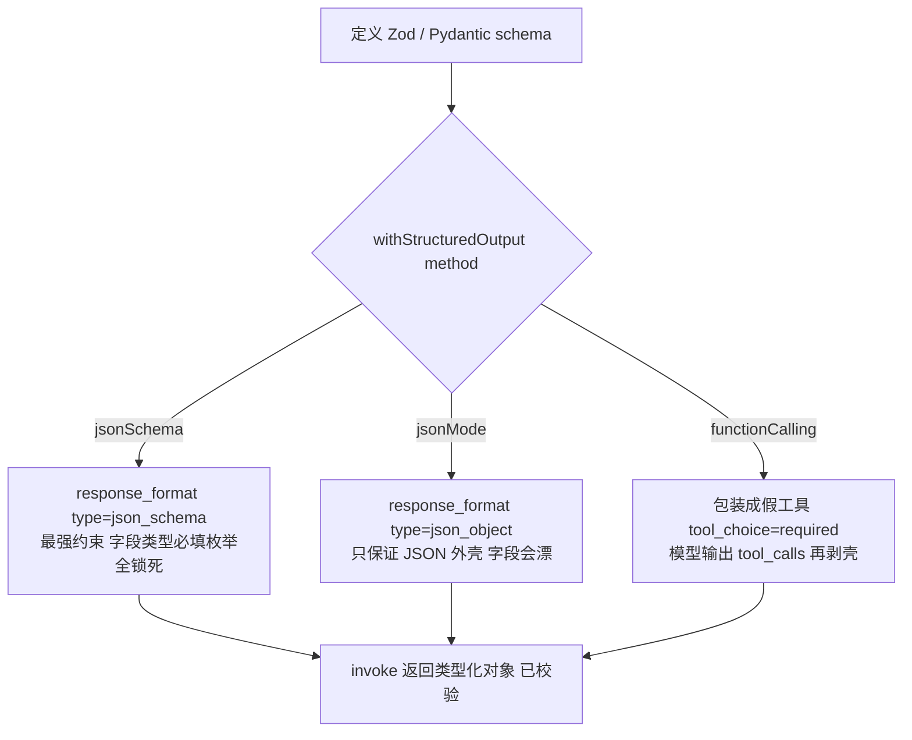

<title>全栈 AI Agent 工程师 · 08-15 · LangChain 结构化输出</title>

# LangChain 结构化输出：一个 withStructuredOutput，三种底层模式

<callout emoji="💡">
在 @langchain/openai 里，结构化输出只有一个入口：**withStructuredOutput()**。它内部按 method 参数自动映射到 OpenAI 的 json_schema / json_object / function calling 三种底层机制。要模型"执行动作"才单独用 bindTools()——这俩经常被搞混。
</callout>

## 为什么需要这个东西

Agent 项目最烦的不是模型不会答，而是模型答得太自由，后端接不住。你让它提取订单、生成表单、拆解任务，它可能多写解释、漏字段、字段名漂移，最后业务代码只能靠正则和补丁兜底，越跑越脏。

在 ai-tools-demo 里，自然语言经常要立刻变成结构化对象，再交给工作流或者数据库。没有输出约束，前端看见的像 JSON，后端拿到的却是半成品。这种错误不是一次性报错，而是悄悄污染后面的节点。

没有 withStructuredOutput 之前，你只能手写 prompt 要求"输出 JSON"，然后 JSON.parse 一把梭，失败就重试，字段漂了就加正则。有了它，你只需要定义一个 Zod/Pydantic schema，LangChain 负责转换、约束、解析、校验，invoke 直接返回类型化对象。

## 核心原理

先记住一个心智模型：**schema 是合同，method 是快递方式**。你定义 schema 只写一次，method 决定这份合同通过哪条通道送到模型手里，以及模型怎么交卷。



三种 mode 的约束强度完全不同：json_schema 把字段类型、必填项、枚举、额外字段一起钉死；json_object 只保证"输出是合法 JSON"；functionCalling 则让模型以为自己在调工具，输出 tool_calls 结构。选哪个，取决于"结果要喂给谁"。

## 底层实现原理

真正起作用的不是提示词，而是 wire JSON 里的 response_format 和 tool 定义。模型生成 token 时，解码器被这个结构约束收紧，输出会朝着你要的格式走。LangChain 做的事就是：把你的 Zod/Pydantic schema 转成 JSON Schema，再按 method 塞进 wire 的不同位置。

**method=jsonSchema**：schema 直接进 response_format.json_schema，strict=true 时所有字段必须 required，且禁止额外属性。

```json
{
  "model": "gpt-4.1-mini",
  "input": "从这段话提取订单信息",
  "response_format": {
    "type": "json_schema",
    "json_schema": {
      "name": "order_extraction",
      "strict": true,
      "schema": {
        "type": "object",
        "properties": {
          "order_id": { "type": "string" },
          "amount": { "type": "number" },
          "currency": { "type": "string", "enum": ["CNY", "USD"] }
        },
        "required": ["order_id", "amount", "currency"],
        "additionalProperties": false
      }
    }
  }
}
```

**method=functionCalling**：LangChain 把你的 schema 包装成一个"假工具"塞进 tools 数组，并强制 tool_choice 必须调用它。模型输出 tool_calls，arguments 字段里才是真正的 JSON，LangChain 再帮你剥出来解析。

**method=jsonMode**：只发 response_format.type=json_object，并在 system prompt 里追加"必须返回 JSON"的指令。模型不会像 json_schema 那样逐 token 约束，所以字段漂移全靠后端兜。

拆成两层看：第一层模型按结构生成，第二层服务端校验。模型不是类型系统，它只是更愿意听话，最终落地还是要 safeParse 一遍，别把"模型说了算"当成"系统保证了"。

## 对比其他方案：functionCalling 的两副面孔

这是最容易踩坑的地方。**method=functionCalling 只是"借用工具调用的通道来输出数据"**，模型并不会真的执行任何东西。真正让模型执行工具、拿到工具结果再继续推理的，是 bindTools()——那是 Agent 循环的事。

| 方案                                        | 约束强度                   | 适合什么                                           | 代价                                                  |
| ------------------------------------------- | -------------------------- | -------------------------------------------------- | ----------------------------------------------------- |
| withStructuredOutput method=jsonSchema      | 强，字段类型必填枚举全锁死 | 订单提取、表单解析、工作流输入，结果直接喂业务系统 | schema 复杂时 token 和延迟上升；strict 要求全字段必填 |
| withStructuredOutput method=functionCalling | 中，走工具调用结构         | 模型不支持 json_schema 时的降级方案                | 输出要剥 tool_calls 壳，语义绕                        |
| withStructuredOutput method=jsonMode        | 弱，只保 JSON 外壳         | 快速原型、容错高的日志类输出                       | 字段会漂，必须后端补校验                              |
| bindTools()                                 | 不约束输出，约束行为       | Agent 执行动作：查库、调 API、多轮工具循环         | 要自己处理工具循环和结果回填                          |

判断标准很直接：要**数据**就 withStructuredOutput，能接受漂字段用 jsonMode，要严格合同用 jsonSchema；要**动作**就用 bindTools。别拿最弱的模式撑生产链路，也别拿工具调用通道当纯数据输出用。

## 适用场景 / 不适用场景

- 适合：订单抽取、表单解析、工作流参数生成、Coze 或 LangGraph 节点入参整理。
- 适合：ai-tools-demo 里把用户自然语言转成稳定 JSON，再交给后续工具或数据库。
- 适合：模型能力较强（gpt-4o 及以上）且 schema 稳定、字段已想清楚的阶段。
- 不适合：开放式创作、长文总结、允许模型自由发挥的内容生成。
- 不适合：schema 频繁变化、字段不稳定、还没想清楚业务合同的阶段。
- 不适合：需要模型反复调用多个工具并依据结果继续推理的场景——那是 bindTools + Agent 循环。

## 示例：agent-coze-workflow 的 plan_workflow 结构化输出

场景是 agent-coze-workflow 项目：plan_workflow 工具需要 LLM 返回严格的 steps JSON 数组——每步含 nodeType（节点类型）、description（功能描述）、dependencies（依赖的前置步骤）。之前用 json_object 模式，字段名经常漂移（nodeType 变 type、dependencies 变 deps），后端解析失败。切到 withStructuredOutput + jsonSchema strict 模式后，字段锁定，invoke 直接返回类型化对象。

```typescript
import { ChatOpenAI } from "@langchain/openai";
import { z } from "zod";

// agent-coze-workflow 的 WorkflowPlanner 输出的真实 schema
const WorkflowStepSchema = z.object({
  index: z.number().describe("步骤序号，从 0 开始"),
  nodeType: z
    .enum(["start", "llm", "code", "condition", "text", "merge", "http", "database_query", "end"])
    .describe("Coze 节点类型"),
  description: z.string().describe("该步骤的功能描述，一句话说清做什么"),
  dependencies: z.array(z.number()).describe("依赖的前置步骤 index 列表"),
});

const WorkflowPlanSchema = z.object({
  name: z.string().describe("工作流名称"),
  description: z.string().describe("工作流用途描述"),
  steps: z.array(WorkflowStepSchema).describe("工作流步骤列表"),
  estimatedComplexity: z.enum(["low", "medium", "high"]).describe("预估复杂度"),
});

type WorkflowPlan = z.infer<typeof WorkflowPlanSchema>;

async function main() {
  const llm = new ChatOpenAI({ model: "gpt-4.1-mini", temperature: 0 });

  // withStructuredOutput + jsonSchema strict：字段类型、必填、枚举全锁死
  const structuredLlm = llm.withStructuredOutput(WorkflowPlanSchema, {
    method: "jsonSchema",
    name: "workflow_plan",
    strict: true,
  });

  console.log("========== withStructuredOutput 验证 ==========\n");
  console.log("Schema 已绑定：WorkflowPlanSchema");
  console.log("  method: jsonSchema (strict: true)");
  console.log("  invoke 返回类型：WorkflowPlan（已校验，无需手动 parse）\n");

  if (!process.env.OPENAI_API_KEY) {
    console.log("⚠️  跳过 LLM 调用：需要设置 OPENAI_API_KEY 环境变量");
    console.log("   Schema 结构验证通过 ✅（类型检查通过）");
    return;
  }

  try {
    const plan: WorkflowPlan = await structuredLlm.invoke(
      "用户输入：帮我建一个音频识别工作流，输入 MP3 链接，输出歌曲名和歌手"
    );
    console.log("LLM 返回结果：");
    console.log(`  工作流名称：${plan.name}`);
    console.log(`  步骤数：${plan.steps.length}`);
    for (const step of plan.steps) {
      console.log(
        `    [${step.index}] ${step.nodeType}: ${step.description} (依赖: [${step.dependencies}])`
      );
    }
    console.log(`  复杂度：${plan.estimatedComplexity}`);
    console.log("\n✅ withStructuredOutput 调用成功");
  } catch (error) {
    console.error("调用失败:", (error as Error).message);
    console.log("⚠️  可能需要有效的 API key");
  }
}

main().catch((e) => {
  console.error("运行失败:", e);
  process.exitCode = 1;
});
```

1. 定义 WorkflowPlanSchema（Zod/Pydantic），含 steps 数组 + 每步的 nodeType 枚举 + dependencies 列表。
2. withStructuredOutput 绑定 schema，method="jsonSchema" + strict=true，字段类型、必填、枚举全锁死。
3. invoke 直接返回 WorkflowPlan 类型化对象，不需要 JSON.parse + safeParse。
4. 之前用 json_object 模式：nodeType 漂成 type、dependencies 漂成 deps → 后端解析失败。
5. 切到 jsonSchema strict 后：字段稳定，schema-converter 直接消费 steps 数组生成 Coze 工作流 JSON。

## 生产环境注意事项

- 显式传 method，别依赖默认值。LangChain 不传 method 时会按 schema 类型和模型能力自动猜，猜的结果可能不是你想要的，线上行为就不确定了。
- json_schema 不等于零成本，schema 越复杂 prompt 和响应越长，延迟和 token 都会上去。复杂场景拆小 schema、分阶段抽取。
- strict 模式要求所有字段必填且禁止额外属性，Zod 的 .optional() 和 Pydantic 的可选字段会直接转换失败，设计 schema 时就按"全必填"来。
- 服务端一定要保留校验层（zod safeParse / pydantic validate），模型偶尔还会在边界条件上出问题。
- schema 变更要做版本管理，前后端一改，老客户端会直接挂。

## 面试考点

- 问：withStructuredOutput 的三种 method 有什么区别？答：method 决定底层 wire 机制，jsonSchema 走 response_format 严格约束字段类型和必填，jsonMode 只保证 JSON 外壳，functionCalling 把 schema 包装成假工具走 tool_calls 通道；约束强度递减。
- 问：method=functionCalling 和 bindTools 有什么区别？答：前者只是借用工具调用通道输出数据，模型不执行任何东西；后者是真正的工具执行，模型决定调哪个工具，代码执行完结果回填，是 Agent 循环的基础。
- 问：你在项目里怎么选？答：订单提取、工作流参数用 jsonSchema + strict，快速试验用 jsonMode，需要模型调工具做事用 bindTools。
- 追问：strict 模式对 schema 有什么限制？答：所有字段必须 required，禁止 additionalProperties，可选字段要用默认值或重构，否则转换直接报错。

## 常见坑

- 症状：不传 method 时输出格式不稳定。原因：LangChain 自动选择逻辑依赖模型能力和 schema 类型。解决：显式传 method。
- 症状：method=functionCalling 拿到的结果要剥壳。原因：模型输出的是 tool_calls 而不是纯 JSON。解决：纯数据输出直接用 jsonSchema，别绕工具通道。
- 症状：strict: true 一开就报 schema 转换错误。原因：Zod 的 .optional() 字段不满足 strict 全必填要求。解决：去掉 optional，用默认值代替。
- 症状：jsonMode 下字段偶尔漂值（enum 出现 RMB）。原因：json_object 不约束字段内容。解决：服务端强校验，或升级 jsonSchema。
- 症状：schema 一加严就超时。原因：约束太重，模型生成和重试成本都上去了。解决：拆小 schema、分阶段抽取。

## 小实验

1. 同一句中文输入，分别切 jsonSchema / jsonMode / functionCalling，观察返回形态差异（类型化对象 vs 需要剥壳）。
2. 把 strict 打开后给 Zod schema 加一个 .optional() 字段，观察转换报错，理解 strict 的约束。
3. 故意把 currency 写成 "RMB"，观察 jsonMode 不拦截、jsonSchema 拦截的差别。
4. 用 bindTools 让模型"决定"是否调工具：分别问"帮我下单"和"今天天气如何"，看 tool_calls 的变化。

## 学习延伸

这篇可以直接落到 ai-tools-demo 的结构化提取、LangGraph 节点入参校验、Coze workflow 参数整理。下一篇建议学"bindTools 和 Agent 工具循环怎么配合"，把 function calling 从输出通道升级成真正的执行能力。

[OpenAI Structured Outputs](https://platform.openai.com/docs/guides/structured-outputs)[OpenAI Function Calling](https://platform.openai.com/docs/guides/function-calling)[LangChain 结构化输出文档](https://langchain-ai.github.io/langgraphjs/how-tos/respond-in-format/)[langchain-openai ChatOpenAI API](https://api.js.langchain.com/classes/langchain_openai.ChatOpenAI.html)
