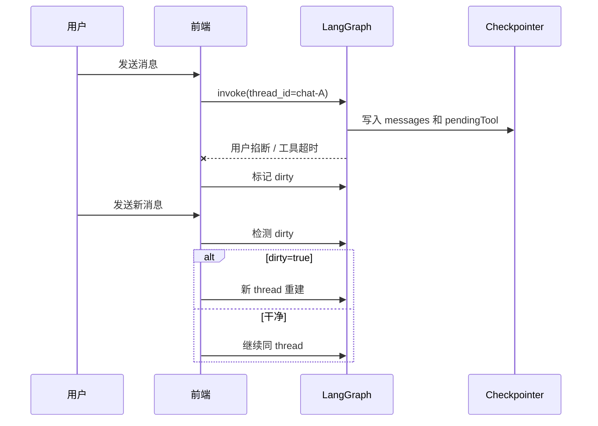

# 全栈 AI Agent 工程师 · 08-16 · 脏状态怎么救回来？

上次我们把 LangGraph 的会话跑通了，但真到前端接流的时候，最烦的不是"跑不起来"，而是"跑到一半被用户掐掉了"。如果这时还沿用同一个 thread_id，下一轮消息很容易把上一轮残留一起带上来，页面看着像接对了，实际已经脏了。

这篇文章不依赖任何项目仓库，你自己建个空目录、装一个依赖就能跟着跑：

```bash
mkdir dirty-demo && cd dirty-demo
npm init -y
npm i @langchain/langgraph tsx
```

## 先搭一个会"半路死掉"的最小 Agent

我们要复现的是"执行到一半被中断"。所以最小图里得有：一个状态、一个会模拟慢速外部 API 的工具节点、一个决定"要不要调工具"的编排节点。先看状态：

```typescript
import { Annotation, StateGraph, START, END, MemorySaver } from "@langchain/langgraph";

const State = Annotation.Root({
  // 消息用 reducer 追加，不是覆盖 —— 脏状态复现的关键
  messages: Annotation<string[]>({
    default: () => [],
    reducer: (a, b) => [...a, ...b],
  }),
  // 记录"正在调用的工具"
  pendingTool: Annotation<string | null>({ default: () => null }),
  // 这一轮是否被打断过
  dirty: Annotation<boolean>({ default: () => false }),
});
```

两个节点。route 看最后一条消息：以"帮我查"开头就去调工具，否则直接结束。callTool 模拟外部 API，演示时等 3 秒（真实场景可能是 30 秒）：

```typescript
// 工具节点：模拟调用外部 API（演示 3 秒，真实可能 30 秒）
async function callTool(state: typeof State.State) {
  await new Promise((r) => setTimeout(r, 3000));
  return { messages: [`工具返回：${state.pendingTool} 执行成功`] };
}

// 编排节点：根据最后一条消息决定下一步
async function route(state: typeof State.State) {
  const last = state.messages[state.messages.length - 1];
  if (last.startsWith("帮我查")) {
    return { pendingTool: `query:${last}` };
  }
  return { messages: ["流程正常结束"] };
}
```

最后编译成图，挂上 MemorySaver 当 checkpointer。这就是一个完整可跑的最小 Agent：

```typescript
function buildGraph() {
  return new StateGraph(State)
    .addNode("route", route)
    .addNode("callTool", callTool)
    .addEdge(START, "route")
    .addConditionalEdges("route", (state) => (state.pendingTool ? "callTool" : END))
    .compile({ checkpointer: new MemorySaver() });
}
```

## 模拟用户中断：AbortController

前端用户点"停止"，本质是 abort 掉这次请求。我们用 AbortController 模拟：第一轮消息发出去 1.5 秒后掐断（工具还没跑完 3 秒）：

```typescript
async function invokeWithUserStop(graph: any, input: any, cfg: any) {
  const controller = new AbortController();
  const timer = setTimeout(() => controller.abort(), 1500);
  try {
    return await graph.invoke(input, { ...cfg, signal: controller.signal });
  } catch (e: any) {
    console.log("第一轮中断:", e.message);
    return null;
  } finally {
    clearTimeout(timer);
  }
}
```

## 场景 A：中断后直接复用 thread，会发生什么？

第一轮发"帮我查订单 12345"，跑到一半被掐断。先看看 checkpoint 里留下了什么：

```typescript
const graphA = buildGraph();
const cfgA = { configurable: { thread_id: "chat-A" } };

await invokeWithUserStop(graphA, { messages: ["帮我查订单 12345"] }, cfgA);

const stA = await graphA.getState(cfgA);
console.log("中断后 checkpoint:", JSON.stringify(stA.values), "| next:", JSON.stringify(stA.next));

// 第二轮：同一个 thread_id 发新话题
const resultA = await graphA.invoke({ messages: ["今天天气怎么样"] }, cfgA);
console.log("第二轮 messages:", JSON.stringify(resultA.messages));
```

```bash
第一轮中断: This operation was aborted
中断后 checkpoint: {"messages":["帮我查订单 12345"],"pendingTool":"query:帮我查订单 12345"} | next: ["callTool"]
第二轮 messages: ["帮我查订单 12345","今天天气怎么样","流程正常结束","工具返回：query:帮我查订单 12345 执行成功"]
```

仔细看第二轮的输出，这就是脏状态最坑的地方：新消息"今天天气怎么样"其实被 route 正常处理了（有"流程正常结束"），但 **pendingTool 里还残留着第一轮的 query:帮我查订单 12345，条件边一看非空，又把 graph 带进了 callTool——多执行了一次不该执行的第一轮任务**。用 stream 模式能看到真实执行顺序：

```bash
执行节点: route → {"messages":["流程正常结束"]}
执行节点: callTool → {"messages":["工具返回：query:帮我查订单 12345 执行成功"]}
```

如果是真实的订单查询，这意味着：用户换了个话题，系统却在后台又查了一次上一单。轻则多花一次 API 钱，重则重复下单、重复发消息。这就是为什么脏状态必须处理。

## 场景 B：标 dirty，下一轮换 thread 重建

修复方式不复杂：第一轮中断后，服务端先把当前 thread 标脏；下一轮进来时检查——dirty 为 true 或者 next 里还有未完成节点，就别硬续了，换一个新 thread 从头重建：

```typescript
const graphB = buildGraph();
const cfgB = { configurable: { thread_id: "chat-B" } };

await invokeWithUserStop(graphB, { messages: ["帮我查订单 12345"] }, cfgB);

// 1. 把当前 thread 标脏
await graphB.updateState(cfgB, { dirty: true });

// 2. 下一轮进来先检查
const stB = await graphB.getState(cfgB);
const isDirty = stB.values.dirty === true || stB.next.length > 0;
console.log("服务层检测 →", isDirty ? "脏，换新 thread 重建" : "干净，继续同 thread");

// 3. 脏就换新 thread 重建
if (isDirty) {
  const freshCfg = { configurable: { thread_id: "chat-B-fresh" } };
  const resultB = await graphB.invoke({ messages: ["今天天气怎么样"] }, freshCfg);
  console.log("重建后 messages:", JSON.stringify(resultB.messages));
}
```

```bash
第一轮中断: This operation was aborted
标脏后 checkpoint: {"messages":["帮我查订单 12345"],"pendingTool":"query:帮我查订单 12345","dirty":true} | next: ["callTool"]
服务层检测 → 脏，换新 thread 重建
重建后 messages: ["今天天气怎么样","流程正常结束"]
```

新 thread 从零开始，没有 pendingTool 残留，新话题干净跑完。这里的判断很朴素但够用：**如果这轮没跑完，就别指望同一个 checkpoint 还能继续干净地接新话题**。LangGraph 的 checkpoint 适合保存执行状态，不适合拿来硬扛"被打断后继续聊新话题"这种场景。

## 对比一下：续跑和重建差在哪

| 方案            | 优点                           | 代价                                    | 适用场景                   |
| --------------- | ------------------------------ | --------------------------------------- | -------------------------- |
| 直接复用 thread | 简单，少一层逻辑               | 残留 pendingTool 会导致旧任务被重复执行 | 纯测试、一次性短流程       |
| 标脏后重建      | 新话题干净，不会重复执行旧任务 | 要维护 dirty 标记和新 thread            | 真实聊天、工具调用、长任务 |

我会直接推荐第二种。因为一旦你有工具调用、外部 API、HITL 打断，流程就不是"问答"那么轻了，脏状态一定会冒头。

## 回头看：checkpoint 到底在干嘛



刚才的两个实验，正好对应图里的两条路。第一条是"继续同 thread"，看起来省事，实际上会把残留的 pendingTool 一起带走，导致新话题里偷偷执行旧任务。第二条是"检测 dirty 再重建"，麻烦一点，但状态边界清楚。

## 完整代码：复制就能跑

上面都是拆开讲的，这是完整文件，存成 dirty-checkpoint.ts，`npx tsx dirty-checkpoint.ts` 直接跑：

```typescript
import { Annotation, StateGraph, START, END, MemorySaver } from "@langchain/langgraph";

// 1. 状态：三块数据
const State = Annotation.Root({
  messages: Annotation<string[]>({
    default: () => [],
    reducer: (a, b) => [...a, ...b],
  }),
  pendingTool: Annotation<string | null>({ default: () => null }),
  dirty: Annotation<boolean>({ default: () => false }),
});

// 2. 工具节点：模拟外部 API（演示 3 秒）
async function callTool(state: typeof State.State) {
  await new Promise((r) => setTimeout(r, 3000));
  return { messages: [`工具返回：${state.pendingTool} 执行成功`] };
}

// 3. 编排节点
async function route(state: typeof State.State) {
  const last = state.messages[state.messages.length - 1];
  if (last.startsWith("帮我查")) {
    return { pendingTool: `query:${last}` };
  }
  return { messages: ["流程正常结束"] };
}

// 4. 编译成图
function buildGraph() {
  return new StateGraph(State)
    .addNode("route", route)
    .addNode("callTool", callTool)
    .addEdge(START, "route")
    .addConditionalEdges("route", (state) => (state.pendingTool ? "callTool" : END))
    .compile({ checkpointer: new MemorySaver() });
}

// 5. 模拟用户 1.5 秒后掐断
async function invokeWithUserStop(graph: any, input: any, cfg: any) {
  const controller = new AbortController();
  const timer = setTimeout(() => controller.abort(), 1500);
  try {
    return await graph.invoke(input, { ...cfg, signal: controller.signal });
  } catch (e: any) {
    console.log("第一轮中断:", e.message);
    return null;
  } finally {
    clearTimeout(timer);
  }
}

// ===== 场景 A：中断后直接复用 thread =====
const graphA = buildGraph();
const cfgA = { configurable: { thread_id: "chat-A" } };
await invokeWithUserStop(graphA, { messages: ["帮我查订单 12345"] }, cfgA);
const stA = await graphA.getState(cfgA);
console.log("中断后 checkpoint:", JSON.stringify(stA.values), "| next:", JSON.stringify(stA.next));
const resultA = await graphA.invoke({ messages: ["今天天气怎么样"] }, cfgA);
console.log("第二轮 messages:", JSON.stringify(resultA.messages));

// ===== 场景 B：标 dirty + 换 thread 重建 =====
const graphB = buildGraph();
const cfgB = { configurable: { thread_id: "chat-B" } };
await invokeWithUserStop(graphB, { messages: ["帮我查订单 12345"] }, cfgB);
await graphB.updateState(cfgB, { dirty: true });
const stB = await graphB.getState(cfgB);
const isDirty = stB.values.dirty === true || stB.next.length > 0;
console.log("服务层检测 →", isDirty ? "脏，换新 thread 重建" : "干净，继续同 thread");
if (isDirty) {
  const freshCfg = { configurable: { thread_id: "chat-B-fresh" } };
  const resultB = await graphB.invoke({ messages: ["今天天气怎么样"] }, freshCfg);
  console.log("重建后 messages:", JSON.stringify(resultB.messages));
}
```

## 总结

LangGraph 的 checkpoint 能记住执行状态，也会把未完成的节点保留下来。被中断后直接复用同一个 thread，最危险的不是"消息混在一起"，而是 **pendingTool 这类残留状态会带着条件边重新执行旧任务**——新话题看着正常跑完了，后台却多干了一次上一轮的活。

解决办法不是"更聪明地猜"，而是明确加一层 dirty 标记。只要这轮没正常收尾，下次就换新 thread 重建 graph。

这个策略的代价是要维护状态边界，但换来的是可控。真实聊天、工具调用、HITL 打断这些场景里，这点代价很值。

## 面试考点

- **LangGraph 的 checkpoint 和业务层会话是什么关系？** 高分要点：checkpoint 记录图的执行状态，比如 pending 节点、已写入的 state；业务层会话记录对话语义。两者不能混用，尤其被中断后，checkpoint 可能脏，业务层要决定是否重建。
- **为什么不能直接复用同一个 thread_id？** 高分要点：未完成节点会留在 next 里，state 里的残留字段（如 pendingTool）会影响条件边路由，导致新话题被旧任务污染、旧任务被重复执行。
- **你在项目里怎么判断该重建还是续跑？** 高分要点：看 dirty 标记和 graph.getState() 的 next；只要上一次不是正常收尾，就重建新 thread，让上下文从干净状态开始。
- **这种方案有什么代价？** 高分要点：要额外维护 dirty 状态和 thread 切换逻辑，但比起把脏状态带进后续对话、重复执行副作用任务，这个成本更低。

## 参考来源

- [LangGraph JS 文档索引：Persistence / Human-in-the-loop / Time Travel / Memory / Streaming](https://langchain-ai.github.io/langgraphjs/llms.txt)
- [LangGraph JS 文档：Persistence](https://langchain-ai.github.io/langgraphjs/concepts/persistence/)
- [LangGraph JS 文档：How to wait for user input](https://langchain-ai.github.io/langgraphjs/how-tos/human_in_the_loop/wait-user-input/)
- [LangGraph JS 文档：How to view and update past graph state](https://langchain-ai.github.io/langgraphjs/how-tos/time-travel/)
