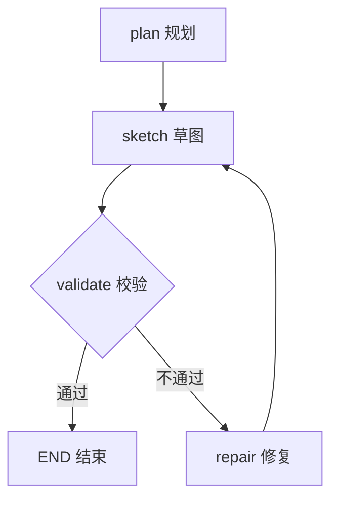

<title>AI Agent 知识点手册 · 08-12 · LangGraph StateGraph 状态机</title>

# 知识点：LangGraph StateGraph

StateGraph 是 LangGraph 的核心抽象：把 Agent 工作流建模成一张「图」——节点（Node）负责干活，边（Edge）决定流转，共享的 State 在节点之间传递。复杂流程（规划→执行→校验→修复）用 StateGraph 表达，比写一堆 if/else 清晰得多。

<callout emoji="💡">
一句话理解：StateGraph = 给工作流画了一张「地图」。节点是站点，边是路线，State 是乘客（数据）。地图画清楚，跑起来就稳。
</callout>

## 为什么需要 StateGraph

1. 复杂流程显式化：规划、执行、校验、修复这些步骤不再散落在 if/else 里，一眼看清全貌
2. 分支和循环可视化：条件边（conditional edge）直接表达「校验不过就修复」，图上能看出来
3. 状态共享统一：所有节点读写同一个 State，不用层层传参
4. 配合 checkpoint 可恢复：图 + 检查点 = 断点续跑（上篇知识点）

## 核心原理：节点 / 边 / 状态

- **节点（Node）**：一个函数，接收 State，返回增量更新（如 {"plan": "..."}）
- **边（Edge）**：节点间的连接，决定执行顺序；条件边根据 State 动态选下一步
- **状态（State）**：TypedDict/Annotation 定义的数据结构，节点间共享，只返回增量、由框架合并



## 普通函数链 vs StateGraph

| 维度     | 普通函数链                    | StateGraph                     |
| -------- | ----------------------------- | ------------------------------ |
| 流程表达 | 写死在代码里，靠 if/else 分支 | 显式声明节点和边，结构一目了然 |
| 分支循环 | 散落各处，难追踪              | 条件边显式表达，图上可见       |
| 状态共享 | 参数层层传递，容易漏          | 共享 State，节点只返回增量     |
| 调试回放 | 难                            | 配合 checkpoint 可回放任意步   |
| 可视化   | 无                            | 图结构可导出/绘制              |

# 示例：规划→草图→校验→修复 工作流

场景：把 ai-tools-demo 里 WorkflowPlanner 的流程简化成 4 个节点——先规划、再画草图、然后校验；校验不过就进修复节点，修完回到校验（形成循环），直到通过才结束。

## Python 示例（可运行）

```python
from typing import TypedDict
from langgraph.graph import StateGraph, START, END

# 1. 定义状态：节点间共享的数据
class WorkflowState(TypedDict):
    requirement: str   # 用户需求
    plan: str          # 规划结果
    sketch: str        # 草图
    valid: bool        # 校验是否通过

# 2. 节点：接收 state，返回增量更新
def plan_node(state: WorkflowState):
    print("→ 规划")
    return {"plan": "先查库再生成"}

def sketch_node(state: WorkflowState):
    print("→ 草图")
    return {"sketch": "start -> llm -> end"}

def validate_node(state: WorkflowState):
    print("→ 校验")
    return {"valid": True}   # 模拟校验通过

def repair_node(state: WorkflowState):
    print("→ 修复")
    return {"plan": "修正后的计划"}

# 3. 条件边：根据 state 决定下一步
def route(state: WorkflowState):
    return "repair" if not state["valid"] else "END"

# 4. 构图
builder = StateGraph(WorkflowState)
builder.add_node("plan", plan_node)
builder.add_node("sketch", sketch_node)
builder.add_node("validate", validate_node)
builder.add_node("repair", repair_node)

builder.add_edge(START, "plan")
builder.add_edge("plan", "sketch")
builder.add_edge("sketch", "validate")
builder.add_conditional_edges("validate", route, {"repair": "repair", "END": END})
builder.add_edge("repair", "validate")   # 修复后回到校验，形成循环

app = builder.compile()

# 5. 运行
result = app.invoke({"requirement": "做一个查询工作流"})
print("结果:", result)
```

## TypeScript 示例（可运行）

```typescript
import { StateGraph, START, END, Annotation } from "@langchain/langgraph";

// 1. 定义状态
const State = Annotation.Root({
  requirement: Annotation<string>,
  plan: Annotation<string>,
  sketch: Annotation<string>,
  valid: Annotation<boolean>,
});

// 2. 节点
const planNode = async (state: typeof State.State) => {
  console.log("→ 规划");
  return { plan: "先查库再生成" };
};

const sketchNode = async (state: typeof State.State) => {
  console.log("→ 草图");
  return { sketch: "start -> llm -> end" };
};

const validateNode = async (state: typeof State.State) => {
  console.log("→ 校验");
  return { valid: true };
};

const repairNode = async (state: typeof State.State) => {
  console.log("→ 修复");
  return { plan: "修正后的计划" };
};

// 3. 条件边
const route = (state: typeof State.State) => (state.valid ? "END" : "repair");

// 4. 构图
const app = new StateGraph(State)
  .addNode("plan", planNode)
  .addNode("sketch", sketchNode)
  .addNode("validate", validateNode)
  .addNode("repair", repairNode)
  .addEdge(START, "plan")
  .addEdge("plan", "sketch")
  .addEdge("sketch", "validate")
  .addConditionalEdges("validate", route, { repair: "repair", END })
  .addEdge("repair", "validate")
  .compile();

// 5. 运行
const result = await app.invoke({ requirement: "做一个查询工作流" });
console.log("结果:", result);
```

## 运行流程

1. invoke 传入初始 state（requirement）
2. plan → sketch → validate 依次执行，每步返回的增量自动合并进 State
3. validate 后走条件边：valid=True 走 END；valid=False 走 repair
4. repair 完回到 validate 再次校验，直到通过——循环次数取决于业务逻辑

# 面试考点

- **Q：StateGraph 和普通函数调用有什么区别？**  
  普通调用流程写死在代码里，分支靠 if/else；StateGraph 把节点、边、状态显式建模，流程可见、可复用、可配合 checkpoint 恢复，条件边还能画成图。
- **Q：条件边（conditional edge）解决什么问题？**  
  根据当前 State 动态决定下一步：比如校验不通过就进 repair 而不是继续走。没有它，分支逻辑只能写进节点内部，流程就不可见了。
- **Q：State 在节点间怎么传递？为什么只返回增量？**  
  框架维护共享 State，节点返回的字典会被合并（可配 reducer 控制合并方式：覆盖/追加/自定义）。只返回增量避免节点间强耦合。
- **Q：追问：怎么防止「校验→修复」死循环？**  
  加次数上限：State 里放 repair_count，条件边里判断超过 3 次强制走 END，或直接抛异常终止。

# 常见坑

- **节点返回整个 State 而不是增量**：容易覆盖其他节点的数据；正确做法是只返回自己改的字段
- **条件边映射表写错**：返回值和映射表的 key 对不上会直接报错，注意 {"repair": "repair", "END": END} 的写法
- **忘加 END 或漏连边**：图无法正常终止，任务挂死
- **状态字段被覆盖**：多个节点写同一个字段且没有 reducer，后者覆盖前者——需要追加时用 Annotation 的 reducer（如 messages 用 addMessages）

# 小实验：动手验证

1. 把示例里 validate_node 的 valid 改成 False，跑一遍，观察 repair 是否被触发、循环几次
2. 给 State 加 repair_count 字段，在 route 里加「超过 3 次强制 END」逻辑
3. 用 app.get_graph().draw_mermaid()（Python）把图导出来看看长什么样

# 学习延伸

咱们 ai-tools-demo 项目的 graph.ts 就是一张完整的 StateGraph：plan → sketch → generate → validate → 条件 repair（repairCount<3）。跑一下项目里 /workflow/run 接口的日志输出，对比今天这个简化版，理解真实图里每个节点做了什么。

- [LangGraph 官方文档：Low-level API（节点/边/状态）](https://langchain-ai.github.io/langgraphjs/concepts/low_level/)
- [LangGraph 官方教程：条件分支](https://langchain-ai.github.io/langgraphjs/how-tos/branching/)
