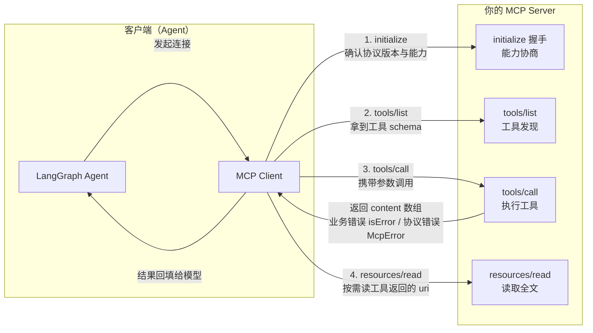

# 怎么规范地写一个 MCP Server？从脚手架到错误处理

## 上一篇讲了"为什么"，这篇解决"怎么写"

上一篇我们弄清了 MCP 解决什么问题（工具接入标准化），也看到了"手写工具 vs MCP"的对比。但真到自己上手写一个 MCP Server，网上的教程要么是十几行的 demo，要么是 `setRequestHandler` 手写 switch 的旧姿势——能跑，但说不清"规范"是什么。

这篇按实战顺序走一遍：从空项目开始，写一个生产级规范的 MCP Server，每一步都告诉你"为什么这么写"。完整代码在 ai-agent-code-examples 仓库 `articles/mcp-server-guide/`，你可以边读边跑。

## 第一步：搭脚手架

一个规范的 MCP Server 起步就两件事：装 SDK、建入口文件。

```bash
# 在 monorepo 里新建包（或普通项目都行）
mkdir articles/mcp-server-guide && cd articles/mcp-server-guide
pnpm add @modelcontextprotocol/sdk zod
```

目录结构就两个文件，职责清晰：

- `src/server.ts` — MCP Server 本体（工具 + 资源都在这定义）
- `src/client.ts` — 验证用的客户端（协议级验证 + Agent 接入验证）

## 第二步：创建 server 实例

用官方推荐的 `McpServer` 类（而不是底层 `Server` + 手写请求分发）：

```typescript
import { McpServer } from "@modelcontextprotocol/sdk/server/mcp.js";
import { StdioServerTransport } from "@modelcontextprotocol/sdk/server/stdio.js";
import { z } from "zod";

const server = new McpServer(
  { name: "prod-mcp-guide", version: "1.0.0" },
  {
    capabilities: {
      tools: { listChanged: true },
      resources: { listChanged: true, subscribe: true },
    },
    instructions:
      "这是一个 MCP 规范示例服务，提供三个工具：" +
      "get_weather（查询实时天气，需要经纬度）、calculate（四则运算）、" +
      "search_docs（检索本地 MCP 规范知识库）。",
  }
);
```

三个细节是规范的关键：

- **serverInfo（name + version）**：协议要求的身份信息，客户端握手时会拿到
- **capabilities**：声明这个 server 支持什么（tools/resources + 变更通知）
- **instructions**：给接入的 LLM 看的"使用说明"，客户端会把它塞进系统提示词——生产级 server 都会写

对比旧姿势：手写 `Server` 类 + `setRequestHandler("tools/list")` + `setRequestHandler("tools/call")` + switch 分发，协议细节（initialize 握手、参数校验、错误包装）全要自己管。用 `McpServer`，这些全部由 SDK 接管，你只关心业务。

## 第三步：注册第一个工具（含描述规范）

用 `registerTool` 声明式注册。这里藏着整篇文章最重要的规范点——**工具描述怎么写**：

```typescript
server.registerTool(
  "get_weather",
  {
    title: "查询实时天气",
    // 描述三段式：何时用 → 参数含义 → 返回什么
    description: `获取指定经纬度（WGS84 坐标系）当前的实时天气，数据源为 Open-Meteo（免费、无需 API key）。
何时用：用户询问某地的当前天气、气温、风速等实时气象信息时。
参数：latitude 纬度（-90~90，北纬为正，如北京 39.9）；longitude 经度（-180~180，东经为正，如北京 116.4）；unit 温度单位（celsius/fahrenheit，默认 celsius）。
返回：JSON 文本，含 temperature、windspeed、winddirection、weather（天气现象描述）、is_day、time。`,
    inputSchema: {
      latitude: z.number().min(-90).max(90).describe("纬度（WGS84，北纬为正，如北京 39.9）"),
      longitude: z.number().min(-180).max(180).describe("经度（WGS84，东经为正，如北京 116.4）"),
      unit: z.enum(["celsius", "fahrenheit"]).default("celsius").describe("温度单位，默认 celsius"),
    },
  },
  async ({ latitude, longitude, unit }) => {
    // 工具实现：调 Open-Meteo 真实接口，10 秒超时
    const url = new URL("https://api.open-meteo.com/v1/forecast");
    url.searchParams.set("latitude", String(latitude));
    url.searchParams.set("longitude", String(longitude));
    url.searchParams.set("current_weather", "true");
    const res = await fetch(url, { signal: AbortSignal.timeout(10_000) });
    const data = await res.json();
    // ... 组装返回（见下文"返回格式规范"）
  }
);
```

为什么描述这么重要？**工具选择是 LLM 做的，描述就是它的使用说明书**。实测中（真实运行，DeepSeek + LangGraph），4 个提问全部一次选对工具、参数零纠正——description 写清触发条件、参数取值范围（模型才不会填出 999 的纬度）、返回结构，LLM 就能正确决策。

inputSchema 用 **zod raw shape**（字段名 → zod schema 的映射），这是 registerTool 的硬性要求，不能传手写 JSON Schema。SDK 会自动：① 转成 JSON Schema 下发给客户端；② 在 handler 执行前自动校验参数，不合法直接抛 InvalidParams——所以 handler 里拿到的参数形状一定合法，不需要再手写类型校验。

## 第四步：返回格式规范

所有工具返回值统一走 **content 数组**，每块必须有 type：

```typescript
// ✅ 规范：content 数组，结构化数据序列化成 JSON 字符串放进 text 块
return {
  content: [
    {
      type: "text",
      text: JSON.stringify(
        { temperature: 31.2, windspeed: 4.1, weather: "阴", observed_at: "2026-08-17T06:15" },
        null,
        2
      ),
    },
  ],
};
```

协议层面不区分"结构化/非结构化"，JSON 字符串丢进 text 块，LLM 自己会解析。支持的 content 类型：`text`（文本）、`image`（base64 图片）、`resource`（资源引用）。

## 第五步：错误处理规范（isError vs McpError）

这是最有"规范感"的点。MCP 错误分两类，各有用武之地：

| **错误类型**    | **场景**                                  | **返回方式**                        | **LLM 侧表现**                     |
| --------------- | ----------------------------------------- | ----------------------------------- | ---------------------------------- |
| 业务错误        | 参数合法但执行失败（除零、上游 API 挂了） | `{ isError: true, content: [...] }` | 读到可解释的错误，决定重试或改参数 |
| 协议/服务端错误 | 请求本身非法、服务端状态损坏              | 抛 `McpError`                       | 整次调用标记失败，不走业务结果通道 |

```typescript
// calculate 工具里：除零是可预期的业务失败
if (operation === "divide" && b === 0) {
  return {
    isError: true,
    content: [{ type: "text", text: "除数为 0：不能执行除法运算，请提供一个非零的 b 再试。" }],
  };
}
```

```typescript
// 读不存在的资源：请求本身非法，属于协议级错误
if (!doc) {
  throw new McpError(ErrorCode.InvalidParams, `文档不存在: docs://mcp-guide/${id}`);
}
```

真实运行中两者的差别立现：除零提问，LLM 收到 isError 后自主解释"数学上无意义"并提议换非零除数重算；而读不存在的资源，客户端直接拿到 `-32602 InvalidParams` 协议错误，不会把异常当业务结果硬编进回答。

## 第六步：工具 + 资源配合

MCP 里工具和资源是两个互补的概念：工具执行动态操作，资源承载静态内容。规范用法是**工具返回引用，资源承载全文**：

```typescript
// search_docs 工具：检索后返回轻量结果 + 资源 uri
return {
  content: [
    {
      type: "text",
      text: JSON.stringify(
        hits.map(({ doc, score }) => ({
          id: doc.id,
          title: doc.title,
          snippet: doc.body.slice(0, 120) + "…",
          uri: `docs://mcp-guide/${doc.id}`, // 工具返回引用
        }))
      ),
    },
  ],
};

// 资源模板：{id} 是变量，客户端可枚举 + 按需读取全文
server.registerResource(
  "mcp-guide-doc",
  new ResourceTemplate("docs://mcp-guide/{id}", {
    list: async () => ({/* 枚举所有资源 */}),
  }),
  { title: "MCP 规范知识条目", description: "…", mimeType: "text/markdown" },
  async (uri, variables) => {
    // 按 id 找文档，返回 markdown 全文
    return {
      contents: [{ uri: uri.toString(), mimeType: "text/markdown", text: "# 标题\n\n正文" }],
    };
  }
);
```

这样工具结果保持轻量，深度信息按需获取。注意两个坑：资源模板必须传 `new ResourceTemplate(...)` 实例（传字符串会被当成静态资源 URI，模板匹配失败）；记得提供 `list` 回调让客户端能枚举资源。

## 第七步：启动（stdio 传输）

```typescript
async function main() {
  const transport = new StdioServerTransport();
  await server.connect(transport);
  // 就绪日志走 console.error —— stdout 是协议通道，绝不能打日志！
  console.error("[mcp-guide-server] 已就绪：prod-mcp-guide v1.0.0");
}

main().catch((err) => {
  console.error("启动失败:", err);
  process.exit(1);
});
```

这是 stdio server 最经典的翻车点：**stdout 是 JSON-RPC 数据通道，任何应用日志都必须走 stderr**（console.error / logger）。想给客户端结构化日志，用 MCP 的 logging 能力（logging/message 通知），而不是往 stdout 打文本。

传输方式选择：本地工具走 **stdio**（进程间通信，低开销）；远程服务走 **Streamable HTTP**（可服务多客户端、支持标准鉴权）。协议层不变，transport 可替换。

## 第八步：客户端接入验证（LangGraph 真实调用）

写完 server，用客户端验证整条链路。两段验证：① 协议级（SDK Client 直连，验握手/资源/McpError）；② 智能体级（LangGraph + DeepSeek 真实调用）：

```typescript
import { MultiServerMCPClient } from "@langchain/mcp-adapters";
import { createReactAgent } from "@langchain/langgraph/prebuilt";
import { ChatOpenAI } from "@langchain/openai";

const llm = new ChatOpenAI({
  model: process.env.LLM_MODEL ?? "deepseek-chat",
  apiKey: process.env.LLM_API_KEY,
  configuration: { baseURL: process.env.LLM_BASE_URL ?? "https://api.deepseek.com" },
});

const mcp = new MultiServerMCPClient({
  "mcp-guide": {
    transport: "stdio",
    command: process.execPath,
    args: [require.resolve("tsx/cli"), "src/server.ts"],
    cwd: process.cwd(),
  },
});

const tools = await mcp.getTools(); // 自动发现 3 个工具（含 schema）
const agent = createReactAgent({ llm, tools });
const res = await agent.invoke({
  messages: [{ role: "user", content: "请调用 get_weather 查询北京当前的天气" }],
});
console.log(res.messages.at(-1)?.content);
await mcp.close();
```

真实运行结果（志武 2026-08-17 验证通过）：

```text
════════ ① 协议级验证：资源读取 + 协议错误（McpError） ════════
[握手] server 能力声明: capabilities: {"resources":...,"tools":...}
[读资源] docs://mcp-guide/error-handling 全文： # 错误处理规范 ...
[读资源] docs://mcp-guide/not-exist → 抛 McpError ✅ code: -32602（InvalidParams）

════════ ② 智能体级验证：LangGraph + DeepSeek 真实调用 ════════
[自动发现] 工具列表（3 个，含 schema）:
  - get_weather：获取指定经纬度（WGS84 坐标系）当前的实时天气...
  - calculate：对两个数字执行四则运算（加/减/乘/除）...
  - search_docs：在本地 MCP 编写规范知识库中按关键词检索文档片段...

───── 提问：get_weather（真实调用外部 API） ─────
🤖 Agent 最终回答: 北京当前的天气信息如下：
  - 温度：31.2°C
  - 风速：4.1 km/h
  - 天气现象：阴（观测时间 2026-08-17 06:15）

───── 提问：calculate（纯计算） ─────
🤖 Agent 最终回答: (12.5 × 3.2) + 7 = 47 ✅

───── 提问：calculate 除零（业务错误走 isError 通道） ─────
🤖 Agent 最终回答: 工具返回了一个错误，提示"除数为 0：不能执行除法运算..."。
在数学中，任何数除以 0 都是没有定义的。如果你需要，我可以帮你计算
其他合法的除法，比如 10 ÷ 2 = 5。

───── 提问：search_docs（工具+资源配合） ─────
🤖 Agent 最终回答: 检索到《错误处理规范》，核心内容：MCP 错误分为两类——
业务错误返回 { isError: true } 让 LLM 决定重试或改参数；协议/服务端错误抛
McpError，客户端把整次调用标记为失败。

✅ 全部验证通过，MCP 连接已关闭。
```

跑这段代码：`cd ~/workspace/ai-agent-code-examples && pnpm run run:mcp-server-guide`（需要根目录 .env 的 LLM_API_KEY，DeepSeek）。

## 原理收束：一个规范的 MCP Server 生命周期

把刚才每一步串起来，完整链路是这样：



你在 server.ts 里写的每个 `registerTool`、每个 `registerResource`，最终都落到这四个协议动作上。规范的本质是：**协议细节交给 SDK，你只负责把工具描述写清楚、返回格式统一、错误分类正确**——这三件事做好了，任何 Agent 框架接进来都能用好你的工具。

## 总结

规范地写一个 MCP Server，就记住六件事：

- 用 `McpServer` + `registerTool`，别手写 switch 分发
- 描述三段式：何时用 / 参数含义（含取值范围）/ 返回什么——这决定 LLM 能不能选对工具
- inputSchema 传 zod raw shape，校验交给 SDK
- 返回统一 content 数组；业务错误 isError、协议错误抛 McpError
- 工具返回引用、资源承载全文，配合使用
- stdio 下日志必须走 stderr

跑通只是前提。这篇文章的验收标准是：读完你能自己从头写一个规范 MCP Server——脚手架、工具注册、描述、返回、错误处理、资源、启动、接入验证，每一步都有据可依。

## 面试考点

- **MCP Server 的推荐写法？** McpServer + registerTool 声明式注册。旧式 Server + setRequestHandler 手写 switch 虽然也能跑，但协议细节（握手、校验、错误包装）全要自己管，不推荐。
- **工具 description 为什么重要？怎么算写得好？** 工具选择是 LLM 做的，描述就是使用说明书。三段式：何时用（触发条件）、参数含义（含取值范围，避免模型填出非法值）、返回什么（结构，模型才知道怎么组织答案）。
- **isError 和 McpError 什么区别？** 业务错误（参数合法但执行失败）返回 isError: true，LLM 能读到原因并决定重试/改参数；协议/服务端错误（请求非法、状态损坏）抛 McpError，整次调用标记失败，防止异常被当业务结果编进回答。
- **你项目里写 MCP 遇到什么坑？（结合项目）** ① inputSchema 必须传 zod raw shape，传裸 JSON Schema 会抛 "inputSchema must be a Zod schema or raw shape"；② stdio 下日志必须走 stderr，否则污染协议帧握手失败；③ 资源模板必须传 new ResourceTemplate 实例，传字符串会被当静态资源 URI。

## 相关资料

- [MCP 官方文档](https://modelcontextprotocol.io/llms-full.txt)
- [LangChain MCP Adapters 文档](https://docs.langchain.com/oss/javascript/langchain_mcp_adapters/)
- [本文完整代码（ai-agent-code-examples）](https://github.com/huzhiwu1/ai-agent-code-examples/tree/main/articles/mcp-server-guide)
