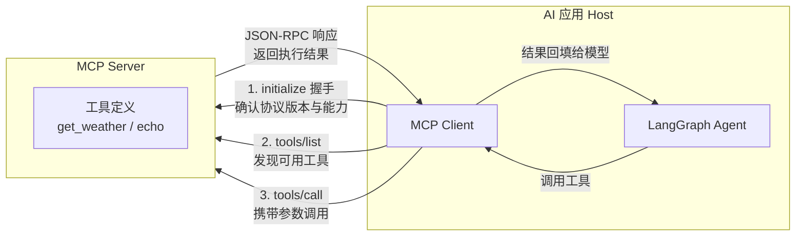

# Agent 接入工具为什么要标准化？MCP 到底解决了什么痛点？

## 从一个工具到十个工具

上一节我们学会了让 Agent 调用工具——`bindTools` 把工具塞给模型，模型自己决定什么时候调、传什么参数。一切都很美好，直到你要接第二个、第三个工具。

不信？我们来看一个真实的"手写工具"长什么样。下面的代码没有任何魔法：输入参数要自己定义 schema，实现要自己写 fetch 和错误处理，最后还要手动把它绑给"这一个" LLM 实例。

```typescript
// ① 手写输入参数 schema
const weatherInputSchema = z.object({
  city: z.string().describe("城市名，如：北京"),
  latitude: z.number().describe("纬度，如北京 39.9"),
  longitude: z.number().describe("经度，如北京 116.4"),
});

// ② 手写工具实现：fetch、超时、错误处理、返回格式全要自己管
const handWrittenWeatherTool = tool(
  async ({ city, latitude, longitude }) => {
    const url =
      `https://api.open-meteo.com/v1/forecast?latitude=${latitude}` +
      `&longitude=${longitude}&current_weather=true`;
    try {
      const res = await fetch(url, { signal: AbortSignal.timeout(10_000) });
      if (!res.ok) throw new Error(`HTTP ${res.status}`);
      const data = (await res.json()) as {
        current_weather?: { temperature?: number; windspeed?: number; time?: string };
      };
      const w = data.current_weather ?? {};
      return `${city} 当前温度 ${w.temperature ?? "?"}°C，风速 ${w.windspeed ?? "?"} km/h`;
    } catch (e) {
      return `查询 ${city} 天气失败：${e instanceof Error ? e.message : String(e)}`;
    }
  },
  {
    name: "get_weather",
    description: "查询指定城市当前天气（需要经纬度）。",
    schema: weatherInputSchema,
  }
);

// ③ 手写"绑定"：把工具塞给这一个 LLM 实例
const llmWithTools = llm.bindTools([handWrittenWeatherTool]);
```

这还只是第一步。工具调用的循环——拿到模型返回的 `tool_calls`、执行工具、把结果包装成 `ToolMessage` 回填、再让模型生成最终回答——也得自己写。真跑一遍，输出长这样（真实运行结果，DeepSeek 调用 open-meteo 天气接口）：

```text
🤖 LLM 请求调用工具: get_weather({"city":"北京","latitude":39.9,"longitude":116.4})
🔧 工具执行结果: 北京 当前温度 29.8°C，风速 5.2 km/h（观测时间 2026-08-17T04:00）
💬 LLM 最终回答: 北京现在的温度是 **29.8°C**，风速为 5.2 km/h（观测时间为 2026-08-17 04:00）。
```

单个工具没问题，但想象一下十个工具：每个工具都要重复"写 schema + 写实现 + 写错误处理 + 绑定"，而且这套东西只服务当前这一个 LLM。换个模型、换个 Agent 框架，全部重写。这就是"MCP 之前"的真实世界。

## MCP：把"接工具"变成"插 USB-C"

MCP（Model Context Protocol）是 Anthropic 开源的一个标准协议，官方文档第一句话就给了定位：

<callout emoji="💡">
MCP (Model Context Protocol) is an open-source standard for connecting AI applications to external systems. Think of MCP like a USB-C port for AI applications.
</callout>

USB-C 的比喻很准确：以前每个工具都像不同的充电口，必须配不同的转接头；MCP 之后，工具统一成同一个接口，即插即用。

MCP 采用 **client-server 架构**：工具的能力定义在 **server** 端（schema + 实现一起），AI 应用作为 **host**，为每个 server 建立一个 **client**。一个 host 可以连多个 server，本地工具走 stdio，远程服务走 Streamable HTTP。

关键点：MCP 不是"模型直连工具"，而是"host → client → server"的协议化连接。AI 应用负责编排，工具服务负责暴露能力，两边通过协议解耦。

## 让工具在 server 端定义一次

现在我们把刚才那个天气工具搬到 MCP server 端，定义一次，同时再加一个 echo 工具（用于验证"新增工具客户端零改动"）：

```typescript
import { McpServer } from "@modelcontextprotocol/sdk/server/mcp.js";
import { StdioServerTransport } from "@modelcontextprotocol/sdk/server/stdio.js";
import { z } from "zod/v3";

const server = new McpServer({ name: "weather-echo-server", version: "1.0.0" });

// 同样的 get_weather，这次在 server 端声明（注意：registerTool 的
// inputSchema 必须传 zod schema，不能传裸 JSON Schema）
server.registerTool("get_weather", {
  description: "根据城市名称与经纬度查询当前天气（温度、风速）。",
  inputSchema: {
    city: z.string().describe("城市名"),
    latitude: z.number().describe("纬度"),
    longitude: z.number().describe("经度"),
  },
  async execute({ city, latitude, longitude }) {
    const url =
      `https://api.open-meteo.com/v1/forecast?latitude=${latitude}` +
      `&longitude=${longitude}&current_weather=true`;
    const res = await fetch(url, { signal: AbortSignal.timeout(10_000) });
    if (!res.ok) throw new Error(`HTTP ${res.status}`);
    const data = (await res.json()) as {
      current_weather?: { temperature?: number; windspeed?: number; time?: string };
    };
    const w = data.current_weather ?? {};
    return `${city} 当前温度 ${w.temperature ?? "?"}°C，风速 ${w.windspeed ?? "?"} km/h（观测时间 ${w.time ?? "?"}）`;
  },
});

// server 端新增工具：客户端一行代码不用改
server.registerTool("echo", {
  description: "把传入的文本原样返回，用于验证 MCP 工具调用链路。",
  inputSchema: { text: z.string().describe("要回显的文本") },
  async execute({ text }) {
    return { echoed: text };
  },
});

const transport = new StdioServerTransport();
await server.connect(transport);
```

注意一个坑（MCP SDK 1.30 实测）：`registerTool` 的 `inputSchema` 支持 **zod schema 或 raw shape（zod 字段对象）**，传纯 JSON Schema 对象会直接抛错 `inputSchema must be a Zod schema or raw shape`。SDK 内部会自动把 zod 转成 JSON Schema 下发给客户端，但声明端必须用 zod 系的写法。

还有个隐蔽的坑：stdio server 的 **stdout 是协议通道**，日志必须走 `console.error`，用 `console.log` 会污染 JSON-RPC 帧导致握手失败。

## 客户端：自动发现，零手写

客户端这边，用 `@langchain/mcp-adapters` 的 `MultiServerMCPClient` 连上这个 server，工具就被自动发现并转成 LangChain Tool：

```typescript
import { MultiServerMCPClient } from "@langchain/mcp-adapters";
import { createReactAgent } from "@langchain/langgraph/prebuilt";

// 上文已定义的路径常量（完整可运行版本在 ai-agent-code-examples 仓库）：
//   tsxCli    = require.resolve("tsx/cli")   —— tsx 的绝对路径，用来拉起 TS 写的 server
//   serverFile= path.join(__dirname, "mcp-server.ts") —— server 文件路径
//   REPO_ROOT = 仓库根目录（.env 所在位置）
const mcp = new MultiServerMCPClient({
  "weather-echo-server": {
    transport: "stdio",
    command: process.execPath, // 用当前 node 执行
    args: [tsxCli, serverFile], // node <tsx-cli> mcp-server.ts
    cwd: REPO_ROOT,
  },
});

// 自动发现：client 与 server 完成 initialize 握手后，
// server 声明的工具（含 JSON Schema）自动转成 LangChain Tool
const mcpTools = await mcp.getTools();

// 接入方式和手写版没有任何区别
const agent = createReactAgent({ llm, tools: mcpTools });
```

真跑一遍，和演示 1 一模一样的问题，这次完全不用手写任何工具代码（真实运行结果）：

```text
MCP server 自动发现的工具（2 个）：
  - get_weather: 根据城市名称与经纬度查询该地当前天气（温度、风速、天气代码）…
  - echo: 把传入的文本原样返回，用于验证 MCP 工具调用链路是否通畅。

💬 LLM 最终回答: 北京现在的天气查询结果如下：
  - 温度：29.8°C
  - 风速：5.2 km/h
  - 观测时间：2026-08-17 04:00

💬 LLM 最终回答(echo): 我已经调用了 echo 工具，它返回了「MCP 链路 OK」
```

注意最后那个 echo：它是 server 端新增的工具，客户端代码**一行没改**，Agent 就能直接用了。这就是标准化的核心价值——工具接入从"人肉适配"变成"协议即插即用"。

## 原理收束：一次 MCP 调用到底发生了什么

刚才跑的每一步，对应到协议层是这样一串动作（MCP 底层用 JSON-RPC 2.0 承载消息）：



三步各司其职：

- **initialize 握手**：确认双方协议版本和能力。握手失败时连接直接断开（客户端会报 `Failed to connect to stdio server`），这是排查 MCP 连接问题时的第一检查点。
- **tools/list**：动态发现 server 暴露了哪些工具，返回的是**工具名 + JSON Schema 描述**。Host 不需要事先硬编码工具名——这是"发现标准化"。
- **tools/call**：按工具名和参数执行，返回统一结构的执行结果。调用语义统一，输入输出结构一致，Host 可以做通用重试/容错。

而 transport（stdio / Streamable HTTP / SSE）是可替换的底层：本地工具走 stdio 进程间通信，远程服务走 HTTP，协议层完全不变。这就是为什么同一个 MCP 工具既能给本地 Agent 用，也能给远程服务用。

## MCP vs 直接 API 对接

把两种方式放在一起对比，差异一目了然：

| **维度**   | **直接 API 对接**                       | **MCP**                                       |
| ---------- | --------------------------------------- | --------------------------------------------- |
| 鉴权       | 每个工具单独处理 token、header、refresh | 收敛到 transport / server 层，host 与实现解耦 |
| 发现       | 人工读文档、手写注册表                  | `tools/list` 动态发现                         |
| Schema     | 每家参数结构不同，容易漂移              | 统一协议暴露，便于生成/校验                   |
| 重试与错误 | 错误码、超时策略高度不一致              | 统一 RPC 语义，通用容错                       |
| 多工具管理 | 工具越多代码越碎                        | 一个 host 连多个 server，统一编排/权限/观测   |

## 总结

MCP 解决的不是"模型会不会调用工具"——模型本来就会。它解决的是"工具接入能不能像插 USB-C 一样标准化"。

对 Agent 来说，标准化的价值有四层：更容易**发现**工具（tools/list）、更容易**调用**工具（tools/call）、更容易**替换**工具（server 端改实现，客户端不动）、更容易**规模化**管理工具（一个 host 连多个 server）。

对工程来说，MCP 把"工具集成"从一次性定制开发，推进为可复用、可组合、可迁移的协议层能力。你的 Agent 框架只要支持 MCP，就能连接任何暴露 MCP 协议的工具服务——这正是生态的意义。

## 面试考点

- **MCP 是什么？解决什么问题？** 开放标准协议，统一 AI 应用连接外部工具的方式。解决工具接入的碎片化：发现、调用、鉴权、schema、重试都要逐家适配的问题。可用 USB-C 比喻作答。
- **MCP 的三个核心方法？** initialize（握手确认版本/能力）、tools/list（发现工具）、tools/call（执行工具）。底层是 JSON-RPC 2.0。
- **MCP 和 Function Calling 是什么关系？** Function Calling 是模型侧的能力（模型输出结构化 tool_calls）；MCP 是工具侧的标准（工具如何被暴露和调用）。两者互补：MCP server 暴露的工具经适配层转成模型可消费的 tool schema。
- **你项目里怎么用 MCP？（结合项目）** 在 ai-agent-code-examples 里用 @langchain/mcp-adapters 把本地 stdio MCP server 接入 LangGraph createReactAgent。踩过的坑：SDK 1.30 的 registerTool 必须传 zod schema；stdio server 日志必须走 stderr 否则污染协议帧。

## 相关资料

- [MCP 官方文档（llms-full.txt）](https://modelcontextprotocol.io/llms-full.txt)
- [LangChain MCP Adapters 文档](https://docs.langchain.com/oss/javascript/langchain_mcp_adapters/)
- [LangGraph JS How-tos（工具调用）](https://langchain-ai.github.io/langgraphjs/how-tos/)
