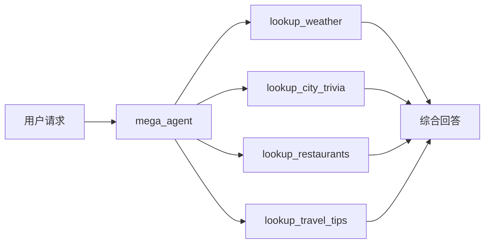
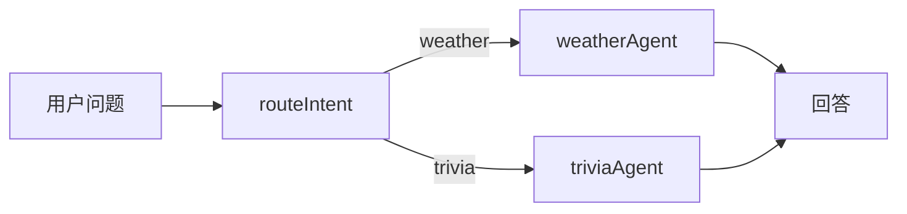
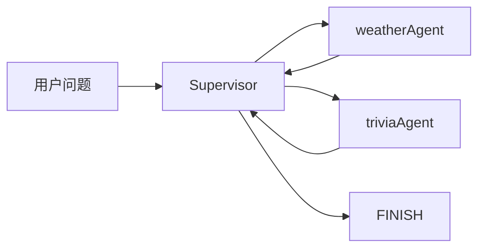
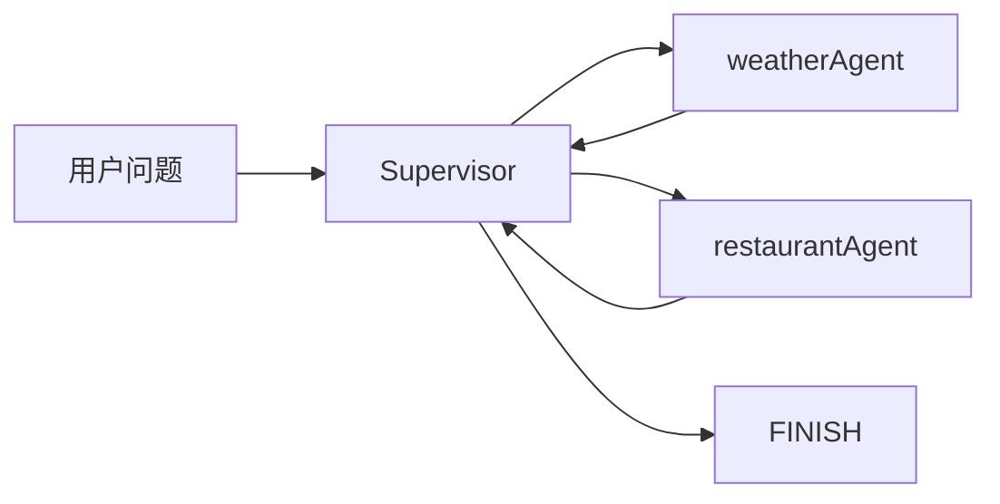
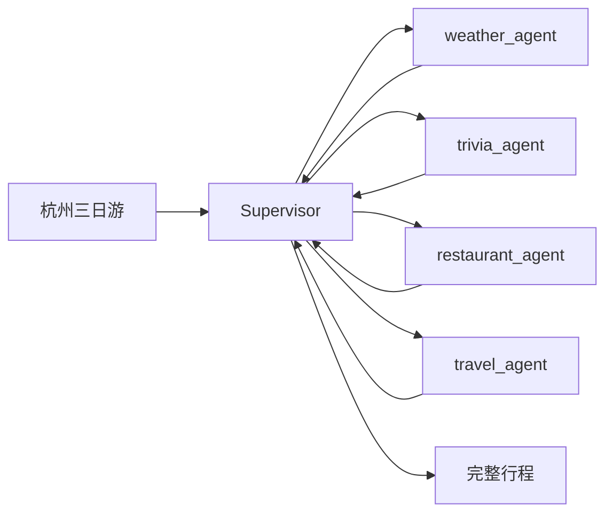
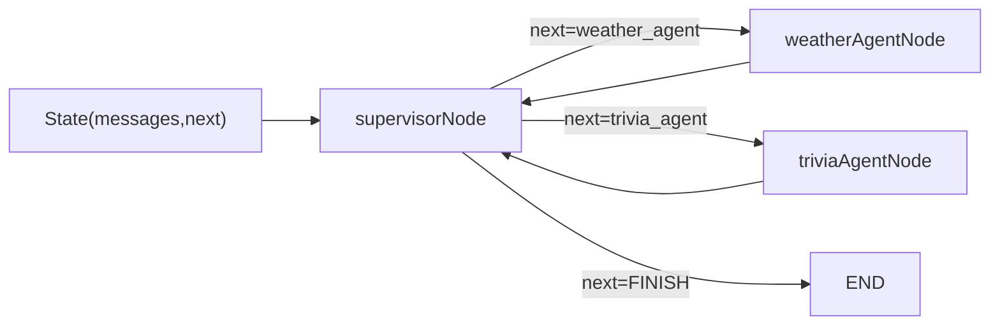
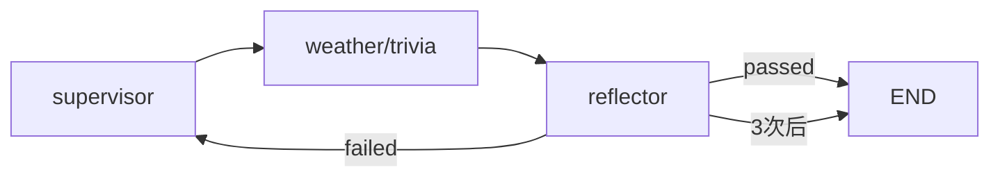

# 多 Agent 一定比单 Agent 更好吗？Supervisor/Handoff 怎么分工才不打架？

## 先别急着拆团队，先看看单 Agent 为什么会翻车

很多人一上来就想把“查天气、查知识、写总结、做路由”全塞进一个 Agent 里，感觉像是给它配了很多本事。可真写起来你就会发现，它不是更强，而是更乱：一个 prompt 里职责太多，工具一多就选错，上下文还会互相干扰。

我更愿意把它理解成一个前端页面里同时塞了业务逻辑、接口调用、表单校验和路由跳转。能跑，但很快就开始打架。那问题来了：如果把任务拆开，让不同 Agent 各管一摊，再找一个人专门调度，会不会更稳？这就是 Supervisor/Handoff 要解决的事。

这篇文章不是一段单点 demo，而是仓库 [articles/multi-agent-supervisor/src/index.ts](https://github.com/huzhiwu1/ai-agent-code-examples/blob/main/articles/multi-agent-supervisor/src/index.ts) 下面的 **7 步渐进式** 实战。它从“单 Agent 先翻车”开始，一路走到“手写 StateGraph + Reflection”，每一步都单独可跑，最后再串成一条完整链路。

## 先认识公共骨架：所有 Step 都依赖这段代码

后面 7 个 Step 的代码片段，会反复用到下面这些定义。它们集中在一个文件里（真实仓库就是 `src/index.ts`），我把它拆成 4 块：**依赖、LLM 初始化、内置数据表、四个工具**。每个 Step 的代码都默认沿用这段骨架，只展示自己新增的部分。

```typescript
// ========== 公共骨架（真实文件：src/index.ts）==========

// ① 依赖：langchain（createAgent/tool）+ langgraph-supervisor（createSupervisor）+ zod（工具入参校验）
import "dotenv/config";
import * as path from "node:path";
import { HumanMessage } from "@langchain/core/messages";
import { createSupervisor } from "@langchain/langgraph-supervisor";
import { ChatOpenAI } from "@langchain/openai";
import { createAgent, tool } from "langchain";
import { z } from "zod";

// ② 环境变量 + LLM 初始化（仓库根目录 .env 里配 LLM_API_KEY / LLM_BASE_URL / LLM_MODEL）
const API_KEY = process.env.LLM_API_KEY ?? "";
const BASE_URL = process.env.LLM_BASE_URL ?? "https://api.deepseek.com";
const MODEL = process.env.LLM_MODEL ?? "deepseek-chat";

const llm = new ChatOpenAI({
  model: MODEL,
  apiKey: API_KEY,
  configuration: { baseURL: BASE_URL },
  temperature: 0.1,
  maxTokens: 1024,
});

// ③ 内置数据表：模拟"真实数据源"，工具只查表，不调外部 API
const weatherTable: Record<
  string,
  { summary: string; tempHighC: number; tempLowC: number; aqi: string }
> = {
  杭州: { summary: "多云转小雨", tempHighC: 22, tempLowC: 15, aqi: "良" },
  北京: { summary: "晴", tempHighC: 26, tempLowC: 12, aqi: "轻度污染" },
  上海: { summary: "阴", tempHighC: 20, tempLowC: 16, aqi: "良" },
};

const triviaTable: Record<string, string> = {
  杭州: "西湖文化景观是世界文化遗产之一。",
  北京: "故宫是世界上现存规模最大的古代宫殿建筑群之一。",
  上海: "外滩万国建筑博览群是近代城市历史的缩影。",
};

// ④ 四个工具（Step 01 会全部塞给一个 Agent，之后逐步拆给专精 Agent）
const lookupWeatherTool = tool(
  async ({ city }: { city: string }) => {
    const w = weatherTable[city.trim()];
    return JSON.stringify(
      w ?? { city, summary: "暂无该城市数据", tempHighC: 20, tempLowC: 12, aqi: "—" }
    );
  },
  {
    name: "lookup_weather",
    description: "查询某城市当天的天气概况、温度区间和空气质量。",
    schema: z.object({ city: z.string().describe("城市名，如 杭州") }),
  }
);

const lookupCityTriviaTool = tool(
  async ({ city }: { city: string }) =>
    JSON.stringify({
      city: city.trim(),
      trivia: triviaTable[city.trim()] ?? "没有为这座城市准备内置小知识。",
    }),
  {
    name: "lookup_city_trivia",
    description: "查询与某城市相关的一句趣味知识。",
    schema: z.object({ city: z.string().describe("城市名，如 杭州") }),
  }
);

// 演示扩展：仓库当前只提交了 weather/trivia 两个工具，
// 下面两个按同一写法扩展，供 Step 01/04/05 使用
const lookupRestaurantsTool = tool(
  async ({ city, weather }: { city: string; weather?: string }) =>
    JSON.stringify({
      city: city.trim(),
      suggestion: weather?.includes("雨")
        ? "今天有雨，优先推荐室内餐厅"
        : "天气不错，可以推荐户外/露台餐厅",
    }),
  {
    name: "lookup_restaurants",
    description: "根据天气情况推荐某城市的餐厅。",
    schema: z.object({
      city: z.string().describe("城市名，如 杭州"),
      weather: z.string().optional().describe("天气概况，可选"),
    }),
  }
);

const lookupTravelTipsTool = tool(
  async ({ city }: { city: string }) =>
    JSON.stringify({ city: city.trim(), tip: "出行前先看天气预报，杭州夏季多阵雨，建议带伞。" }),
  {
    name: "lookup_travel_tips",
    description: "查询某城市的旅行贴士。",
    schema: z.object({ city: z.string().describe("城市名，如 杭州") }),
  }
);

const allTools = [
  lookupWeatherTool,
  lookupCityTriviaTool,
  lookupRestaurantsTool,
  lookupTravelTipsTool,
];
```

记住这套骨架就够了，后面每个 Step 我只贴“新增/变化的部分”，引用到的 `llm`、`allTools`、`lookupWeatherTool` 等都来自这里。

## Step 01：一个 Agent 背四个工具，先把痛点照出来

**上下文衔接：**沿用公共骨架的 `allTools` 和 `llm`。Step 01 故意不分工，把 4 个工具全塞给一个 `mega_agent`。

**为什么这么做：**不是因为这样更好，而是为了把单 Agent 的上限先照出来。工具越多，System Prompt 越长，Agent 越容易在“该查天气还是该查餐厅”这种事上犹豫。

```typescript
// 上下文：llm / allTools 来自公共骨架，createAgent 来自 langchain（已 import）
const megaAgent = createAgent({
  name: "mega_agent",
  model: llm,
  tools: allTools,
  systemPrompt: `你是一个万能旅行助手，可以处理以下所有类型的请求：
- 天气查询：使用 lookup_weather 工具
- 城市知识/景点介绍：使用 lookup_city_trivia 工具
- 餐厅推荐：使用 lookup_restaurants 工具
- 旅行贴士：使用 lookup_travel_tips 工具

注意：用户可能同时问多个问题，你需要逐一调用对应工具，确保所有需求都被满足。`,
});
```



**实测结果：**这一步跑的是“杭州三日游”完整请求，最后确实能一次性答全天气、景点、美食、贴士，但代价也很明显：**一个 Agent 背着 4 类职责**，回答看着完整，结构上已经开始变臃肿。

## Step 02：先手动交接一次，理解 Handoff 是什么

**上下文衔接：**把 Step 01 的“大一统”拆开：`weatherAgent` 和 `triviaAgent` 各拿一个工具（`lookupWeatherTool`/`lookupCityTriviaTool` 来自公共骨架），再加一个 `routeIntent()` 做路由分类。

**为什么这么做：**先不谈 Supervisor，先把最朴素的“谁负责这件事”跑通。这里的 Handoff 还是人工版：先判断意图，再把请求交给对应 Agent。

```typescript
// 上下文：llm 来自公共骨架；SystemMessage/HumanMessage 来自 @langchain/core/messages（需补充 import）
import { SystemMessage } from "@langchain/core/messages";

// 两个专精 Agent：各拿一个工具，各管一件事
const weatherAgent = createAgent({
  name: "weather_agent",
  description: "专门查天气的子 Agent。",
  model: llm,
  tools: [lookupWeatherTool],
  systemPrompt: "你只处理天气。用户提到城市时，必须先调用 lookup_weather，再用中文简短说明。",
});

const triviaAgent = createAgent({
  name: "trivia_agent",
  description: "专门讲城市小知识的子 Agent。",
  model: llm,
  tools: [lookupCityTriviaTool],
  systemPrompt:
    "你只讲城市小知识。必须先调用 lookup_city_trivia，再用人话转述，不要编造工具里没有的内容。",
});

// 手动路由：先用 LLM 判断意图，再决定把请求交给哪个 Agent
async function routeIntent(query: string): Promise<"weather" | "trivia" | "unknown"> {
  const routerPrompt =
    new SystemMessage(`你是一个路由分类器。分析用户输入，判断意图类型，只输出一个词：
- 如果用户问天气、气温、下雨、空气质量 → 输出 "weather"
- 如果用户问城市知识、景点、历史、文化 → 输出 "trivia"
- 否则 → 输出 "unknown"`);

  const result = await llm.invoke([routerPrompt, new HumanMessage(query)]);
  const content = typeof result.content === "string" ? result.content.trim().toLowerCase() : "";
  if (content.includes("weather")) return "weather";
  if (content.includes("trivia")) return "trivia";
  return "unknown";
}
```



**实测结果：**纯天气问题和纯知识问题都能准确交接；但一旦出现“天气 + 景点”这种复合查询，Router 只能选一个方向，另一个需求就被丢掉了。也就是说，**手动 Handoff 能跑，但不够聪明**。

## Step 03：把手动路由升级成 Supervisor 自动调度

**上下文衔接：**继续使用 Step 02 的 `weatherAgent`/`triviaAgent`（通过 `.graph` 暴露给 Supervisor），`llm` 来自公共骨架，把 `routeIntent()` 换成 `createSupervisor()`。这里还特意加了 `addHandoffMessages: false` 和 `addHandoffBackMessages: false`，这是为了兼容 DeepSeek 的 tool_calls 校验，避免消息配对报错。

**为什么这么做：**Supervisor 不负责回答，它只负责选人；而且它可以在一轮结束后再回来继续选人，所以复合任务终于能“先天气、再知识”地串起来了。

```typescript
// 上下文：weatherAgent/triviaAgent 来自 Step 02，llm 来自公共骨架，createSupervisor 已 import
const workflow = createSupervisor({
  agents: [weatherAgent.graph, triviaAgent.graph],
  llm,
  supervisorName: "supervisor",
  includeAgentName: "inline",
  addHandoffMessages: false,
  addHandoffBackMessages: false,
  prompt: `你是调度员（Supervisor），只负责选人，绝对不要自己报气温或讲城市百科。

你的子 Agent 及其职责：
- weather_agent：查天气、气温、下雨、空气质量
- trivia_agent：讲城市小知识、景点、历史、文化

规则：
1. 分析用户请求，每次只调用一个 Agent
2. 如果用户问天气 → 调 weather_agent，问完后立即 FINISH
3. 如果用户问知识 → 调 trivia_agent，问完后立即 FINISH
4. 如果用户同时问天气+知识 → 先调 weather_agent，再调 trivia_agent，然后 FINISH
5. 绝对不要重复调用同一个 Agent，每个 Agent 最多调用一次`,
});

const app = workflow.compile();

// 运行：提交用户消息 → 观察节点执行路径 → 取最后一条消息作为最终回答
async function run(query: string) {
  const input = { messages: [new HumanMessage(query)] };
  const nodePath: string[] = [];
  let finalState: { messages?: Array<{ content?: unknown }> } | null = null;

  const stream = await app.stream(input, { streamMode: ["updates", "values"] });
  for await (const event of stream) {
    const [mode, payload] = event as [string, Record<string, unknown>];
    if (mode === "updates") nodePath.push(...Object.keys(payload)); // 记录每一步执行了哪个节点
    if (mode === "values") finalState = payload as { messages?: Array<{ content?: unknown }> };
  }

  console.log("执行路径:", nodePath.join(" → "));
  console.log("最终回答:", finalState?.messages?.at(-1)?.content ?? "");
}
```



**实测结果：**这一步跑“查杭州天气，再讲一条杭州小知识”，最终答案里天气和小知识都完整出现了。日志里的执行路径是 `supervisor → weather_agent → supervisor → trivia_agent → supervisor → FINISH` 这一类循环，说明 Supervisor 真的在做多轮调度，而不是一次性选完就结束。

## Step 04：让后一个 Agent 看到前一个 Agent 的结果

**上下文衔接：**在 Step 03 基础上新增 `restaurantAgent`（用公共骨架的 `lookupRestaurantsTool`），并把 `outputMode` 设成 `"full_history"`。这一步的关键不是多了一个餐厅工具，而是让餐厅 Agent 能看到天气 Agent 已经输出了什么。

**为什么这么做：**如果天气结果能进入历史，后续推荐就能带条件。比如“今天下雨”，餐厅 Agent 就知道该优先推荐室内餐厅；如果是晴天，就可以往适合出行的方向推荐。

```typescript
// 上下文：weatherAgent 来自 Step 02，llm / lookupRestaurantsTool 来自公共骨架
const restaurantAgent = createAgent({
  name: "restaurant_agent",
  description: "根据天气情况推荐餐厅的子 Agent。",
  model: llm,
  tools: [lookupRestaurantsTool],
  systemPrompt:
    "你只推荐餐厅。必须先调用 lookup_restaurants，再结合已有的天气信息给出建议；没有天气信息就直接推荐。",
});

const workflow = createSupervisor({
  agents: [weatherAgent.graph, restaurantAgent.graph],
  llm,
  supervisorName: "supervisor",
  includeAgentName: "inline",
  addHandoffMessages: false,
  addHandoffBackMessages: false,
  outputMode: "full_history", // 关键：把前一个 Agent 的输出保留在消息历史里
  prompt: `你是调度员。根据用户请求选择合适的 Agent：

你的子 Agent：
- weather_agent：查天气、气温、是否下雨
- restaurant_agent：推荐餐厅，会根据天气情况调整推荐策略

规则：
1. 如果用户先问天气再问餐厅 → 先调 weather_agent 再调 restaurant_agent
2. 如果用户只问餐厅 → 直接调 restaurant_agent
3. 所有需求满足后，输出 FINISH`,
});
```



**实测结果：**天气结果先出来，餐厅推荐再根据“今天会下雨”这个条件去做判断。文档里最后呈现的是“天气 + 雨天餐厅建议”的串联结果，说明 **outputMode = full_history** 真的把前一步状态带进来了。

## Step 05：四个专精 Agent 拼出完整旅行规划

**上下文衔接：**把 `weather_agent`（Step 02）、`restaurant_agent`（Step 04）、以及新增的 `trivia_agent`/`travel_agent` 全部接上，还是同一个 `createSupervisor()`，只是职责更细了。`travelAgent` 用公共骨架的 `lookupTravelTipsTool`。

**为什么这么做：**旅行规划本来就天然分工：天气决定穿什么，知识决定去哪玩，餐厅决定吃什么，旅行贴士决定注意事项。这里把它拆成 4 个 Agent，目的是让每个 Agent 只做自己最擅长的一块。

```typescript
// 上下文：weather/trivia/restaurant Agent 来自前序 Step，travelAgent 是新增的
const travelAgent = createAgent({
  name: "travel_agent",
  description: "提供旅行贴士的子 Agent。",
  model: llm,
  tools: [lookupTravelTipsTool],
  systemPrompt: "你只提供旅行贴士。必须先调用 lookup_travel_tips，再用人话补充说明，不要编造。",
});

const workflow = createSupervisor({
  agents: [weatherAgent.graph, triviaAgent.graph, restaurantAgent.graph, travelAgent.graph],
  llm,
  supervisorName: "supervisor",
  includeAgentName: "inline",
  addHandoffMessages: false,
  addHandoffBackMessages: false,
  outputMode: "full_history",
  prompt: `你是旅行规划调度员。管理 4 个专家 Agent：

- weather_agent：查天气
- trivia_agent：讲城市知识/景点
- restaurant_agent：推荐餐厅
- travel_agent：提供旅行贴士

规则：
1. 分析用户请求，确定需要哪些 Agent，列出调用顺序
2. 天气、知识、贴士互不依赖，任意顺序调用，但每个 Agent 最多调用一次
3. 餐厅推荐放在天气之后
4. 所有需要的 Agent 都调用完毕后，立即 FINISH，汇总时引用各 Agent 的输出`,
});
```



**实测结果：**最后输出已经不是“查几个信息”的集合，而是一份能直接拿去用的三日游规划：天气、景点、美食、旅行贴士都拼在了一起。执行路径里还能看到 Supervisor 反复回来调度，说明它是在做“收集—决策—再调度”的状态机，而不是一次性流水线。

## Step 06：把 createSupervisor 的黑盒拆开，手写 StateGraph

**上下文衔接：**Step 06 不再依赖 `createSupervisor()`，改成手写：新增 `@langchain/langgraph` 的 `Annotation`/`StateGraph` import，定义 `SupervisorState` 和 `RoutingDecision`（zod schema），手写 `supervisorNode`、`weatherAgentNode`、`triviaAgentNode`，最后用 `addConditionalEdges()` 拼出图。`llm` 来自公共骨架，`lookupWeatherTool`/`lookupCityTriviaTool` 同上。

**为什么这么做：**前面几步都在用高层封装，这一步是把黑盒拆开。你会非常清楚地看到：Supervisor 只改 `state.next`，Agent 只追加消息，条件边负责跳转，回流边负责再回到 Supervisor 决策。

```typescript
// 上下文：新增 langgraph import；llm / 两个工具来自公共骨架
import { Annotation, StateGraph, START, END } from "@langchain/langgraph";
import { SystemMessage, AIMessage, BaseMessage } from "@langchain/core/messages";

// 路由决策的 JSON Schema：Supervisor 每次只输出"下一步去哪"
const RoutingDecision = z.object({
  next: z
    .enum(["weather_agent", "trivia_agent", "FINISH"])
    .describe("下一个要执行的 Agent；全部完成则 FINISH"),
});

// 状态：messages 累积对话，next 记录下一步要去哪个节点
const SupervisorState = Annotation.Root({
  messages: Annotation<BaseMessage[]>({
    reducer: (prev: BaseMessage[], next: BaseMessage[]) => prev.concat(next),
    default: () => [],
  }),
  next: Annotation<string>({
    reducer: (_prev: string, next: string) => next,
    default: () => "supervisor",
  }),
});

const supervisorSystemPrompt = new SystemMessage(
  "你是调度员。看用户请求决定下一步：天气相关去 weather_agent，知识相关去 trivia_agent，都完成则 FINISH。"
);

// Supervisor 节点：只改 state.next，不回答任何专业问题
async function supervisorNode(state: typeof SupervisorState.State) {
  const routingLLM = llm.withStructuredOutput(RoutingDecision, {
    method: "functionCalling",
    name: "routing_decision",
  });
  const decision = await routingLLM.invoke([supervisorSystemPrompt, ...state.messages]);
  return { next: decision.next, messages: [] };
}

// 子 Agent 节点：调用工具查数据，把回答追加进 messages
async function weatherAgentNode(state: typeof SupervisorState.State) {
  const result = await llm.invoke([
    new SystemMessage("你只处理天气。先调用 lookup_weather，再用中文简短说明。"),
    ...state.messages,
  ]);
  return { messages: [new AIMessage(result.content)] };
}

async function triviaAgentNode(state: typeof SupervisorState.State) {
  const result = await llm.invoke([
    new SystemMessage("你只讲城市小知识。先调用 lookup_city_trivia，再用人话转述。"),
    ...state.messages,
  ]);
  return { messages: [new AIMessage(result.content)] };
}

// 图组装：条件边看 state.next 路由；两条回流边保证 Agent 干完活回到 Supervisor
const graph = new StateGraph(SupervisorState)
  .addNode("supervisor", supervisorNode)
  .addNode("weather_agent", weatherAgentNode)
  .addNode("trivia_agent", triviaAgentNode)
  .addEdge(START, "supervisor")
  .addConditionalEdges("supervisor", (state) => state.next, {
    weather_agent: "weather_agent",
    trivia_agent: "trivia_agent",
    FINISH: END,
  })
  .addEdge("weather_agent", "supervisor")
  .addEdge("trivia_agent", "supervisor");

const app = graph.compile(); // 之后用 app.stream(...) 运行，和 Step 03 完全一样
```



**实测结果：**这一步跑出来的日志很清楚：Supervisor 先选 `weather_agent`，再回来选 `trivia_agent`，最后 FINISH。也就是说，**createSupervisor 其实就是 StateGraph + 条件边**，只是官方把这些细节封装好了。

## Step 07：加一个 Reflector，给输出做质量兜底

**上下文衔接：**在 Step 06 的 StateGraph 上又加了一个 `reflector` 节点和两个状态字段：`reflectionResult`、`reflectionCount`。它负责检查前面 Agent 的输出是不是完整、准确、清楚。

**为什么这么做：**多 Agent 的问题不只是“会不会答”，还有“答得是不是靠谱”。Reflection 模式就是在输出后再过一道关：通过就结束，不通过就把问题带回 Supervisor 重调度，最多 3 次，防止无限循环。

```typescript
// 上下文：沿用 Step 06 的 SupervisorState / supervisorNode / weatherAgentNode / triviaAgentNode 和 graph 组装
// 新增两个状态字段的 schema 定义：
const ReflectionResult = z.object({
  passed: z.boolean().describe("输出是否通过质量检查"),
  feedback: z.string().describe("未通过时的改进建议"),
});

// Reflector 节点：检查 messages 里最近的回答是否完整覆盖用户需求
async function reflectorNode(state: typeof SupervisorState.State) {
  const reflectionLLM = llm.withStructuredOutput(ReflectionResult, {
    method: "functionCalling",
    name: "reflection",
  });
  const result = await reflectionLLM.invoke([
    new SystemMessage(
      "你是质量检查员。检查对话中最近一条回答是否完整覆盖了用户的所有需求（例如同时问了天气和小知识）。只输出 JSON。"
    ),
    ...state.messages,
  ]);
  const newCount = (state.reflectionCount ?? 0) + 1;

  if (result.passed) {
    return { reflectionResult: "passed", reflectionCount: newCount, next: "FINISH" };
  }
  if (newCount >= 3) {
    return { reflectionResult: "max_retries", reflectionCount: newCount, next: "FINISH" };
  }
  return {
    reflectionResult: "failed",
    reflectionCount: newCount,
    messages: [new HumanMessage(`质量检查未通过：${result.feedback}`)],
    next: "supervisor",
  };
}

// 图组装：supervisor → 子 Agent → reflector；通过或超过 3 次 → END，否则回 supervisor 重调度
const graph = new StateGraph(SupervisorState)
  .addNode("supervisor", supervisorNode)
  .addNode("weather_agent", weatherAgentNode)
  .addNode("trivia_agent", triviaAgentNode)
  .addNode("reflector", reflectorNode)
  .addEdge(START, "supervisor")
  .addConditionalEdges("supervisor", (state) => state.next, {
    weather_agent: "weather_agent",
    trivia_agent: "trivia_agent",
    FINISH: "reflector",
  })
  .addEdge("weather_agent", "supervisor")
  .addEdge("trivia_agent", "supervisor")
  .addConditionalEdges("reflector", (state) => state.next, {
    supervisor: "supervisor",
    FINISH: END,
  });
```



**实测结果：**这次运行里 Reflection 一次就通过了，最终状态是 `passed`，说明输出完整覆盖了“杭州天气 + 杭州小知识”两个需求。这个步骤也把一件事说透了：**多 Agent 不是银弹，质量兜底才是生产化关键**。

## 把 7 步串起来看，真正的结论是什么？

这套代码最有价值的地方，不是“我又造了几个 Agent”，而是它把多 Agent 的演进路线摆明白了：

先用一个 mega_agent 把问题照出来；再用 Router 试一次手动交接；然后上 Supervisor 做自动调度；接着让后一个 Agent 读前一个 Agent 的历史；再把多个专精 Agent 拼成完整协作；最后手写 StateGraph，确认你真的懂了黑盒；如果还不放心，再加 Reflector 做质量兜底。

这就是多 Agent 的真实本质：**不是“更多 Agent”，而是“更清楚的职责 + 更明确的状态流转”**。如果一个 Agent + 强工具就能做完，别折腾多 Agent；如果任务天然分工明显、上下文又长，Supervisor/Handoff 才值回票价。

## 总结

这篇文章的起点不是“多 Agent 很高级”，而是“一个 Agent 乱背太多职责，最后会打架”。先承认这个问题，后面的分工才站得住。

Step 01 先把单 Agent 的坏味道照出来；Step 02 让你看懂 Handoff 的最小闭环；Step 03 证明 Supervisor 能处理复合任务；Step 04 说明状态能在 Agent 间传递；Step 05 说明多 Agent 可以拼出完整方案；Step 06 让你看懂 createSupervisor 的底层；Step 07 给整个系统加了质量兜底。

你只要记住一件事：多 Agent 的重点不是“多”，而是“分得对”。分工清楚，状态清楚，路由清楚，系统就不容易打架。

## 面试考点

**1. 多 Agent 一定比单 Agent 更好吗？**  
不一定。多 Agent 会引入路由成本、交接成本和错误级联，只有在任务天然可分工时才值得上。

**2. Supervisor 的职责是什么？**  
只负责路由和调度，把任务交给最合适的子 Agent，不要自己替它回答专业问题。

**3. Handoff 和多工具有什么区别？**  
多工具是一个 Agent 拿多把工具；Handoff 是把任务交给另一个更专门的 Agent，职责边界更清楚。

**4. 结合你项目里怎么做？**  
如果是 agent-coze-workflow 这类项目，我会把 plan、generate、validate 拆成不同角色，Supervisor 负责选路，生成器只产出结构，校验器只做约束检查，避免一个 Agent 既写又改又审。

## 相关资料

- [LangGraph JS · Multi-Agent 概念](https://langchain-ai.github.io/langgraphjs/concepts/multi_agent/)
- [LangGraph JS · 官方文档入口](https://docs.langchain.com/oss/javascript/langgraph/)
- [Deep Agents · Overview](https://docs.langchain.com/oss/javascript/deepagents/overview)
- [Deep Agents · Subagents](https://docs.langchain.com/oss/javascript/deepagents/subagents)
