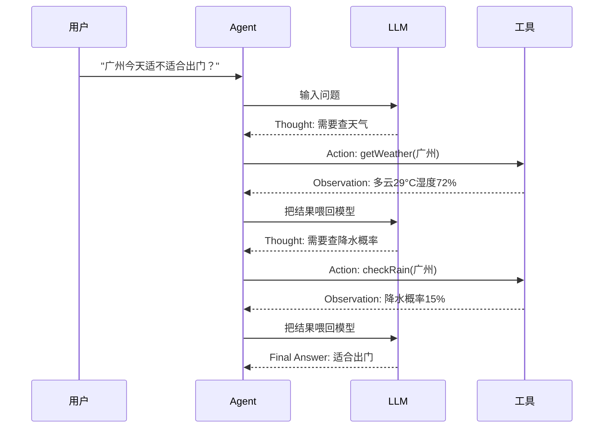
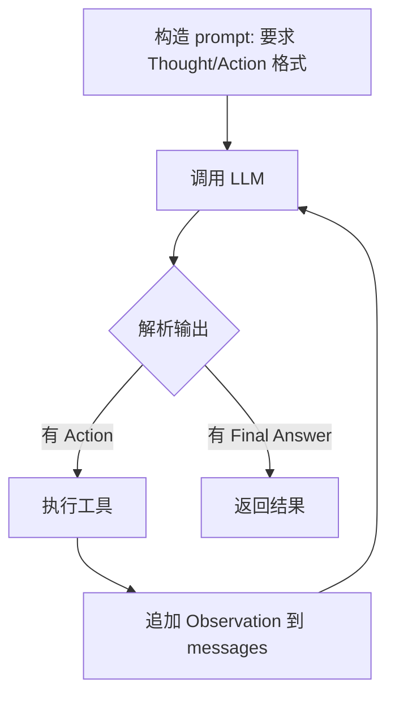

<title>全栈 AI Agent 工程师 · 08-13 · ReAct 模式</title>

# 知识点：ReAct 模式

<callout emoji="💡">
ReAct = Reasoning + Acting。不是先推理完再执行，而是把推理和行动交替进行：想一步、做一步、看到结果、再想下一步。这个交替机制让 Agent 的决策过程可追溯、可调试、可纠错。
</callout>

# 为什么需要 ReAct

普通的 Function Calling 有这个问题：模型直接返回 tool_calls，你作为开发者看不到它**为什么**选这个工具、它**打算怎么用**工具结果。出问题时你只能猜——模型是判断错了？还是工具返回的数据不对？

ReAct 把"思考过程"显式化。模型在调用工具之前，先输出一段自然语言推理（Thought），然后才是行动（Action），最后观察结果（Observation）。这三个步骤交替进行，直到任务完成。你可以在日志里逐行看到 Agent 的决策链：它先想了什么、为什么决定调这个工具、看到结果后又怎么调整判断。

这对 AI 项目来说不止是"更透明"，它是调试和优化的基础。没有 Thought，Agent 就是一个黑盒——你只知道它调了什么工具，不知道它为什么调。有了 Thought，你就能判断：是 prompt 没写好导致推理偏了，还是工具本身不靠谱。

# 核心原理

ReAct 的每一次循环固定三段：

- **Thought**：当前状态分析，下一步该做什么、为什么
- **Action**：具体执行什么工具、带什么参数
- **Observation**：工具返回了什么结果

然后基于 Observation 进入下一轮 Thought，循环直到给出 Final Answer。



这次循环里，每一步都有 Thought 痕迹。你能看到模型在每轮里是怎么判断的、为什么决定调下一个工具——这才是 ReAct 和普通 Function Calling 的本质区别。

# 对比：ReAct vs 纯 Function Calling vs Planner-Executor

| 维度       | 纯 Function Calling          | ReAct                                         | Planner-Executor                           |
| ---------- | ---------------------------- | --------------------------------------------- | ------------------------------------------ |
| 思考过程   | 隐藏，只有 tool_calls        | 显式 Thought，每步可见                        | 先出完整计划，再逐步执行                   |
| 可调试性   | 低，只能看工具调用日志       | 高，Thought 链完整可追溯                      | 中，计划可审阅但执行不可见                 |
| 灵活性     | 高，每步动态决策             | 高，Thought 引导每步决策                      | 低，计划一旦生成就按部就班                 |
| Token 消耗 | 低，只传工具定义和结果       | 中，每次循环多一段 Thought                    | 高，计划本身占大量 token                   |
| 适用场景   | 简单工具调用（查天气、算数） | 需要多步推理的任务（研究、分析、排错）        | 步骤明确可预见的任务（代码生成、文档处理） |
| 失败恢复   | 工具报错后模型可能乱猜       | Observation 里看到错误，下一轮 Thought 会调整 | 执行失败后需重新规划                       |

结论：简单任务用 Function Calling 就够了，省 token；多步推理任务用 ReAct，可追溯；步骤固定用 Planner-Executor，可控。你的 ai-tools-demo 项目实际上走的是 ReAct + LangGraph 的混搭——规划阶段像 Planner，执行阶段像 ReAct，中间用 StateGraph 的 conditional edge 做路由。

# 适用场景 / 不适用场景

**适合 ReAct 的场景：**

- 多步推理任务：需要查多个数据源、交叉验证后再下结论
- 排错/调试类任务：Agent 需要试一个方案、看结果、再调整
- 需要解释决策过程：用户或审计需要知道 Agent 为什么这么回答
- 工具调用链较长的场景：先查 A、根据 A 的结果决定查 B 还是 C

**不适合 ReAct 的场景：**

- 单步工具调用：查天气、算数学，Function Calling 就够了，ReAct 多出来的 Thought 是浪费 token
- 对延迟敏感的实时场景：每次循环多一轮 LLM 调用，Thought + Action + Observation 至少 3 步
- 步骤固定不变的任务：比如文件上传→解析→入库，这种固定流程用 Workflow 更稳

# 示例：用 LangChain 实现 ReAct Agent

场景：用户问"广州今天适合出门吗？需要带伞吗？"。Agent 先查天气，看到湿度数据后自己判断是否需要进一步查降水概率，最后给出综合建议。

**TypeScript 示例：LangChain ReAct Agent（完整可运行）**

```typescript
import { ChatOpenAI } from "@langchain/openai";
import { tool } from "@langchain/core/tools";
import { createReactAgent } from "@langchain/langgraph/prebuilt";
import { HumanMessage } from "@langchain/core/messages";
import { z } from "zod";

// 1. 定义工具：用 zod 约束参数，LangChain 自动生成 tool schema
const getWeather = tool(
  async ({ city }: { city: string }) => {
    const map: Record<string, string> = {
      广州: "多云，29°C，湿度 72%",
      北京: "晴，31°C，湿度 30%",
      上海: "小雨，27°C，湿度 85%",
    };
    return map[city] ?? `${city} 天气数据暂缺`;
  },
  {
    name: "getWeather",
    description: "获取指定城市的实时天气，返回温度、湿度",
    schema: z.object({ city: z.string().describe("城市名") }),
  }
);

const checkRain = tool(
  async ({ city }: { city: string }) => {
    const map: Record<string, string> = {
      广州: "降水概率 15%，无需带伞",
      北京: "降水概率 5%，无需带伞",
      上海: "降水概率 70%，建议带伞",
    };
    return map[city] ?? `${city} 降水数据暂缺`;
  },
  {
    name: "checkRain",
    description: "查询指定城市的降水概率",
    schema: z.object({ city: z.string().describe("城市名") }),
  }
);

// 2. 创建 ReAct Agent
const llm = new ChatOpenAI({
  model: "deepseek-chat",
  configuration: { baseURL: "https://api.deepseek.com/v1" },
  apiKey: process.env.DEEPSEEK_API_KEY,
  temperature: 0,
});

const agent = createReactAgent({
  llm,
  tools: [getWeather, checkRain],
  // ReAct 的核心：prompt 里要求模型输出 Thought/Action/Observation
  messageModifier: `你是一个智能助手。使用 ReAct 模式回答问题：
先思考（Thought），再行动（Action），观察结果（Observation），
直到能给出最终答案。每次只调用一个工具。`,
});

// 3. 运行
const result = await agent.invoke({
  messages: [new HumanMessage("广州今天适合出门吗？需要带伞吗？")],
});

// 4. 打印完整的 Thought 链
for (const msg of result.messages) {
  const content = typeof msg.content === "string" ? msg.content : JSON.stringify(msg.content);
  if (msg._getType() === "ai") {
    console.log(`\n${"=".repeat(40)}`);
    console.log(content);
  }
  if (msg._getType() === "tool") {
    console.log(`  → Observation: ${content}`);
  }
}
```

**运行方式**

1. 安装：`npm i @langchain/openai @langchain/core @langchain/langgraph zod`
2. 设置 key：`export DEEPSEEK_API_KEY="***"`
3. 运行：`npx tsx react-agent.ts`
4. 观察输出：你会看到每次 Thought → Action → Observation 的完整链路

运行流程

1. 模型收到用户问题，第一轮 Thought 判断需要查天气 → Action: getWeather("广州")
2. 拿到 Observation "多云，29°C，湿度 72%"，第二轮 Thought 判断降水概率未知 → Action: checkRain("广州")
3. 拿到 Observation "降水概率 15%"，第三轮 Thought 判断信息足够 → Final Answer
4. 整个过程 3 轮循环，每轮的 Thought 都记录在 messages 里，可追溯

# 底层实现：不用框架，ReAct 是怎么跑起来的

上面用 LangChain 的 createReactAgent 一行代码就搞定了，但如果你面试被问到"不用框架怎么实现 ReAct"，你需要知道底层是怎么转的。核心就三步：

1. 构造一个 prompt，要求模型按 Thought/Action/Observation 格式输出
2. 解析模型的输出，提取 Action 名和参数，执行工具
3. 把工具结果拼成 Observation 追加到对话里，再调一次模型，循环直到出现 Final Answer



关键代码就这三段：

```typescript
// 1. prompt 模板：要求模型输出 Thought/Action/Observation
const REACT_PROMPT = `
你是一个助手。用以下格式回答，每次只输出一个 Action：

Thought: 当前状态分析，下一步做什么
Action: 工具名["参数"]
Observation: 工具返回结果
...（重复 Thought/Action/Observation）
Thought: 信息够了，可以回答了
Final Answer: 最终答案

可用工具：
- getWeather: 查天气，参数 city
- checkRain: 查降水概率，参数 city

问题：{question}
`;

// 2. 解析模型输出，提取 Action
function parseAction(text: string) {
  const actionMatch = text.match(/Action:\s*(\w+)\["([^"]+)"\]/);
  if (actionMatch) {
    return { tool: actionMatch[1], arg: actionMatch[2] };
  }
  // 检查是否出现 Final Answer
  const finalMatch = text.match(/Final Answer:\s*(.+)/);
  if (finalMatch) return { final: finalMatch[1] };
  return null;
}

// 3. 主循环：思考→行动→观察→再思考
async function reactLoop(question: string) {
  const messages = [{ role: "user", content: REACT_PROMPT.replace("{question}", question) }];
  let maxSteps = 5;

  while (maxSteps-- > 0) {
    const response = await llm.chat(messages);
    const parsed = parseAction(response);

    if (parsed?.final) return parsed.final; // 结束
    if (!parsed?.tool) throw new Error("解析失败"); // 格式错误

    // 执行工具，把结果当 Observation 追加
    const result = executeTool(parsed.tool, parsed.arg);
    messages.push({ role: "assistant", content: response });
    messages.push({ role: "user", content: `Observation: ${result}` });
  }
  return "超过最大步数";
}
```

LangChain 的 createReactAgent 没做别的，就是把这三步封装成了 agent executor：你给它 prompt 模板和工具列表，它帮你跑解析→执行→追加→循环。理解了这个底层循环，你就知道为什么 Thought 很重要——它不只是"好看"，而是模型在每轮循环里唯一能表达"我为什么这么做"的字段。

# 生产环境注意事项

- **Token 成本是 Function Calling 的 1.5-3 倍**：每次循环多一段 Thought 文本，3 轮循环就多 3 段。如果你的 Agent 平均 5 轮才完成任务，token 消耗会比纯 Function Calling 高不少。建议加 max_steps 限制，超过 5 轮强制终止。
- **Thought 可能会"骗你"**：模型输出的 Thought 是对它自己行为的解释，但不一定等于真实推理过程。Thought 说"我判断需要查天气"，但实际可能是模型在训练数据里见过类似模式。Thought 是调试工具，不是真相。
- **延迟翻倍**：ReAct 每轮至少 1 次 LLM 调用，3 轮就是 3 次。如果每次调用 2 秒，总延迟 6 秒起步。对实时场景（如聊天机器人）体验较差，建议用 streaming 边推边显示 Thought 来缓解。
- **Observation 太长会撑爆上下文**：如果工具返回的是整篇文档，每次 Observation 都塞进 messages，几轮下来上下文就满了。需要对工具结果做摘要或截断。

# 面试考点

1. **ReAct 和普通 Function Calling 的本质区别是什么？**  
   高分回答：本质区别不在"多了 Thought"，而在"决策过程可追溯"。Function Calling 你只知道模型调了什么工具，ReAct 你能看到模型每步的推理原因。这对调试和优化来说是天壤之别——你能定位问题是推理错了还是工具错了，而不是对着黑盒猜。
2. **ReAct 的 Thought 和 Chain-of-Thought 的推理过程有什么区别？**  
   高分回答：CoT 是单次推理，Thought 是迭代推理。CoT 的"想"是一次性的，输出完就结束了；ReAct 的"想"会触发 Action，Action 的 Observation 会改变下一轮 Thought。CoT 适合数学题，ReAct 适合需要外部信息的多步任务。
3. **ReAct 在什么场景下不如 Planner-Executor？**  
   高分回答：当任务步骤明确可预见时，Planner-Executor 效率更高——一次规划，逐步执行，不用每步都重新推理。ReAct 的灵活性在步骤固定时反而成了浪费——你不需要"每步重新想"，你只需要"按计划走"。
4. **你在项目中怎么用 ReAct？**  
   高分回答：不是所有场景都用 ReAct。简单工具调用直接用 Function Calling 省 token；需要多步推理和数据交叉验证时才上 ReAct。在 ai-tools-demo 里，plan 阶段用 Planner 模式生成整体计划，execute 阶段用 ReAct 模式允许动态调整——这是混合模式，也是实际项目里最常见的做法。

追问：ReAct 怎么防止死循环？Thought 太长怎么办？怎么在 Thought 里做工具调用路由？

# 常见坑

- **死循环：模型反复调用同一工具**。症状：Thought 说"我再查一次"，然后无限循环查天气。原因：Observation 里没有新信息，模型不知道该结束了。解决：加 max_steps，超过 5 轮强制终止；在 prompt 里加"如果信息已经足够，不要再调用工具"。
- **Thought 和 Action 不匹配**。症状：Thought 说"我需要查天气"，但 Action 调了 checkRain。原因：模型在生成长文本时可能前后不一致。解决：用结构化输出约束 Thought 和 Action 的格式，或者用 LangGraph 的 StateGraph 把 Thought 和 Action 分开成两个节点。
- **Observation 被截断导致误判**。症状：工具返回了 5000 字文档，模型只看到前 500 字，基于不完整信息做了错误判断。解决：对长 Observation 做摘要，或者在工具定义里加 max_length 限制。
- **忘了在 prompt 里要求 Thought 格式**。症状：ReAct Agent 退化成了普通 Function Calling，没有 Thought 输出。原因：LangChain 的 createReactAgent 依赖 prompt 模板里的 Thought/Action/Observation 格式。解决：确保 messageModifier 里明确要求了 ReAct 格式。

# 小实验

1. 把上面的 ReAct Agent 跑起来，观察日志里的 Thought 链，和之前 Agent Loop 文章的纯 Function Calling 对比
2. 把 max_steps 改成 1，看 Agent 能不能在一步内完成"查天气+判断是否带伞"
3. 在 getWeather 里故意返回"工具调用失败"，观察 Agent 的 Thought 是否会自动调整、尝试降级
4. 打开你 ai-tools-demo 项目的 graph.ts，对比 LangGraph 的 conditional edge 和 ReAct 的 Thought→Action→Observation 循环有什么异同

# 学习延伸

学完 ReAct，下一步可以继续看：Planner-Executor 模式（什么时候应该先规划再执行）、LangGraph 的 conditional edge（如何用图结构替代 prompt 驱动的循环）、Tool Routing（多个工具时怎么让模型选对工具）。

在你的 ai-tools-demo 项目里，plan→sketch→generate→validate→repair 这条链路本身就混合了 Planner 和 ReAct 的思路——plan 是先规划，repair 是动态调整。看完这篇后，可以回头再看看 graph.ts 里的 conditional edge 是怎么实现"校验不过就修复"的。

- [LangGraph 官方教程：ReAct Agent 从零实现](https://langchain-ai.github.io/langgraphjs/how-tos/react-agent-from-scratch-functional/)
- [ReAct 原始论文：Synergizing Reasoning and Acting in Language Models](https://arxiv.org/abs/2210.03629)
- [LangGraph 官方文档：Agentic Concepts](https://langchain-ai.github.io/langgraphjs/concepts/agentic_concepts/)
