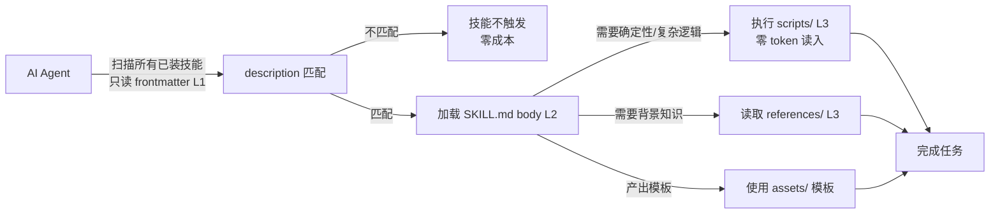

# Skill 是什么？怎么写好一个 Skill？它和 MCP 有什么区别？

## 我们其实每天都在用 Skill

你在读的这套"AI Agent 知识点"文档，就是靠一个叫 `multi-agent-article-writing` 的 Skill 产出的——它定义了编辑、研究员、工程师、读者四个角色怎么协作，每天定时触发，把两篇高质量文档写出来推给你。它只是一个文件夹，里面装了一份 SKILL.md 和几条流程说明。

但你有没有想过：Skill 到底是什么？它和 MCP 有什么区别？为什么写得好不好，直接决定 AI 能不能用起来？这篇文章一次讲清，**读完后你能自己写出一个最小可用的 SKILL.md**。

## 痛点：你写的是给人看的文档，还是给 AI 看的指令？

先看一个反面案例。假设你要做一个"代码审查"技能，你可能这样写：

```markdown
---
name: code-review
description: 代码审查技能
---

# Code Review Skill

## 背景

本技能基于团队多年的代码审查经验总结而成。

## 审查原则

- 保持专业、建设性的语气
- 关注代码质量而非个人风格
- 平衡严格性和灵活性

## 版本记录

- v1.0: 初始版本
```

如果这是给人看的团队文档，写得不错。但 skill 的读者是 AI，用这个视角逐条审视：

- **"基于团队多年经验总结"** — AI 不关心技能怎么来的，它只需要知道现在该怎么做
- **"保持专业、建设性的语气"** — 人类能 get 到感觉，但 AI 会把"专业"展开成无数种组合，每次输出都不一样
- **"平衡严格性和灵活性"** — 人类有直觉，AI 没有，这句话等于没说
- **"全面审查，给出改进建议"** — AI 需要的是：先检查什么？再检查什么？什么问题必须指出？
- **"版本记录"** — AI 每次被唤醒都是全新的，v1.0 还是 v1.1 没有意义
- **description 只有"代码审查技能"** — 太模糊，用户说"帮我看看这段代码"要不要触发？AI 无法判断

每一条单独看都不是"错"，但都是写给人看的。**问题不在于写得不够多，而在于写错了对象。**

## Skill 是什么：一个装满"能力"的文件夹

Skill 是一个文件夹，里面装着指令文档、参考资料、可执行脚本等资源。AI 拿到它，就能胜任一项原本不会的特定工作。比如 `pdf-editor` 技能文件夹里，可能有一份"怎么处理 PDF"的操作指令、一个旋转 PDF 的 Python 脚本、一份 API 参考文档——AI 不需要从外部再找任何东西。

你可以把它理解为 AI 的**能力插件**：插上去，AI 就多一项专长；拔掉，AI 还是那个通用助手。这个概念不限于某一个产品，Claude、Codex、OpenClaw 的 skill 本质都一样。

最小形态只需要一个文件：

```markdown
my-skill/
└── SKILL.md
```

```markdown
---
name: my-skill # ← 上半部分 frontmatter（元数据）
description: >- #    AI 靠这里决定要不要激活这个技能
  当用户需要做某件事时，使用这个技能。
---

下半部分 body（操作指令） # ← AI 激活技能后才会读到这里
按照以下步骤执行...
```

关键机制：**frontmatter 里的 description 是技能被触发的唯一依据**。AI 在每次对话开始时扫描所有已安装技能的 frontmatter，靠 description 判断"这个技能和当前请求相关吗"；只有被触发后，才加载 body 的操作指令。如果技能没被触发，AI 永远不会读 body。

复杂技能可以带更多资源：

```text
skill-name/
├── SKILL.md                  # [必需] 入口文件：frontmatter + body
├── agents/
│   └── openai.yaml           # [推荐] 技能的"名片"
├── scripts/                  # [可选] 可执行脚本
├── references/               # [可选] 参考文档
└── assets/                   # [可选] 产出物模板
```

## Skill vs MCP：连接性 vs 能力

这是最容易混的一对概念。一句话概括：**MCP 给 AI 提供"手"来操作工具，Skill 提供"操作手册"教 AI 怎么用**。

为什么需要 Skill？因为 MCP 解决了两类问题中的一类：

- **上下文爆炸**：一个 MCP server 通常暴露几十上百个工具，完整 JSON Schema 加载进系统提示词可能占几万 token（社区反馈：仅一个 Playwright MCP server 就占 200k 上下文的 8%）
- **能力鸿沟**：能连接数据库 ≠ 知道怎么写高效安全的 SQL。给新手开所有系统权限，但没有操作手册，他还是不会用

MCP 解决了"能够连接"（Connectivity），Skill 解决"知道怎么用"（Capability）。Anthropic 在 2025 年初推出 MCP 之后又提出 Agent Skills，正是为了补上能力这一环。

| **维度**   | **MCP**                                      | **Skill**                                     |
| ---------- | -------------------------------------------- | --------------------------------------------- |
| 本质       | 标准化连接协议（工具/资源/能力暴露）         | 程序性知识封装（领域知识 + 操作流程）         |
| 比喻       | 手 / 插座（USB-C）                           | 操作手册 / SOP                                |
| 解决       | 连接性：够得着外部工具和数据                 | 能力：知道正确高效地使用                      |
| 加载方式   | 急切加载（连上就把工具 schema 全塞进上下文） | 惰性加载（先看 description，触发才加载 body） |
| token 成本 | 工具 schema 常驻，几十上百个工具时很高       | L1 元数据 \~100 词常驻，body 触发才加载       |
| 典型内容   | JSON Schema、工具实现、transport             | 步骤指令、最佳实践、示例、常见坑              |

**两者不是竞争，是互补**。最佳实践是分层架构：用户提问 → Skill 层识别任务并加载技能 → 按技能指令拆解步骤 → MCP 层执行具体查询/操作 → Skill 层解读结果生成回答。注意：这是一种**常见的推荐架构**，不是 Skill/MCP 的硬性定义——你的系统完全可以只用 MCP、只用 Skill，或者按自己的方式组合。关注点分离的意思是：MCP 管"够得着"，Skill 管"用得好"。

## 怎么写好一个 Skill：skill-creator 的三层框架

怎么写好？直接看 Anthropic/Codex 官方的 `skill-creator`（一个"创建 skill 的 skill"），它自己的 SKILL.md 就是最佳实践答案。整个框架三层：

### 第一层：根本约束——简洁

上下文窗口是公共资源：系统提示、对话历史、所有已安装技能的元数据共享同一块工作台。你的 skill 占得越多，留给别的越少。skill-creator 第一原则：**每一句话都要值得它占用的 token**。

### 第二层：两个设计维度

**维度一：信息放在哪里？（三级渐进式加载）**

| **层级** | **内容**                          | **何时在上下文** | **token 成本**                           |
| -------- | --------------------------------- | ---------------- | ---------------------------------------- |
| L1       | frontmatter（name + description） | 始终             | \~100 词                                 |
| L2       | SKILL.md body                     | 触发后加载       | <5k 词                                   |
| L3       | scripts / references / assets     | 按需加载         | 无上限（scripts 执行而不读入，零 token） |

L1 是过滤器（从几十个技能中筛出需要的），L2 是操作手册（触发后告诉 AI 怎么做），L3 是工具箱（按需打开）。其中 scripts 最妙——**执行而不读入，零 token 成本**。

**维度二：给 AI 多大自由度？**

写技术博客，十个人十种风格都可以——高自由度，给方向即可。但生成 YAML 配置文件就不一样：字段要求 25-64 字符、首字母大写、不能有引号，差一个字符就出错——这类"脆弱操作"必须用脚本锁死格式，低自由度。**做对只有一种方式、做错有一百种方式的，就是脆弱操作。**

### 第三层：落地要点

- **description 写好"何时用"**：不只说"做什么"，要说"什么时候用"。把 when-to-use 信息全放 description，不要放 body——body 触发后才加载，那时已经迟了。好例子："Comprehensive document creation... Use when Codex needs to work with professional documents (.docx files) for: (1) Creating new documents, (2) Modifying content..."
- **统一祈使语气**：body 正文用祈使句/不定式（Always use imperative form），祈使句天然就是指令，减少歧义
- **写"不要做什么"**：做完写"反转测试"——每一条正面指导，能不能改写成"不要做 X"？通常改写后更精确。用前面的代码审查例子演示："审查时保持专业"→ 改成"不要攻击代码作者个人，只对代码本身提问题"；"平衡严格和灵活"→"不要因为代码风格与团队习惯不同就报错，只报功能问题和明确 bug"——改写后 AI 执行更稳定
- **单一职责**：一个 skill 专注一个领域，描述过宽导致匹配精度下降、指令过长浪费上下文

### 内容放哪一层：一张决策表

新手最容易卡的是"我手里的内容该放哪"。判断标准很简单：

| **内容类型**                        | **放哪**    | **为什么**                          |
| ----------------------------------- | ----------- | ----------------------------------- |
| 什么时候用这个技能（触发条件）      | description | AI 靠它决定是否激活，必须常驻可见   |
| 按什么顺序做（执行步骤）            | body        | 激活后才加载，是操作手册            |
| 结果必须精确/反复执行（格式、校验） | scripts/    | 脚本执行而不读入，零 token 且确定性 |
| 背景知识/规范/API 文档              | references/ | 按需读取，不用时零成本              |
| 产出物模板/样例                     | assets/     | 让 AI 拷贝修改而不是从头写          |

判断"要不要用脚本"看是不是**脆弱操作**：字段格式、字符长度、大小写、顺序要求、不能容错的操作——做对只有一种方式、做错有一百种方式的，统统丢给脚本。

## 一个真实的好 Skill 长什么样

拿我们正在用的 `multi-agent-article-writing` 举例，它的 frontmatter：

```yaml
---
name: "multi-agent-article-writing"
description: "四 Agent 协作写 AI 知识文章：编辑审稿、研究员查资料、
工程师跑代码、读者挑刺，循环直至读者能看懂"
---
```

注意它的 description 直接说"四 Agent 协作写文章，循环直至读者能看懂"——包含了做什么（写文章）、怎么组织（四角色）、验收标准（读者能看懂）。AI 读到就知道什么时候该激活它。

body 里是四个角色的详细职责、铁律、检查清单——全部是给 AI 的操作指令，不是给人看的团队文档。

## 新手 10 分钟：从零写出第一个 Skill

把上面的原理落成一张填空模板，直接抄：

```markdown
code-review-skill/
├── SKILL.md
└── references/
└── review-rules.md # 团队审查规范（可选）

---

# 文件内容：SKILL.md ---

---

name: code-review
description: >-
审查 TypeScript/JavaScript 代码并给出结构化改进建议。
当用户说"帮我看看这段代码""这代码有什么问题""review 一下"
或提交 PR 要求审查时使用。
---

# Code Review

## 步骤

1. 通读代码，先列出功能与意图，再找问题。
2. 按顺序检查：逻辑错误 → 边界条件 → 类型安全 → 可读性。
3. 每个问题给出：位置（函数/行）+ 严重程度（blocker/major/minor）+ 修改建议。

## 不要做

- 不要评价代码作者个人风格，只针对代码本身。
- 不要报与功能无关的格式问题（交给 lint）。
- 不要一次提超过 10 个问题，按严重程度排序。

## 示例

用户说："帮我看看这个函数" → 输出：

- [blocker] 第 12 行：数组可能越界，建议先判 length。
- [major] 第 20 行：async 函数缺少 try/catch，异常会冒泡到调用方。
```

这个模板 20 行，包含了全部关键块：frontmatter（name + 三段式 description）→ 步骤 → 不要做 → 示例。照着这个结构，把你的任务填进去，就是第一个 Skill。

写完后跑一遍自查（对照本文的检查点）：

- description 里有没有"什么时候用"？
- 步骤是不是祈使句？有没有模糊词（"专业""合适""全面"）？
- 哪些操作是脆弱操作？提到 scripts/ 了吗？
- 每一条正面规则，能改写成"不要做 X"吗？
- 有没有写给人看的内容（版本记录、背景故事）？删掉。

## 原理收束：Skill 的完整生命周期



整个机制的核心是**渐进式加载**：L1 常驻做过滤器（\~100 词），L2 触发才加载（<5k 词），L3 按需使用（脚本零成本）。这既是 token 优化手段，也是信息熵管理系统——让 AI 在正确的时机拿到正确的信息量。

## 总结

Skill 是 AI 的能力插件——一个装着指令、参考、脚本的文件夹，让 AI 胜任原本不会的特定工作。写好的关键是**写给 AI 看，不是写给人看**：description 决定触发，body 决定执行质量，scripts 承载确定性。

Skill 和 MCP 是互补的两层：MCP 管连接性（够得着外部世界），Skill 管能力（知道怎么用好）。在常见的混合架构里，Skill 层负责拆解任务和解读结果，MCP 层负责执行具体操作——但这不是硬性规定，按需组合即可。

写一个好的 Skill，记住 skill-creator 的三层框架：简洁是根本约束；信息按 L1/L2/L3 三级放置（这是**写法上的分层策略，不是 Skill 的硬性本体定义**）；自由度按任务性质调整（脆弱操作用脚本锁死）。

现在就可以照着做：拿上面的 code-review 模板，填你自己的任务，跑一遍五步自查——你已经写出第一个 Skill 了。

## 面试考点

来源标注：[题库] = AI Agent 面试题库（github.com/bcefghj/ai-agent-interview-guide）｜[参考文档] = hello-agents skill 章节｜[项目经验] = 本项目实践

- **MCP 与 Function Calling 是替代关系吗？[题库 Q7]** 不是。FC 是模型侧表达（模型怎么输出调用指令），MCP 是工具侧集成（工具能力怎么暴露与连接）。Host 常把 MCP 工具转成 FC 的 tools 定义给模型，两者互补：模型侧用 FC，工具侧来自 MCP。
- **为什么工具 description 比函数名更重要？[题库 Q3]** 模型主要依据自然语言描述区分相似工具，函数名更多是给程序路由用。描述应写清边界与反例——这也是 Skill 里 description 决定触发的同一原理。
- **Skill 和 MCP 的本质区别？[参考文档：hello-agents Extra05]** MCP 是标准化连接协议（Connectivity，够得着工具），Skill 是程序性知识封装（Capability，知道怎么用）。MCP 急切加载工具 schema（可能占几万 token），Skill 惰性加载（L1 常驻 100 词，触发才加载 body）。两者互补，常见混合架构里 Skill 拆解任务、MCP 执行操作。
- **SKILL.md 的 frontmatter 和 body 各起什么作用？[参考文档：hello-agents Extra08]** frontmatter（name + description）是触发唯一依据，AI 扫描它决定是否激活；body 是激活后加载的操作指令。when-to-use 信息必须放 description，不能放 body（触发后加载就迟了）。
- **你项目里怎么用 Skill？（结合项目）[项目经验]** 在 OpenClaw 里用 multi-agent-article-writing skill 每天产出知识文档：description 写清"四 Agent 协作写文章"，body 定义四角色职责和铁律。踩过的坑：skill 描述太模糊会误触发或漏触发；指令写给人看（"保持专业语气"）AI 执行会漂移，必须写成具体步骤和祈使句。

## 相关资料

- [DataWhale Hello-Agents：Agent Skills 与 MCP 的两种范式](https://raw.githubusercontent.com/datawhalechina/hello-agents/main/Extra-Chapter/Extra05-AgentSkills解读.md)
- [DataWhale Hello-Agents：如何写出好的 Skill](https://raw.githubusercontent.com/datawhalechina/hello-agents/main/Extra-Chapter/Extra08-如何写出好的Skill.md)
- [Hello-Agents 在线文档](https://hello-agents.datawhale.cc/)
- [Hello-Agents GitHub 仓库](https://github.com/datawhalechina/hello-agents)
