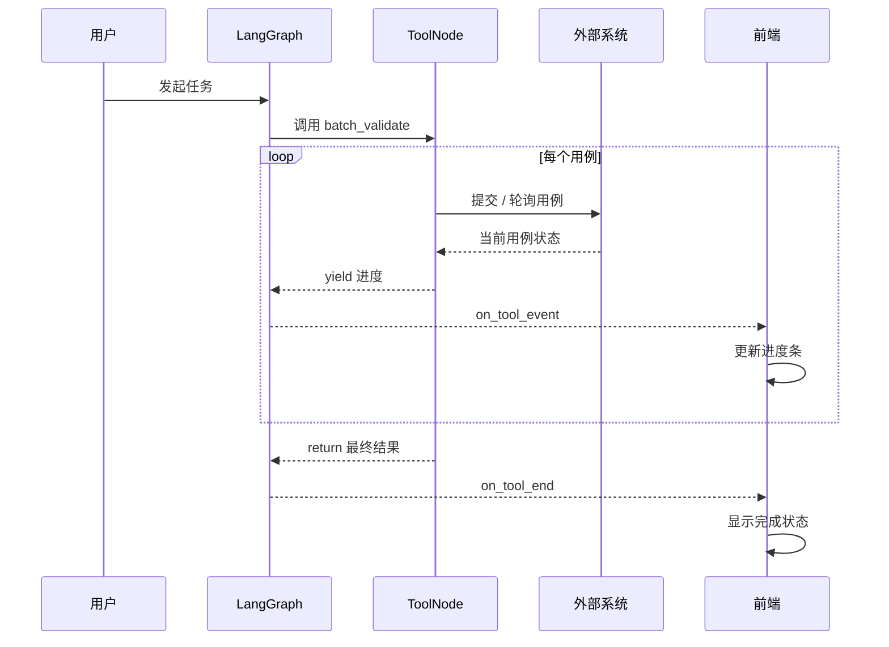

# 全栈 AI Agent 工程师 · 08-16 · 工具跑 5 分钟，前端像死了一样，怎么办？

Agent 最怕的不是工具慢，而是工具执行期间前端一片黑。批量验证、文件处理、外部 API 轮询——这些天然慢的工具，一旦跑起来，前端只有 tool_start 和 tool_end，中间什么反馈都没有。用户不知道是在跑、是死了、还是快好了，只能等。

这篇文章先从最简 async 函数开始复现"卡死"现象，再改成 async generator 逐个推送进度，最后看 LangGraph 怎么把这个能力接进 Agent 流。

## 实验 0：普通 async 工具，前端无反馈

一个典型的批量验证工具：循环 3 个用例，每个等 500ms（模拟外部 API 轮询）。用普通 async 函数写：

```typescript
async function slowValidate() {
  const results: string[] = [];
  for (let i = 1; i <= 3; i++) {
    await new Promise((r) => setTimeout(r, 500)); // 模拟轮询外部系统
    results.push(`用例${i}：通过`);
  }
  return results.join("\n");
}

const start = Date.now();
const result = await slowValidate();
console.log(`[${Date.now() - start}ms]`, result);
```

```bash
[1524ms] 用例1：通过
用例2：通过
用例3：通过
→ 等了 1.5 秒一次性出结果，中间前端什么都不知道
```

这就是问题：函数内部 await 了 3 次，每次 500ms，但外部只能等到函数 return 才能拿到结果。在 LangGraph 里，工具节点就是这样的普通 async 函数，graph 会等到它 return 才继续——这个等待期间，stream 没有任何事件产出来，前端只能干等。

## 先把 yield 搞懂：它和 return 到底有什么区别？

这里最容易混淆的是：`yield` 不是一个“更早的 return”。它会把一个中间值交给调用方，然后**暂停当前函数**；下一次调用 `next()` 时，函数从暂停的位置继续执行。`return` 则表示整个 generator 结束，后面不会再有新的值。

```typescript
async function* count() {
  console.log("开始");
  yield 1; // 暂停，第一次 next() 收到 1
  console.log("继续");
  yield 2; // 再次暂停，第二次 next() 收到 2
  return 3; // 结束，第三次 next() 的 done=true
}

const iterator = count();
console.log(await iterator.next()); // { value: 1, done: false }
console.log(await iterator.next()); // { value: 2, done: false }
console.log(await iterator.next()); // { value: 3, done: true }
```

所以 async generator 实际上返回的是一个**异步迭代器**，不是最终结果。`for await...of` 会自动重复调用 `next()`，把每次 `done: false` 的 value 交给循环体；当 `done` 变成 true 时结束循环。需要注意：`for await...of` 会消费 yield 出来的值，但不会把 return 的 value 交给循环体，最终结果要直接调用 `next()` 才能拿到。

```typescript
async function* progress() {
  yield { current: 1, total: 3 };
  yield { current: 2, total: 3 };
  return { current: 3, total: 3, status: "done" };
}

for await (const event of progress()) {
  // 这里依次收到两个 yield 的进度对象
  renderProgress(event);
}
// return 是最终结果，不会自动进入循环体
```

放到长任务里就很直观：`await` 负责等待外部系统，`yield` 负责把当前进度交出去，`return` 负责提交最终结果。LangGraph 的 ToolNode 需要消费这个异步迭代器，才能把 yield 转成工具事件。

## 实验 1：async generator，逐个 yield 进度

把函数从 async function 改成 async function\*（generator）。每次 yield 就是一次进度推送，return 才是最终结果：

```typescript
async function* validateWithProgress() {
  for (let i = 1; i <= 3; i++) {
    await new Promise((r) => setTimeout(r, 500));
    yield { type: "progress", current: i, total: 3 }; // 进度事件
  }
  return { type: "done", current: 3, result: "全部通过" }; // 最终结果
}

// 消费端：用 for await...of 逐个接收进度
const gen = validateWithProgress();
for await (const event of gen) {
  console.log("进度:", JSON.stringify(event));
}
```

```bash
进度: {"type":"progress","current":1,"total":3}
进度: {"type":"progress","current":2,"total":3}
进度: {"type":"progress","current":3,"total":3}
→ 最终结果: {"type":"done","current":3,"result":"全部通过"}
→ 每 500ms 一个进度事件，前端可以实时渲染进度条
```

核心区别：普通 async 函数是"等全部做完一次性返回"，async generator 是"做一点就吐一点"。前端收到每个 yield 就能更新进度条，不用等到 return。

## 实验 2：在 LangGraph 里用 async generator 工具

LangGraph 的 ToolNode 原生支持 async generator 工具。用 @langchain/core/tools 的 tool() 定义，把函数体改成 async function\*：

```typescript
import { tool } from "@langchain/core/tools";
import { ToolNode } from "@langchain/langgraph/prebuilt";

const batchValidate = tool(
  async function* (args: { cases: number }) {
    for (let i = 1; i <= args.cases; i++) {
      await new Promise((r) => setTimeout(r, 500));
      yield `正在验证用例${i}...`; // yield = 进度事件
    }
    return `全部 ${args.cases} 个用例通过`; // return = 最终结果
  },
  {
    name: "batch_validate",
    description: "批量验证用例",
    schema: { cases: { type: "number" } },
  }
);

const toolNode = new ToolNode([batchValidate]);
// 在 StateGraph 里像普通工具一样 addNode("tools", toolNode)
```

工具被调用时，ToolNode 内部会逐个消费 generator 的 yield。每次 yield 触发一次 on_tool_event 事件，return 触发 on_tool_end。前端用 stream mode "tools"（或旧版 streamEvents 的 on_tool_event）就能收到这些事件：

```typescript
const stream = await graph.stream(input, {
  streamMode: ["updates", "tools"], // 同时订阅图更新和工具事件
});

for await (const [mode, chunk] of stream) {
  if (mode === "tools") {
    // chunk.event === "on_tool_event" → 进度更新
    // chunk.event === "on_tool_end"    → 工具完成
    console.log(chunk.event, chunk.data);
  }
}
```

如果用的是旧版 API（streamEvents），用 custom stream mode 配合 config.writer() 也能达到同样效果：工具内部调 config.writer() 写自定义数据，前端在 on_custom_event 里接收。

## 把整条链路画出来

一次长工具调用，真正发生的是“工具暂停 → 推送进度 → 继续执行”的循环，而不是等工具结束后才有一个结果：



图里最关键的边界是：**yield 的数据走进度事件，return 的数据才走最终工具结果**。如果工具内部只 await 不 yield，ToolNode 就只能在最后一步通知前端。

## 对比：三种方案

| 方案                        | 优点                                 | 代价                             | 适用                        |
| --------------------------- | ------------------------------------ | -------------------------------- | --------------------------- |
| 普通 async + sleep 轮询     | 实现最简单                           | 执行期前端全黑，用户不知道在干嘛 | 短任务（< 2 秒）            |
| async generator             | 官方一等公民，on_tool_event 原生支持 | 工具逻辑要改成 generator         | 长任务、批量操作            |
| config.writer + custom mode | 老工具零侵入，数据结构自由           | 事件不带工具名，需自己关联       | 存量 Promise 工具不想改结构 |

判断：新工具直接用 async generator；存量 Promise 工具不想动结构用 config.writer。

## 总结

工具执行期间前端卡死的本质是：普通 async 函数内部 await 期间，外部拿不到任何反馈。async generator 把"做一点就吐一点"变成一等公民，每次 yield 就是一次进度推送。

LangGraph 的 ToolNode 原生支持 async generator 工具，yield 值自动转成 on_tool_event 事件，前端通过 stream mode "tools" 接收。老工具不用改结构，用 config.writer 配合 custom stream mode 也能发自定义事件。

这个代价是工具逻辑要从 async function 改成 async function\*，但换来的是用户在长任务期间能看到实时进度——这个代价很值。

## 面试考点

- **工具执行期间前端为什么没反馈？** 普通 async 函数是同步等待 Promise resolve，中间不产生任何事件。LangGraph 的 stream 要等到工具节点 return 才能继续。
- **async generator 怎么解决这个问题？** 每次 yield 触发一次 on_tool_event，前端可以实时收到进度。return 才是 on_tool_end 的最终结果。
- **stream mode "tools" 和 "updates" 有什么区别？** updates 是图状态变化（节点 return 后），tools 是工具执行期间的事件（start/event/end/error）。要拿进度必须 streamMode 包含 tools。
- **config.writer 是什么？** 老工具不改结构的情况下，在函数体内调 config.writer() 发自定义数据，前端用 streamMode "custom" 接收。适合不想改成 generator 的存量代码。

## 参考来源

- [LangGraph JS：Streaming Tool Events](https://langchain-ai.github.io/langgraphjs/how-tos/streaming/#streaming-tool-events)
- [LangGraph JS：Custom Streaming（config.writer）](https://langchain-ai.github.io/langgraphjs/how-tos/streaming/#custom-streaming)
- [MDN：async function\*（async generator）](https://developer.mozilla.org/en-US/docs/Web/JavaScript/Reference/Statements/async_function*)
