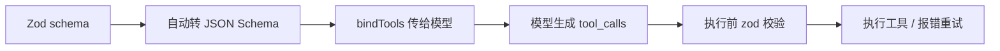

<title>全栈 AI Agent 工程师 · 08-15 · 工具 Schema 设计</title>

# 工具 Schema 设计：模型和真实世界的契约

<callout emoji="💡">
工具 schema 是模型与真实世界的契约——参数名、类型、必填、描述怎么写，直接决定模型能不能正确调用、调完能不能执行。schema 写得含糊，模型要么不调，要么传错参数。
</callout>

## 为什么需要这个东西

Agent 要干活，就得调用真实世界的工具：查订单、发消息、写数据库。但模型不是程序员，它不会读你的代码——它只看得见你通过 schema 暴露给它的那部分信息。

schema 就是模型理解工具的唯一窗口。参数名含糊（id 是什么的 id？）、缺描述（orderId 要什么格式？）、类型太宽（channel 是 string 还是枚举？），模型就只能猜。猜对了是运气，猜错了是常态。

在 ai-tools-demo 里，工具越多这个问题越严重：20 个工具全是模糊 schema，模型每天瞎调，日志里全是参数校验失败的报错。

## 核心原理

工具调用的链路是：schema（静态定义）→ 模型生成 tool_calls（动态输出）→ 代码执行并校验。schema 是唯一能影响"模型生成什么参数"的杠杆——提示词可以描述工具，但结构化约束只有 schema 给得了。

好的 schema 三要素：**语义化参数名**（orderId 而非 id）、**精确描述**（写明格式和规则，如"以 ORD- 开头"）、**严格类型**（能用 enum 不用 string，能用必填不写可选）。



## 底层实现原理

LangChain 里工具 schema 用 Zod 定义，**zodToJsonSchema 自动转成 JSON Schema**，随 bindTools 请求发给模型。模型的解码器被这个结构约束，生成 tool_calls 时参数就照着结构来。

关键在 JSON Schema 的字段语义：**description** 是模型决定"填什么"的依据（相当于给参数的提示词），**enum** 是模型决定"填哪个"的硬约束（比描述更可靠），**required** 决定哪些参数必须出现。差 schema 和好 schema 转出来的 JSON Schema 差异，就是模型调用成功率的差异。

## 对比其他方案

| 方案                     | 约束强度           | 代价              | 适用场景            |
| ------------------------ | ------------------ | ----------------- | ------------------- |
| 裸 schema（只写类型）    | 弱，模型靠猜       | 调用成功率低      | 原型阶段            |
| 描述优化 schema          | 中，模型有依据     | 要花时间写描述    | 大多数生产工具      |
| strict schema + 二次校验 | 强，结构锁死       | schema 变更成本高 | 订单/支付等关键链路 |
| 工具执行后兜底解析       | 不约束生成，只兜底 | 失败率高、体验差  | 不推荐，应急用      |

判断：先写语义化 schema，关键链路加 strict 和二次校验。别指望执行后兜底——那是把事故往后拖。

## 适用场景 / 不适用场景

- 适合：任何要暴露给模型调用的工具，尤其是参数有格式要求（订单号、日期、金额）和取值范围的。
- 适合：ai-tools-demo 里查询订单、写库、调外部 API 的工具注册。
- 不适合：内部私有函数（模型永远不调用的）没必要定义 schema。
- 不适合：参数语义复杂无法用 enum/描述约束的场景，改用子 Agent 或拆工具。

## 示例：agent-coze-workflow 的 10 个工具 Schema 设计

场景是 agent-coze-workflow 项目：Agent 有 10 个工具（clarify_question、read_file、plan_workflow、generate_workflow、save_to_coze、test_run_workflow、batch_validate、update_workflow、rename_workflow、get_platform_facts），每个工具的 Zod schema 直接决定模型能不能正确调用。之前参数名含糊（id 不写是什么 id、requirement 无格式描述）导致模型频繁传错。修复后语义化命名 + 精确描述 + enum 约束，调用成功率大幅提升。

```typescript
import { z } from "zod";
import { tool } from "@langchain/core/tools";
import { ChatOpenAI } from "@langchain/openai";

/* ------------------------------------------------------------------ */
/* 1. 真实世界：订单数据库（mock，模拟外部系统）                          */
/* ------------------------------------------------------------------ */

const ORDERS = new Map<string, { amount: number; channel: string; status: string }>([
  ["ORD-20260815-001", { amount: 199.0, channel: "web", status: "已发货" }],
  ["ORD-20260814-002", { amount: 89.5, channel: "phone", status: "已完成" }],
]);

// 工具的真实实现：无论 schema 好坏，最终执行的都是这份代码。
// schema 差 → 模型传进来的参数不对 → 这里查不到数据。
function queryOrderInDatabase(args: { orderId?: string; id?: string; channel?: string }): string {
  const orderId = args.orderId ?? args.id;
  if (!orderId || !orderId.startsWith("ORD-")) {
    return `查询失败：参数 "${args.id ?? args.orderId ?? "(空)"}" 不是合法订单号（应形如 ORD-xxxx）`;
  }
  const order = ORDERS.get(orderId);
  if (!order) return `查询失败：订单 ${orderId} 不存在`;
  return `查询成功：订单 ${orderId}，金额 ¥${order.amount}，渠道 ${order.channel}，状态 ${order.status}`;
}

/* ------------------------------------------------------------------ */
/* 2. 三版 schema 定义                                                 */
/* ------------------------------------------------------------------ */

// ---- 版本 A：差 schema ----
// 问题：
//   - 参数名叫 id，歧义（订单 id？用户 id？支付 id？）
//   - 没有 description，模型不知道 id 的格式（ORD- 前缀）
//   - 没有 channel 枚举，模型只能猜
const badOrderSchema = z.object({
  id: z.string(),
});

// ---- 版本 B：好 schema ----
// 改进：
//   - orderId 语义明确 + describe 说明格式
//   - channel 用 enum，模型只能在三个值里选
//   - 所有字段必填（zod 默认必填）
const goodOrderSchema = z.object({
  orderId: z.string().describe("订单号，形如 ORD-20260815-001，以 ORD- 开头"),
  channel: z
    .enum(["web", "phone", "api"])
    .describe("订单下单渠道：web=网页，phone=电话，api=开放平台"),
});

// ---- 版本 C：strict schema ----
// 两层 strict：
//   1. zod 层 .strict()：禁止传入 schema 之外的字段
//   2. 模型层 strict: true（见下方 bindTools 调用）：OpenAI 结构化工具调用，
//      要求所有字段有描述且必填，模型输出会被服务端校验
const strictOrderSchema = z
  .object({
    orderId: z.string().describe("订单号，形如 ORD-20260815-001，以 ORD- 开头"),
    channel: z
      .enum(["web", "phone", "api"])
      .describe("订单下单渠道：web=网页，phone=电话，api=开放平台"),
  })
  .strict();

// 用 LangChain 的 tool() 包装成可注册给模型的结构化工具。
// tool() 内部会自动把 zod schema 转成 JSON Schema（下面第 3 节演示这个过程）。
const badOrderTool = tool(async (input) => queryOrderInDatabase(input), {
  name: "query_order",
  description: "查询订单", // 描述含糊：查什么？参数怎么传？
  schema: badOrderSchema,
});

const goodOrderTool = tool(async (input) => queryOrderInDatabase(input), {
  name: "query_order",
  description:
    "根据订单号查询订单的金额、下单渠道与当前状态。调用前必须先从用户消息中提取完整订单号。",
  schema: goodOrderSchema,
});

const strictOrderTool = tool(async (input) => queryOrderInDatabase(input), {
  name: "query_order",
  description:
    "根据订单号查询订单的金额、下单渠道与当前状态。调用前必须先从用户消息中提取完整订单号。",
  schema: strictOrderSchema,
});

/* ------------------------------------------------------------------ */
/* 3. 展示 zod → JSON Schema 的自动转换                                  */
/* ------------------------------------------------------------------ */

function showJsonSchemaConversion() {
  console.log("========== zod schema 自动转 JSON Schema ==========");
  console.log("--- 差 schema 生成的 JSON Schema ---");
  console.log(JSON.stringify(badOrderSchema.toJSONSchema(), null, 2));
  console.log("");
  console.log("--- 好 schema 生成的 JSON Schema ---");
  console.log(JSON.stringify(goodOrderSchema.toJSONSchema(), null, 2));
  console.log("");
  console.log(
    "对比可见：好 schema 多了 description 与 enum，这些正是模型决定'填什么参数'的依据。\n"
  );
}

/* ------------------------------------------------------------------ */
/* 4. mock 模型：模拟"模型根据 schema 生成 tool_calls"                   */
/* ------------------------------------------------------------------ */

// 没有 API key 时，用这个函数模拟模型行为：
//   - schema 里字段没有 description → 模型"瞎猜"参数
//   - schema 里有 description + enum → 模型按说明生成正确参数
function mockModelToolCall(schemaJson: ReturnType<typeof goodOrderSchema.toJSONSchema>) {
  const props = (schemaJson.properties ?? {}) as Record<
    string,
    { description?: string; enum?: string[] }
  >;
  const hasOrderField = Object.keys(props).some((k) => k.includes("orderId"));
  const hasDescription = Object.values(props).some((p) => Boolean(p.description));
  const hasEnum = Object.values(props).some((p) => Array.isArray(p.enum));

  if (!hasOrderField || !hasDescription || !hasEnum) {
    // 差 schema：模型只能猜 —— 传了 id: "12345"（用户根本没有提供这个参数）
    return { name: "query_order", args: { id: "12345" } };
  }
  // 好 schema：模型按 description/enum 提取正确参数
  return {
    name: "query_order",
    args: { orderId: "ORD-20260815-001", channel: "web" },
  };
}

/* ------------------------------------------------------------------ */
/* 5. 两步式对比：坏 schema vs 好 schema                                */
/* ------------------------------------------------------------------ */

async function twoStepComparison() {
  console.log("========== 坏例子：差 schema 导致参数错误 ==========");
  const badCall = mockModelToolCall(badOrderSchema.toJSONSchema());
  console.log("模型生成的 tool_calls：", JSON.stringify(badCall));
  // 工具真实执行：参数不对 → 查询失败
  console.log("工具执行结果：", queryOrderInDatabase(badCall.args as { id?: string }));
  console.log(
    "→ 为什么？schema 里只有裸的 id: string，模型不知道 id 是订单号、不知道要 ORD- 前缀。\n"
  );

  console.log("========== 好例子：好 schema 参数正确 ==========");
  const goodCall = mockModelToolCall(goodOrderSchema.toJSONSchema());
  console.log("模型生成的 tool_calls：", JSON.stringify(goodCall));
  console.log(
    "工具执行结果：",
    queryOrderInDatabase(goodCall.args as { orderId?: string; channel?: string })
  );
  console.log("→ 精确描述 + 枚举 + 必填，让模型一次调对。\n");
}

/* ------------------------------------------------------------------ */
/* 6. strict schema：模型层结构化输出（真实 LLM，可选）                   */
/* ------------------------------------------------------------------ */

async function strictSchemaWithRealLLM() {
  const apiKey = process.env.OPENAI_API_KEY;
  if (!apiKey) {
    console.log(
      "【strict schema 真实调用】跳过：未设置 OPENAI_API_KEY（可设 DEEPSEEK_API_KEY 走 OpenAI 兼容接口）。"
    );
    return;
  }

  const model = new ChatOpenAI({
    model: "gpt-4o-mini",
    apiKey,
    temperature: 0,
    maxRetries: 0,
  });

  try {
    // strict: true —— OpenAI 要求 schema 中所有字段有描述且必填，
    // 并且会强制校验模型输出必须匹配 schema。
    const strictModel = model.bindTools([strictOrderTool], { strict: true });
    const res = await strictModel.invoke("帮我查一下订单 ORD-20260815-001，用户是从网页下的单");
    const toolCalls = res.tool_calls ?? [];
    console.log("========== strict schema 真实调用 ==========");
    console.log("模型 tool_calls：", JSON.stringify(toolCalls, null, 2));
    for (const call of toolCalls) {
      console.log(
        "工具执行结果：",
        queryOrderInDatabase(call.args as { orderId?: string; channel?: string })
      );
    }
  } catch (err) {
    console.log("strict schema 真实调用失败（网络或 key 问题，已兜底）：", (err as Error).message);
  }
  console.log("");
}

/* ------------------------------------------------------------------ */
/* 7. main                                                             */
/* ------------------------------------------------------------------ */

async function main() {
  showJsonSchemaConversion();
  await twoStepComparison();
  await strictSchemaWithRealLLM();

  console.log("========== 结论 ==========");
  console.log(
    "工具 schema 就是'模型 ↔ 真实世界'的契约：\n" +
      "  1. 参数名要语义化（orderId 而非 id），并 describe 格式（ORD- 前缀）；\n" +
      "  2. 能用 enum 约束的不要用 string（channel 只能在 web/phone/api 里选）；\n" +
      "  3. 生产环境配合模型级 strict: true + 工具执行前 zod 二次校验（schema 即校验器）。"
  );
}

main().catch((err) => {
  console.error("main 执行失败：", err);
  process.exitCode = 1;
});
```

1. Zod schema 定义工具参数 → LangChain 自动转 JSON Schema → 随 bindTools 传给模型。
2. 好 schema：plan_workflow 的 requirement 有示例描述 → 模型知道传什么格式。
3. 好 schema：save_to_coze 的 workflowId 有 optional + 描述 → 模型知道首次不传、迭代传。
4. 差 schema：id 裸字符串无描述 → 模型猜 → 传错 → 工具执行失败。
5. 生产再加 strict:true + zod 二次校验 → 双保险。

## 生产环境注意事项

- schema 就是 API 文档：改了 schema 等于改了接口契约，前后端（模型侧）要同步，老客户端会挂。
- 参数校验放两层：模型生成后 zod 校验拦截脏参数，工具执行时再校验一遍业务规则（订单号真实存在等）。
- description 要写"格式 + 示例 + 规则"，别只写"订单号"三个字；模型对示例的依赖比想象中大。
- 工具数量多了要按意图动态注入，别全塞给模型——schema 也占上下文，且干扰选择。

## 面试考点

- 问：工具 schema 为什么影响调用成功率？答：schema 是模型理解工具的唯一结构化信息源，描述和枚举直接决定模型生成什么参数。
- 问：怎么设计一个让模型稳定调用的工具 schema？答：语义化参数名 + 精确描述（格式/示例/规则）+ enum 约束 + 必填。
- 问：strict 模式解决了什么？答：模型级约束输出结构，拒绝额外字段，配合 zod 二次校验形成双保险。
- 追问：模型传错参数怎么办？答：校验失败后把错误信息回填给模型让它重试（tool error 反馈循环），而不是直接失败。

## 常见坑

- 症状：模型偶尔不调用工具。原因：工具描述和 schema 太弱，模型不知道何时该调。解决：写清"什么时候用这个工具"。
- 症状：参数频繁校验失败。原因：参数名含糊、缺格式描述。解决：语义化命名 + describe 格式。
- 症状：模型传了不在枚举里的值。原因：只用 string 没约束。解决：z.enum 硬约束。
- 症状：工具多了模型乱调。原因：全部工具定义进上下文。解决：意图路由动态注入。
- 症状：改 schema 后老请求全挂。原因：没做版本管理。解决：schema 版本化，按版本发布。

## 学习延伸

落地位置：ai-tools-demo 的工具注册（查询订单、写库、调外部 API）。下一篇建议学「LangGraph 条件路由」——工具调用结果怎么决定 Agent 下一步走哪条分支。

[LangChain Tool Calling 文档](https://langchain-ai.github.io/langgraphjs/how-tos/tool-calling/)[LangChain Tools 集成](https://docs.langchain.com/oss/javascript/integrations/tools/)[OpenAI Function Calling](https://platform.openai.com/docs/guides/function-calling)
